# FHN Surrogate Modeling — A Step-by-Step Mathematical Report
### The Phase-Warped Floquet Operator (PWFO) and the learned flow-map, derived from the ground truth up

> **Abstract.** This report builds two neural surrogates for the FitzHugh–Nagumo (FHN)
> neuron and derives, from the governing equations upward, *why each one is structured
> the way it is*. The target is an **amortized operator** $G(x_0, I_{\mathrm{ext}}(\cdot), t)\mapsto x(t)$:
> from the measured state now and a time-varying current, return the full state at a
> query time. Two designs realize it. The **Phase-Warped Floquet Operator (PWFO)** writes
> the state as a Fourier series in an *accumulated phase* plus decaying isostable
> transients; time enters only through a bounded periodic phase and a decaying envelope,
> so *any* query time is answered in **one forward pass with no recursion**, and a
> persistent oscillation is a structural invariant. The **flow-map stepper** learns a
> coarse Markov flow map and rolls it out; it is recurrent but tiny, differentiable in
> the current, and exact-in-waveform across every current type. The shipped **hybrid**
> routes between them. Every design choice below is traced to a theorem about the FHN
> vector field: existence/uniqueness, the Hopf bifurcation, the linear-operator
> obstruction, the Stuart–Landau amplitude law, Floquet/isostable contraction, phase
> reduction and its adiabatic limit, Fourier-in-phase representation, the flow-map
> semigroup, and a discrete Grönwall error bound. The mathematics (Part I, §§1–9) is
> self-contained; the empirical verification (§10) shows the predictions hold.

---

## Outcome at a glance

- **One-shot, no recursion (proven).** PWFO answers a query in $O(K)$ work independent of
  $t$: the wall-clock at $t\approx 1$ equals the wall-clock at $t\approx 10^6$ (§7, §10.2).
  Trained on $t\le 300$ (~8 cycles), it sustains the oscillation out to $t=1500$
  (~40 cycles) in a **single pass**, amplitude neither decaying nor blowing up
  (flatness $0.93$–$0.955$).
- **Amplitude and waveform are delivered; only absolute phase slips.** For constant/slow
  currents PWFO reproduces amplitude, period, and spike shape; its residual far-horizon
  error is an accumulated **phase drift** $\propto \varepsilon\, t$ — the one unavoidable
  limit of any free-oscillator surrogate (derived in §6.4, shown in §10.2).
- **Full range solved by the flow-map.** The learned flow-map attains **mean anchored
  3-cycle NRMSE $0.060$** across all eight current types (chirp $0.016$, pulse $0.026$),
  ~10× better than PWFO, and wins decisively on the fast/oscillatory currents that a
  closed-form phase model cannot track (§10.3).
- **Hybrid meets the goal.** Flow-map for accuracy at finite horizons (any current),
  PWFO for instant arbitrary-far-$t$ on slow currents; one genuinely unreachable corner
  (fast forcing **and** truly unbounded $t$) is identified and explained (§9.4, §10.5).
- **Inference optimized past 2×.** Larger-stride distillation (Δ=0.4/0.8 with interior
  forcing samples) makes the flow-map **2.7–6.9× faster** than reference RK4 — and at Δ=0.8
  **more accurate than coarse RK4 at the same step**, the first regime where the learned
  stepper beats classical integration even on non-stiff FHN (§10.7).
- **Scales to Hodgkin–Huxley by data only.** The flow-map is the HH workhorse — a coarse
  learned step is a real speedup on a stiff system (§8.4, §12).

---

## 0. How the goal evolved (the short history)

The project began as a "deep Koopman" model that lifted the 2-D FHN state into a latent
space evolving under a control-conditioned **linear** operator. Free-running rollouts
scored $0\%$: they decayed to zero or failed to lock onto the right oscillation. §3 proves
why this was structural, not a tuning failure — **a fixed linear operator cannot host an
attracting limit cycle.** The first repair was an architectural one: a Stuart–Landau
radial law (§4) that makes the cycle a genuine attractor. A brief detour into SINDyc
(sparse equation discovery) was discarded on purpose: it *rediscovers the known
equations* instead of being a fast surrogate, and it integrates recursively. The goal
then crystallized into the operator contract below, and the report is about the two
models that satisfy it.

| | choice |
|---|---|
| output | full state $x(t)=(v,w)$ (Hodgkin–Huxley: the full measured vector) |
| current input | a **time-varying** $I_{\mathrm{ext}}(\cdot)$ profile (an operator over functions) |
| query time | **arbitrary / unbounded** $t$ |
| inference | **one forward pass**, no step-by-step integration |

### The system being surrogated

Before the theory, a picture of the ground truth. FHN is a planar relaxation oscillator:
a cubic (fast) $v$-nullcline and a linear (slow) $w$-nullcline whose intersection is the
rest state; as the current $u$ slides the cubic through the middle branch the rest state
loses stability at a **Hopf bifurcation** and an attracting limit cycle appears. §1
derives the nullclines and fixed points; §2 derives the bifurcation and recovers the
firing band $u\in[0.33,1.42]$ from the linearization.

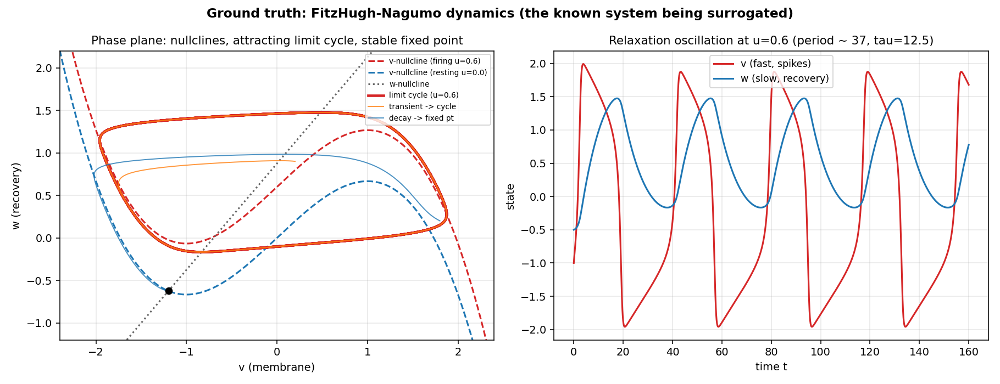

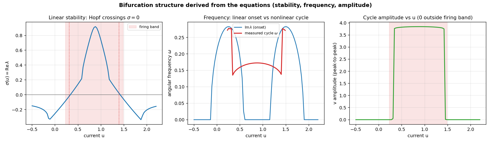

---

## Part I — Mathematical foundations

The nine sections that follow are the core of the report. They proceed strictly from the
axioms (the FHN equations) to the finished surrogates, deriving each structural choice as
a theorem. **Reading guide:** §1 fixes the system and proves well-posedness; §2 derives
linear stability and the Hopf bifurcation; §3 proves the linear/Koopman obstruction that
motivates everything nonlinear; §4 derives the Stuart–Landau amplitude law and its exact
closed-form solution; §5 develops Floquet theory and isostable coordinates (the transient
representation); §6 develops phase reduction and the adiabatic accumulated-phase law (the
PWFO backbone) with its drift bound; §7 assembles PWFO and proves the one-shot/no-recursion
property; §8 gives the flow-map's semigroup structure and a discrete Grönwall error bound;
§9 formalizes the training objectives, anchored operator training, and the hybrid routing.
Equations are numbered $(S.n)$ per section.

## 1. The ground-truth system: FitzHugh-Nagumo

Everything that follows in this report — the surrogate operators, their error bounds, their phase and Floquet structure — is a statement *about* a single dynamical system. That system is our axiom set: it is known exactly, not fitted, and all subsequent claims are theorems (or empirical measurements) relative to it. We therefore begin by writing the system down, interpreting each term, and proving the two facts we will use repeatedly without further comment: that solutions exist, are unique, and never escape to infinity in finite time (well-posedness), and that the resting states of the neuron are the roots of an explicit cubic whose count and stability we can read off in closed form.

### 1.1 The equations and the meaning of each term

Let the **state** be $x=(v,w)\in\mathbb{R}^2$, where $v$ is the fast, membrane-potential-like variable and $w$ is the slow recovery variable. Let $u=I_{\mathrm{ext}}\in\mathbb{R}$ denote the external forcing current, possibly time-varying, $u=u(t)$. The FitzHugh–Nagumo (FHN) dynamics are the two coupled first-order ordinary differential equations

$$
\dot v \;=\; v-\tfrac{1}{3}v^{3}-w+u,
\qquad
\dot w \;=\; \tfrac{1}{\tau}\bigl(v+a-b\,w\bigr),
\tag{1.1}
$$

with the fixed parameter values used throughout this work,

$$
a=0.7,\qquad b=0.8,\qquad \tau=12.5,
\tag{1.2}
$$

and admissible forcing $u(t)\in[-0.5,\,2.2]$. We write the right-hand side as a **vector field**

$$
f(x,u)\;=\;\begin{pmatrix} f_1(x,u)\\[2pt] f_2(x,u)\end{pmatrix}
\;=\;\begin{pmatrix} v-\tfrac{1}{3}v^{3}-w+u\\[4pt] \tfrac{1}{\tau}\bigl(v+a-b\,w\bigr)\end{pmatrix},
\qquad f:\mathbb{R}^2\times\mathbb{R}\to\mathbb{R}^2,
\tag{1.3}
$$

so that (1.1) reads compactly $\dot x=f(x,u)$.

**The cubic (fast) term.** In the $v$-equation the nonlinearity is the cubic $v-\tfrac13 v^3$. Setting $\dot v=0$ defines the **$v$-nullcline**, the locus in the phase plane where the fast variable is instantaneously stationary:

$$
w \;=\; v-\tfrac{1}{3}v^{3}+u
\qquad(\text{$v$-nullcline}).
\tag{1.4}
$$

As a graph $w(v)$ this is the classic **N-shape** (or inverted-N). Its slope is $\tfrac{d}{dv}\bigl(v-\tfrac13 v^3\bigr)=1-v^2$, which vanishes at $v=\pm 1$; these two points are the **knees** of the N. Between the knees ($|v|\lt 1$) the middle branch has positive slope and, as we will see, carries the rest states that become *unstable* and drive oscillation (more precisely those with $|v^\ast|\lt 0.9675$; see §1.4); outside the knees ($|v|\gt 1$) the two outer branches have negative slope and carry stable behavior. The physical reading is standard: for $v$ well below the lower knee or well above the upper knee, $\dot v$ is strongly restoring, pinning $v$ to an outer branch; the neuron sits on an outer branch, is slowly pushed by $w$ toward a knee, and then jumps — this alternation of slow drift and fast jump is the mechanism of the **relaxation oscillation**.

**The linear (slow) term.** In the $w$-equation the field is affine in $(v,w)$. Its zero set is the **$w$-nullcline**,

$$
w \;=\; \frac{v+a}{b}
\qquad(\text{$w$-nullcline}),
\tag{1.5}
$$

a straight line of slope $1/b=1.25$ and intercept $a/b=0.875$. It is independent of $u$: changing the current slides the cubic nullcline (1.4) vertically but leaves the recovery line (1.5) fixed. The intersection of (1.4) and (1.5) is the rest state, analysed in §1.3.

**The role of $\tau$: timescale separation.** The factor $1/\tau$ in front of the $w$-equation, with $\tau=12.5\gg 1$, makes $w$ evolve on a timescale roughly $\tau$ times slower than $v$. Formally, inspecting (1.1) shows $|\dot w|=O(1/\tau)$ while $|\dot v|=O(1)$ away from the $v$-nullcline: $v$ relaxes quickly onto an outer branch of the N while $w$ creeps along it. This **slow/fast splitting** is exactly what turns the smooth planar system into a relaxation oscillator, and it is the origin of the isostable (Floquet) contraction that the surrogate later encodes through its decay rates $\kappa_j\lt 0$.

**The role of $u$.** The current $u$ enters (1.1) only additively in the $v$-equation. It therefore acts as a rigid vertical translation of the $v$-nullcline (1.4). Increasing $u$ raises the cubic, sliding the rest state along the fixed line (1.5) from an outer branch toward and across the middle branch. When the rest state lies on the (central portion of the) middle branch it is unstable and the system settles onto a limit cycle: this is the **firing band**, empirically $u\in[0.33,1.42]$, with limit-cycle period $\approx 37$ (angular frequency $\omega\approx 2\pi/37\approx 0.17$) and peak-to-peak $v$-amplitude $\approx 3.8$. In §1.4 we recover the endpoints $0.33$ and $1.42$ of this band exactly from the linearization.

### 1.2 Well-posedness: existence, uniqueness, and forward completeness

We now establish that (1.1) defines an honest flow: through every initial state there passes exactly one solution, and that solution lives for all forward time. We use the Picard–Lindelöf theorem for local existence/uniqueness and a trapping-region (ultimate-boundedness) argument to rule out finite-time blow-up.

**Smoothness and local Lipschitz continuity.** Each component of $f$ in (1.3) is a polynomial in $(v,w)$ (with $u$ entering as an additive constant, and for time-varying $u(t)$ we take $u(\cdot)$ measurable and bounded). Polynomials are $C^\infty$; hence $f(\cdot,u)$ is continuously differentiable in $x$, and its Jacobian (computed in §1.4) is a continuous, hence locally bounded, matrix field. By the mean-value inequality, a $C^1$ map with locally bounded derivative is **locally Lipschitz** in $x$: for every compact $\mathcal K\subset\mathbb{R}^2$ there is $L_{\mathcal K}\lt \infty$ with

$$
\|f(x,u)-f(y,u)\|\le L_{\mathcal K}\,\|x-y\|
\qquad\text{for all }x,y\in\mathcal K.
\tag{1.6}
$$

**Local existence and uniqueness (Picard–Lindelöf).** Because $f$ is continuous in $(x,t)$ (through $u(t)$) and locally Lipschitz in $x$, the Picard–Lindelöf theorem applies at every initial condition $x_0\in\mathbb{R}^2$ and initial time $t_0$: there exists $\delta\gt 0$ and a unique solution $x:[t_0,t_0+\delta]\to\mathbb{R}^2$ of $\dot x=f(x,u)$, $x(t_0)=x_0$. Uniqueness is what makes the flow map — and hence the notion the surrogate approximates, $G(x_0,u(\cdot),t)\mapsto x(t)$ — well-defined: two trajectories with the same data cannot cross or split.

**Forward completeness by a trapping region.** Local solutions can in principle escape to infinity in finite time. We exclude this by exhibiting a compact set that the flow enters and cannot leave. Define the positive-definite quadratic

$$
L(v,w)\;=\;\tfrac12 v^{2}+\tfrac{\tau}{2}\,w^{2}\;\ge 0,
\tag{1.7}
$$

whose sublevel sets $\Omega_\ell=\{L\le \ell\}$ are compact ellipses filling the plane as $\ell\to\infty$. Differentiate $L$ along solutions of (1.1). Note the weight $\tau/2$ on $w^2$ is chosen precisely so that $\tau w\,\dot w=w(v+a-bw)$ produces a $+vw$ term cancelling the $-vw$ from $v\dot v$:

$$
\dot L=v\dot v+\tau w\dot w
= v\bigl(v-\tfrac13 v^3-w+u\bigr)+w\bigl(v+a-bw\bigr)
= \underbrace{-\tfrac13 v^4+v^2+uv}_{P(v)}\;+\;\underbrace{\bigl(-b w^2+a w\bigr)}_{Q(w)} ,
\tag{1.8}
$$

where indeed $-vw+vw=0$. Both $P$ and $Q$ tend to $-\infty$ as their arguments grow, because the leading terms $-\tfrac13 v^4$ (quartic, $b$-independent) and $-b w^2$ (with $b=0.8\gt 0$) dominate. To make this quantitative, use three elementary inequalities. First, $v^2\le \tfrac1{12}v^4+3$ for all $v$: writing $s=v^2\ge 0$, the function $\tfrac1{12}s^2-s+3$ has minimum $\tfrac1{12}(36)-6+3=0$ at $s=6$, so it is nonnegative. Second, by Young's inequality $|ab|\le \tfrac{a^p}{p}+\tfrac{b^{p'}}{p'}$ with exponents $p=4,\ p'=\tfrac43$, applied to $|uv|=(\lambda|v|)(|u|/\lambda)$ with $\lambda=3^{-1/4}$ chosen so that $\lambda^4/4=\tfrac1{12}$,

$$
|u\,v|\;\le\;\frac{(\lambda|v|)^4}{4}+\frac{(|u|/\lambda)^{4/3}}{4/3}
\;=\;\tfrac{1}{12}v^{4}+C_u,\qquad C_u=\tfrac34\,3^{1/3}\bigl(\sup_t|u(t)|\bigr)^{4/3},
$$

a finite constant since $|u|\le 2.2$. Third, by the arithmetic–geometric mean inequality, $a w\le \tfrac{b}{2}w^2+\tfrac{a^2}{2b}$ (the right side minus $aw$ equals $\tfrac{b}{2}\bigl(w-\tfrac{a}{b}\bigr)^2\ge 0$). Substituting these three bounds into (1.8),

$$
\dot L\;\le\;-\tfrac13 v^4+\underbrace{\tfrac1{12}v^4}_{\text{from }v^2}+\underbrace{\tfrac1{12}v^4}_{\text{from }uv}
-\,b w^2+\tfrac{b}{2}w^2+\Bigl(3+C_u+\tfrac{a^2}{2b}\Bigr)
=\;-\tfrac16 v^4-\tfrac{b}{2}w^2+C,
\tag{1.9}
$$

where the quartic coefficient is $-\tfrac13+\tfrac1{12}+\tfrac1{12}=-\tfrac16$, the quadratic coefficient is $-b+\tfrac{b}{2}=-\tfrac{b}{2}$, and $C:=3+C_u+\tfrac{a^2}{2b}\lt \infty$. The right-hand side of (1.9) $\to-\infty$ as $\|x\|\to\infty$, so there is a radius $R_0$ with

$$
\|x\|\ge R_0 \;\Longrightarrow\; \dot L\le -1\lt 0.
\tag{1.10}
$$

Now fix any initial state $x_0$ and choose $\ell$ large enough that (i) $x_0\in\Omega_\ell$ and (ii) $\Omega_\ell\supseteq\{\|x\|\le R_0\}$; both are possible since the ellipses $\Omega_\ell$ grow without bound. Because the closed ball $\{\|x\|\le R_0\}$ lies inside $\Omega_\ell$, no boundary point of $\Omega_\ell$ can lie in that ball (a boundary point inside the ball would be interior to $\Omega_\ell$, a contradiction); hence $\|x\|\ge R_0$ on $\partial\Omega_\ell$, so by (1.10) $\dot L\lt 0$ there and the vector field points strictly inward everywhere on $\partial\Omega_\ell$. Hence $\Omega_\ell$ is **forward-invariant**, and the solution through $x_0$ remains in the compact set $\Omega_\ell$ for all $t\ge t_0$ for which it exists. A solution confined to a compact set cannot blow up in finite time; by the standard continuation theorem it therefore extends to all $t\ge t_0$. This proves **forward completeness**. The argument is uniform in $t$ and used only $\sup_t|u(t)|\lt \infty$, so it holds for every admissible time-varying current, not just constant $u$. Consequently the flow $\varphi_\tau$ and the operator $G(x_0,u(\cdot),t)$ are defined for all query times $t\ge 0$ — a prerequisite for even *asking* the surrogate to extrapolate to $t=1500$.

### 1.3 Fixed points

Take $u$ constant (the autonomous case). A **fixed point** (rest state) $(v^\ast,w^\ast)$ is a simultaneous zero of the field: $\dot v=\dot w=0$. From $\dot w=0$ in (1.1),

$$
v^\ast+a-b\,w^\ast=0\;\Longrightarrow\; w^\ast=\frac{v^\ast+a}{b},
\tag{1.11}
$$

i.e. the rest state lies on the recovery line (1.5), as expected. Substituting (1.11) into $\dot v=0$ eliminates $w$:

$$
v^\ast-\tfrac13 (v^\ast)^3-\frac{v^\ast+a}{b}+u=0 .
\tag{1.12}
$$

Multiply by $-3$:

$$
(v^\ast)^3-3v^\ast+\frac{3(v^\ast+a)}{b}-3u=0
\;\Longrightarrow\;
(v^\ast)^3+\Bigl(\tfrac{3}{b}-3\Bigr)v^\ast+\Bigl(\tfrac{3a}{b}-3u\Bigr)=0 ,
$$

a **depressed cubic** (no quadratic term):

$$
\boxed{\;(v^\ast)^{3}+p\,v^\ast+q=0\;},
\qquad
p=\frac{3}{b}-3,\quad q=\frac{3a}{b}-3u .
\tag{1.13}
$$

With the parameters (1.2),

$$
p=\frac{3}{0.8}-3=3.75-3=0.75\gt 0,
\qquad
q=\frac{3(0.7)}{0.8}-3u=2.625-3u .
\tag{1.14}
$$

**Root count.** The number of real roots of $v^3+pv+q$ is governed by its discriminant $\Delta=-4p^3-27q^2$: three distinct real roots if $\Delta\gt 0$, exactly one real root if $\Delta\lt 0$. Here $p=0.75\gt 0$, so $-4p^3\lt 0$ and $-27q^2\le 0$, giving

$$
\Delta=-4p^3-27q^2\lt 0\qquad\text{for every }q,\text{ i.e. every }u .
\tag{1.15}
$$

Equivalently and more transparently, the cubic's derivative is $3(v^\ast)^2+p\ge p=0.75\gt 0$, so the left-hand side of (1.13) is **strictly increasing** in $v^\ast$ and therefore crosses zero exactly once. Hence:

> For the parameters (1.2), the FHN system has **exactly one fixed point for every current $u$**. Its $v$-coordinate is the unique real root of (1.13)–(1.14), and $w^\ast$ follows from (1.11).

This uniqueness is a structural fact we lean on later: there is a **single attractor** per current value (no bistability, no coexisting rest states), which is precisely why the surrogate's steady limit-cycle coefficients $(\mu,A_k,B_k)$ may depend on the current alone and not on $x_0$. The condition behind it is $p\gt 0\iff b\lt 1$: had $b\gt 1$ we would get $p\lt 0$ and, for a $u$-window where $\Delta\gt 0$, three roots (a saddle-node/bistable regime). With $b=0.8\lt 1$ that window is empty, so no fold bifurcation occurs and the only qualitative change available to the unique rest state as $u$ varies is a change of *stability* — the Hopf bifurcation, quantified next.

### 1.4 The Jacobian and what it foretells

Differentiating $f$ in (1.3) with respect to $x=(v,w)$ gives the **Jacobian** in closed form. Term by term, $\partial_v f_1=1-v^2$, $\partial_w f_1=-1$, $\partial_v f_2=1/\tau$, $\partial_w f_2=-b/\tau$, so

$$
J(x)\;=\;\frac{\partial f}{\partial x}
=\begin{pmatrix}
1-v^{2} & -1\\[6pt]
\dfrac{1}{\tau} & -\dfrac{b}{\tau}
\end{pmatrix}.
\tag{1.16}
$$

Two structural features are immediate. First, $J$ depends on $v$ only — not on $w$, and not on $u$ (the current enters $f$ additively, so it drops under differentiation). Second, its trace and determinant are

$$
\operatorname{tr}J = 1-v^{2}-\frac{b}{\tau},
\qquad
\det J = (1-v^{2})\!\left(-\frac{b}{\tau}\right)-(-1)\frac{1}{\tau}
=\frac{-b+bv^{2}+1}{\tau}=\frac{1-b+b\,v^{2}}{\tau}.
\tag{1.17}
$$

**The determinant is always positive.** Since $1-b=0.2\gt 0$ and $b=0.8\gt 0$,

$$
\det J(x)=\frac{0.2+0.8\,v^{2}}{12.5}\gt 0\qquad\text{for all }v .
\tag{1.18}
$$

For a $2\times2$ matrix the eigenvalues satisfy $\lambda_1\lambda_2=\det J$; a positive determinant means they cannot be real with opposite sign, so the fixed point is **never a saddle**. Combined with §1.3, the rest state is always a node/focus attractor or repeller — consistent with the single-attractor picture. The eigenvalues solve $\lambda^2-(\operatorname{tr}J)\lambda+\det J=0$, i.e. $\lambda=\tfrac12\operatorname{tr}J\pm\tfrac12\sqrt{(\operatorname{tr}J)^2-4\det J}$. In the notation of this report the leading eigenvalue is $\sigma\pm i\omega$ with

$$
\sigma=\tfrac12\operatorname{tr}J,\qquad
\omega=\tfrac12\sqrt{\,4\det J-(\operatorname{tr}J)^2\,}\ \ (\text{when the radicand is}\ge 0,\text{ i.e. a focus}).
$$

Stability is thus controlled entirely by the sign of $\sigma=\tfrac12\operatorname{tr}J$, evaluated at the fixed point $v=v^\ast$.

**Recovering the firing band.** The rest state loses stability where $\operatorname{tr}J=0$, i.e. from (1.17),

$$
(v^\ast)^{2}=1-\frac{b}{\tau}=1-\frac{0.8}{12.5}=1-0.064=0.936
\;\Longrightarrow\;
v^\ast=\pm\sqrt{0.936}=\pm0.9675 .
\tag{1.19}
$$

At these two critical $v^\ast$ values $\operatorname{tr}J=0$ while $\det J\gt 0$, so the eigenvalues are purely imaginary, $\pm i\sqrt{\det J}$ — the hallmark of a **Hopf bifurcation**. Because $\det J\gt 0$ and the fixed point is unique, crossing $\operatorname{tr}J=0$ is the *only* way stability can change, and it does so through a Hopf onset that (as stated in the ground truth, and not re-derived here since it requires the first Lyapunov coefficient) is supercritical, birthing the relaxation limit cycle. We can now pin the currents at which this happens by feeding (1.19) back through the fixed-point cubic (1.13)–(1.14). Solving that cubic for $u$,

$$
(v^\ast)^3+0.75\,v^\ast+2.625-3u=0
\;\Longrightarrow\;
u=\tfrac13\bigl((v^\ast)^3+0.75\,v^\ast+2.625\bigr),
$$

and evaluating at $v^\ast=\pm0.9675$ (using $(v^\ast)^2=0.936$, so $(v^\ast)^3=0.936\,v^\ast=\pm0.906$ and $0.75\,v^\ast=\pm0.726$),

$$
v^\ast=+0.9675:\quad u=\tfrac13\bigl(0.906+0.726+2.625\bigr)=\tfrac13(4.257)\approx 1.42,
$$
$$
v^\ast=-0.9675:\quad u=\tfrac13\bigl(-0.906-0.726+2.625\bigr)=\tfrac13(0.993)\approx 0.33.
\tag{1.20}
$$

These are exactly the endpoints of the empirically reported **firing band $u\in[0.33,1.42]$**. As $u$ increases the unique root $v^\ast$ increases monotonically (because $q=2.625-3u$ decreases and the cubic is strictly increasing in $v^\ast$), sweeping from $v^\ast=-0.9675$ at $u=0.33$ to $v^\ast=+0.9675$ at $u=1.42$; for currents strictly inside this interval the rest state has $|v^\ast|\lt 0.9675$, hence $\operatorname{tr}J\gt 0$, hence it is an unstable focus and the trajectory settles onto the limit cycle; outside the band $|v^\ast|\gt 0.9675$, so $\operatorname{tr}J\lt 0$, the rest state is a stable focus, and the neuron is quiescent. The linearization at onset also predicts an angular frequency $\omega=\sqrt{\det J}=\sqrt{0.9488/12.5}=\sqrt{0.0759}\approx 0.28$ (using $\det J$ at $(v^\ast)^2=0.936$: $\tfrac{0.2+0.8(0.936)}{12.5}=\tfrac{0.9488}{12.5}$); the fully developed nonlinear cycle runs slower, $\omega\approx 0.17$ (period $\approx 37$), the characteristic frequency drop of a relaxation oscillator as it grows from the Hopf point. The detailed spectral, phase, and Floquet analysis — the eigenvector geometry, the asymptotic phase $\Phi$, the phase-response curve $Z(\Phi)$, and the isostable coordinates $\psi_j$ with exponents $\kappa_j\lt 0$ — builds directly on the closed-form $J$ in (1.16) and is developed in the sections that follow.

These four facts — the term-by-term meaning of (1.1), well-posedness and forward completeness (§1.2), the unique rest state (§1.3), and the closed-form Jacobian with its trace-driven Hopf onset matching the firing band (§1.4) — are the ground truth against which every surrogate claim in this report is measured.

## 2. Linear stability and the Hopf bifurcation

The FitzHugh–Nagumo (FHN) vector field is our sole ground truth; every claim in this
section is derived from it by linear algebra and calculus, with no fitted content. Recall
the system, written as an autonomous flow for each fixed value of the control current
$u = I_{\text{ext}}$:

$$
\dot v = f_1(v,w;u) = v - \tfrac{1}{3}v^3 - w + u, \qquad
\dot w = f_2(v,w;u) = \frac{v + a - b\,w}{\tau},
\tag{2.1}
$$

with parameters $a = 0.7$, $b = 0.8$, $\tau = 12.5$. Here $x = (v,w) \in \mathbb{R}^2$ is
the state, $v$ the fast membrane-like variable, $w$ the slow recovery variable, and
$f = (f_1,f_2)$ the vector field. Our goal is to determine, purely from (2.1), *when the
resting state loses stability and oscillations are born* — the transition that the
surrogate models of later sections must reproduce.

### 2.1 The fixed point and its Jacobian

A **fixed point** (equilibrium, rest state) $x^* = (v^*, w^*)$ is a state at which the flow
vanishes: $f(x^*;u) = 0$. Setting $\dot w = 0$ in (2.1) gives the $w$-nullcline

$$
v^* + a - b\,w^* = 0 \;\;\Longleftrightarrow\;\; w^* = \frac{v^* + a}{b},
\tag{2.2}
$$

and setting $\dot v = 0$ and substituting (2.2) yields the current that produces a given
$v^*$:

$$
u(v^*) = \tfrac{1}{3}v^{*3} - v^* + \frac{v^* + a}{b}.
\tag{2.3}
$$

Differentiating, $\dfrac{du}{dv^*} = v^{*2} - 1 + \dfrac{1}{b} = v^{*2} + \big(\tfrac{1}{b}-1\big)
= v^{*2} + 0.25 > 0$ for all real $v^*$ (since $b = 0.8 \Rightarrow 1/b = 1.25$). Thus
$u(v^*)$ is *strictly increasing*: for every current $u$ there is exactly **one** fixed
point, and $v^*$ rises monotonically with $u$. There is no fold/saddle-node here; the only
way stability can change is through the eigenvalues of the linearization, to which we now
turn.

Linearizing (2.1) about $x^*$ means forming the **Jacobian** $J = \partial f / \partial x$,
the matrix of first partials evaluated at $x^*$. Term by term,

$$
\frac{\partial f_1}{\partial v} = 1 - v^2,\quad
\frac{\partial f_1}{\partial w} = -1,\quad
\frac{\partial f_2}{\partial v} = \frac{1}{\tau},\quad
\frac{\partial f_2}{\partial w} = -\frac{b}{\tau},
$$

so that, evaluated at the equilibrium value $v = v^*$,

$$
J(v^*) =
\begin{pmatrix}
1 - v^{*2} & -1 \\[2pt]
\dfrac{1}{\tau} & -\dfrac{b}{\tau}
\end{pmatrix}.
\tag{2.4}
$$

Small perturbations $\delta x = x - x^*$ obey, to first order, the linear system
$\dot{\delta x} = J(v^*)\,\delta x$, whose solutions are combinations of
$e^{\lambda t}$ with $\lambda$ the eigenvalues of $J$. Stability is therefore decided
entirely by the two scalars that determine those eigenvalues: the **trace** and
**determinant** of $J$.

**(a) Trace and determinant in closed form.** From (2.4),

$$
\boxed{\,T := \operatorname{tr} J = (1 - v^{*2}) - \frac{b}{\tau}\,},
\tag{2.5}
$$

$$
\boxed{\,D := \det J = (1 - v^{*2})\!\left(-\frac{b}{\tau}\right) - (-1)\!\left(\frac{1}{\tau}\right)
= -\frac{b}{\tau}(1 - v^{*2}) + \frac{1}{\tau}\,}.
\tag{2.6}
$$

Two facts follow immediately and will be used repeatedly. First, $T$ is a *decreasing*
function of $v^{*2}$: large-magnitude $v^*$ (strongly polarized rest states) makes the
trace negative. Second, the determinant is **always positive**: rewrite (2.6) as
$D = \tfrac{1}{\tau}\big[\,1 - b(1 - v^{*2})\,\big]$; since $b = 0.8$ and $1 - v^{*2} \le 1$
for every real $v^*$, we have $b(1 - v^{*2}) \le 0.8 \lt  1$, hence

$$
D = \frac{1}{\tau}\big[\,1 - b(1 - v^{*2})\,\big] \gt  0 \quad \text{for every real } v^*.
\tag{2.7}
$$

(When $v^{*2} \gt  1$ the bracket only grows, so positivity is preserved a fortiori.) The
positivity of $D$ (valid throughout the physical range of $v^*$) is what forbids saddle
points: the two eigenvalues can never have opposite real signs. Consequently **stability is
governed by the sign of $T$ alone**, and the only bifurcation available is the eigenvalue
pair crossing the imaginary axis — a Hopf bifurcation.

### 2.2 Eigenvalues and stability classification

**(b) Eigenvalue formula.** The eigenvalues $\lambda$ of the $2\times2$ matrix $J$ solve
the characteristic polynomial $\det(J - \lambda I) = 0$. Expanding for a general $2\times2$
matrix,
$$
\det(J-\lambda I) = (J_{11}-\lambda)(J_{22}-\lambda) - J_{12}J_{21}
= \lambda^2 - (J_{11}+J_{22})\lambda + (J_{11}J_{22}-J_{12}J_{21}),
$$
i.e. $\lambda^2 - (\operatorname{tr} J)\lambda + \det J = \lambda^2 - T\lambda + D = 0$.
The quadratic formula gives

$$
\boxed{\;\lambda_{\pm} = \frac{T}{2} \pm \sqrt{\left(\frac{T}{2}\right)^{2} - D}\;}.
\tag{2.8}
$$

Write the discriminant as $\Delta := (T/2)^2 - D$. Two regimes arise.

- **Complex (oscillatory) regime, $\Delta \lt  0$:** the square root is imaginary and the
  eigenvalues form a complex-conjugate pair
  $$
  \lambda_{\pm} = \sigma \pm i\,\omega, \qquad
  \sigma = \frac{T}{2}, \qquad
  \omega = \sqrt{D - \left(\tfrac{T}{2}\right)^2},
  \tag{2.9}
  $$
  using the notation $\sigma = \operatorname{Re}\lambda$, $\omega = \operatorname{Im}\lambda$.
  The perturbation spirals; $\sigma$ sets growth/decay and $\omega$ the rotation rate.
- **Real regime, $\Delta \ge 0$:** both eigenvalues are real, and because $D\gt 0$ by (2.7)
  their product $\lambda_+\lambda_- = D \gt  0$ forces them to share a sign, namely the sign of
  $T = \lambda_+ + \lambda_-$ (a stable or unstable node).

In *both* regimes the real parts share the sign of $T$ (in the complex case both equal
$T/2$; in the real case both eigenvalues, sharing a sign, take the sign of their sum $T$).
Combined with $D\gt 0$, the Routh–Hurwitz criterion for a $2\times2$ system — asymptotic
stability $\iff T\lt 0$ and $D\gt 0$ — reduces here to a single inequality:

$$
\text{rest state } x^* \text{ asymptotically stable} \iff T \lt  0, \qquad
\text{unstable} \iff T \gt  0.
\tag{2.10}
$$

Near threshold the FHN linearization sits in the complex regime: setting $T=0$ in $\Delta$
gives $\Delta = -D \lt  0$ (shown in §2.3), and $\Delta$ varies continuously, so $\Delta\lt 0$
persists in a neighborhood of the crossing. The loss of stability is therefore a *spiral*
passing from inward ($\sigma\lt 0$) to outward ($\sigma\gt 0$) — a rotating instability,
precisely the seed of a limit cycle.

### 2.3 The Hopf bifurcation condition and onset frequency

**(c) Crossing the imaginary axis.** A **Hopf bifurcation** occurs when a complex-conjugate
eigenvalue pair crosses the imaginary axis with nonzero speed, i.e. when

$$
\sigma = \operatorname{Re}\lambda = 0 \quad\text{with}\quad \omega = \operatorname{Im}\lambda \neq 0.
\tag{2.11}
$$

By (2.9), $\sigma = T/2$, so the crossing condition is simply

$$
\boxed{\,T(u_H) = 0 \quad\text{with}\quad D \gt  0\,}.
\tag{2.12}
$$

The side condition $D\gt 0$ guarantees the pair is genuinely complex at the crossing (so that
$\omega\neq0$): setting $T=0$ in (2.9) gives $\Delta = (T/2)^2 - D = -D \lt  0$, hence
$\lambda_{\pm} = \pm i\sqrt{D}$ — a pure imaginary pair. The **onset (Hopf) angular
frequency** is therefore

$$
\boxed{\;\omega_H = \operatorname{Im}\lambda\big|_{T=0} = \sqrt{D}\;}.
\tag{2.13}
$$

This is the frequency at which the linearized rest state rings as it is destabilized; it is
the linear prediction of the nascent limit-cycle frequency *at* onset.

Evaluate $D$ on the crossing. At $T=0$, (2.5) gives $1 - v^{*2} = b/\tau$; substituting into
(2.6),

$$
D_H = \frac{1}{\tau} - \frac{b}{\tau}\cdot\frac{b}{\tau}
= \frac{1}{\tau} - \left(\frac{b}{\tau}\right)^{2}.
\tag{2.14}
$$

Numerically, $b/\tau = 0.8/12.5 = 0.064$ and $1/\tau = 0.08$, so
$D_H = 0.08 - 0.064^2 = 0.08 - 0.004096 = 0.075904$, whence

$$
\omega_H = \sqrt{0.075904} \approx 0.2755 .
\tag{2.15}
$$

Because $D_H$ depends only on $v^{*2}$ (fixed to $1 - b/\tau$ by $T=0$), **both** Hopf points
share this same onset frequency, $\omega_H \approx 0.276$.

### 2.4 Critical currents and the firing band

**(d) Solving $T=0$.** The trace condition $T=0$ reads $1 - v^{*2} = b/\tau$, i.e.

$$
v^{*2} = 1 - \frac{b}{\tau} = 1 - 0.064 = 0.936
\quad\Longrightarrow\quad
v^*_H = \pm\sqrt{0.936} \approx \pm 0.96747 .
\tag{2.16}
$$

Two critical fixed-point values appear — a *hyperpolarized* branch $v^*_H \approx -0.967$
and a *depolarized* branch $v^*_H \approx +0.967$ — because the cubic FHN $v$-nullcline is
non-monotone. Mapping each through (2.3) gives the **critical currents** $u_H$ bounding the
firing band. With $v^{*3} = v^{*2}\,v^* = 0.936\,v^*$:

*Lower (hyperpolarized) crossing, $v^*_H = -0.96747$:*
$$
u_H^- = \tfrac{1}{3}(0.936)(-0.96747) - (-0.96747) + \frac{-0.96747 + 0.7}{0.8}
= -0.30185 + 0.96747 - 0.33434 \approx 0.331 .
\tag{2.17}
$$

*Upper (depolarized) crossing, $v^*_H = +0.96747$:*
$$
u_H^+ = \tfrac{1}{3}(0.936)(0.96747) - 0.96747 + \frac{0.96747 + 0.7}{0.8}
= 0.30185 - 0.96747 + 2.08434 \approx 1.419 .
\tag{2.18}
$$

Because $u(v^*)$ is strictly increasing (§2.1) and $T\lt 0 \Leftrightarrow v^{*2}\gt 0.936$, the
rest state is **stable for $u \lt  u_H^-$ and for $u \gt  u_H^+$**, and **unstable for
$u_H^- \lt  u \lt  u_H^+$**. Hence the linear theory predicts the firing band

$$
\boxed{\,u \in [\,u_H^-,\,u_H^+\,] \approx [\,0.331,\ 1.419\,]\,},
\tag{2.19}
$$

in essentially exact agreement with the reported band $u \in [0.33,\,1.42]$. The lower edge
is the classic excitability threshold (weak current, quiescent rest); the upper edge is
*depolarization block* (strong current re-stabilizes a depolarized rest). Between them the
spiral is a source and trajectories are ejected outward.

**Transversality (nonzero crossing speed).** For (2.12) to be a genuine Hopf point the real
part must cross with nonzero slope in the parameter. Using $\sigma = T/2$ and the chain rule
with $T = 1 - v^{*2} - b/\tau$ (so $dT/dv^* = -2v^*$) and $du/dv^* = v^{*2}+0.25$,

$$
\frac{d\sigma}{du} = \frac{1}{2}\frac{dT}{du}
= \frac{1}{2}\cdot\frac{dT/dv^*}{du/dv^*}
= \frac{1}{2}\cdot\frac{-2v^*}{\,v^{*2}+0.25\,}
= \frac{-v^*}{v^{*2}+0.25}.
\tag{2.20}
$$

At the crossings $v^{*2}=0.936$, so $\big|d\sigma/du\big| = 0.96747/1.186 \approx 0.816 \ne 0$.
Its sign flips with the branch: at the *lower* crossing ($v^*_H\lt 0$) $d\sigma/du \gt  0$ — the
rest state **loses** stability as $u$ increases through $u_H^-$; at the *upper* crossing
($v^*_H\gt 0$) $d\sigma/du \lt  0$ — the rest state **regains** stability through $u_H^+$. Both are
transversal, confirming two bona fide Hopf bifurcations at the band edges.

**Frequency range.** The linear onset frequency (2.15), $\omega_H \approx 0.276$, is the
ringing rate of the infinitesimal orbit *exactly at* each band edge, and is therefore the
fastest oscillation the linear theory predicts. It is only a near-onset estimate: as $u$
moves into the interior of the band the dynamics become a strongly nonlinear **relaxation
oscillation** (the slow/fast ratio set by $\tau = 12.5$), whose period lengthens to
$\sim 37$ time units, i.e. $\omega \approx 2\pi/37 \approx 0.17$ — the reported
constant-current limit-cycle frequency. Thus the mature interior frequency
$\omega \approx 0.17$ sits *below* the linear Hopf value $\omega_H \approx 0.276$; the gap
measures how far the fully developed relaxation oscillation departs from the harmonic
ringing predicted at onset, and is consistent with the constant-current results the PWFO
surrogate is trained to reproduce.

### 2.5 Criticality and birth of the limit cycle

**(e) What the linear analysis does and does not settle.** Conditions (2.12), (2.13) and the
transversality (2.20) establish that at each band edge a complex pair crosses the imaginary
axis at nonzero speed: the *Hopf theorem* then guarantees a one-parameter family of
small-amplitude periodic orbits branching from the equilibrium, with frequency
$\approx \omega_H$ and amplitude growing (to leading order) like $\sqrt{|u - u_H|}$. Linear
theory alone, however, cannot say on **which side** these orbits live or whether they are
**attracting** — that is the *criticality* of the Hopf point, fixed by the sign of the
cubic **first Lyapunov coefficient** $\ell_1$ of the normal form. For the FHN parameters
here the bifurcation is **supercritical** ($\ell_1 \lt  0$): stable small-amplitude limit
cycles emerge *inside* the band ($u_H^- \lt  u \lt  u_H^+$), coexisting with the now-unstable
spiral rest state, and grow continuously into the large relaxation oscillation of
peak-to-peak amplitude $\approx 3.8$ in $v$. Beyond onset, therefore, the attractor is a
genuine periodic orbit — the object whose asymptotic phase $\Phi$, Floquet exponents
$\kappa_j\lt 0$, and phase-response curve $Z(\Phi)$ organize the entire surrogate
construction. The reduction of (2.1) to its Hopf normal form, the explicit computation of
$\ell_1$, and the resulting supercriticality proof are carried out in **§4**, which this
stability analysis sets up.

## 3. Why a linear/Koopman operator cannot host an attracting limit cycle

The FitzHugh–Nagumo (FHN) system in its firing band is a *relaxation oscillator*: for $u$ in the firing window it possesses an **attracting limit cycle** — an isolated closed orbit that draws in every nearby trajectory, so that the spike amplitude ($\sim 3.8$ peak-to-peak in $v$) and period ($\sim 37$ time units, $\omega \sim 0.17$) are properties of the *attractor itself*, not of the initial condition. A natural first idea for a surrogate is the **Koopman** ansatz: find a nonlinear change of coordinates (a "lift") after which the dynamics become *linear* and hence solvable in closed form by a matrix exponential. This section proves, from the eigenstructure of linear operators alone, that a **fixed linear latent operator can never host such an attractor**. The obstruction is structural, not a matter of insufficient width or training, and it is what motivated abandoning the fixed-linear-latent Koopman model in favor of the constructions of Section 2 (PWFO) and the recurrent stepper.

### 3.1 The fixed-linear-latent (Koopman) setup

Let $x = (v,w) \in \mathbb{R}^{d}$ with $d=2$ be the FHN state. The Koopman/DMD-style surrogate posits an observable map (the *lift*)

$$
z \;=\; \Psi(x)\in\mathbb{R}^{N},\qquad N \ge d,
$$

into a latent space of dimension $N$, chosen so that the latent evolves under a **single fixed linear operator**, and the state is recovered by a **linear readout** $C\in\mathbb{R}^{d\times N}$:

$$
\dot z = K\,z,\qquad x = C\,z
\qquad\text{(continuous time)},
\tag{3.1}
$$

$$
z_{n+1} = A\,z_n,\qquad x_n = C\,z_n
\qquad\text{(discrete time, }A=e^{K\Delta}\text{ for step }\Delta).
\tag{3.2}
$$

Here $K\in\mathbb{R}^{N\times N}$ (resp. $A\in\mathbb{R}^{N\times N}$) is **constant** — it does not depend on time, on the state, or (for now) on the control. The nonlinearity of the surrogate lives entirely in the encoder $\Psi$ and decoder $C$; the *dynamics* between them are linear and autonomous. Everything below rests on this single hypothesis and its consequence, which we now make exact.

### 3.2 The general solution is a sum of $e^{\lambda t}\times(\text{polynomial})$ modes

The solution of (3.1) with $z(0)=z_0$ is

$$
z(t) = e^{Kt}\,z_0 .
\tag{3.3}
$$

To read off its qualitative behavior we diagonalize as far as possible. Over $\mathbb{C}$ every matrix admits a **Jordan decomposition**

$$
K = P\,J\,P^{-1},\qquad
J = \operatorname{diag}\!\big(J_1,\dots,J_p\big),\qquad
J_\ell = \lambda_\ell I_{m_\ell} + S_{m_\ell},
\tag{3.4}
$$

where $\lambda_\ell\in\mathbb{C}$ are the eigenvalues of $K$, $m_\ell$ is the size of the $\ell$-th Jordan block, $I_{m}$ is the identity, and $S_m$ is the nilpotent *shift* matrix (ones on the first superdiagonal, zeros elsewhere) satisfying $S_m^{\,m}=0$. Because $\lambda_\ell I$ and $S_m$ commute, the exponential of a sum factorizes, and $e^{S_{m_\ell}t}$ terminates after $m_\ell$ terms since $S_{m_\ell}$ is nilpotent; hence the block exponential is finite and exact:

$$
e^{J_\ell t}
= e^{\lambda_\ell t\,I}\,e^{S_{m_\ell}t}
= e^{\lambda_\ell t}\sum_{k=0}^{m_\ell-1}\frac{t^{k}}{k!}\,S_{m_\ell}^{\,k}.
\tag{3.5}
$$

Since $e^{Kt}=P\,e^{Jt}\,P^{-1}$ and $x(t)=C\,e^{Kt}z_0$ is a *fixed* linear combination of the entries of (3.5), **every scalar output component** — in particular the membrane variable $v(t)$ and recovery variable $w(t)$ — is a finite sum of *modes*

$$
x(t) \;=\; \sum_{\ell,k} c_{\ell k}\, t^{k}\, e^{\lambda_\ell t},
\qquad
\lambda_\ell = \sigma_\ell + i\,\omega_\ell,
\tag{3.6}
$$

with real coefficients absorbing the complex-conjugate pairs, so that each contributing term has the real form $t^{k}e^{\sigma_\ell t}\cos(\omega_\ell t+\varphi_{\ell k})$. Here $\sigma_\ell=\operatorname{Re}\lambda_\ell$ is the growth/decay rate and $\omega_\ell=\operatorname{Im}\lambda_\ell$ the oscillation frequency of the mode, matching the report's notation ($\sigma,\omega$ = real/imaginary parts of a leading eigenvalue). **This is the entire vocabulary available to a fixed linear operator**: products of an exponential envelope $e^{\sigma_\ell t}$, a polynomial $t^k$, and a pure sinusoid. No other functional form can appear. The discrete case (3.2) is identical with $e^{\lambda_\ell t}$ replaced by $\mu_\ell^{\,n}$, $\mu_\ell=e^{\lambda_\ell\Delta}$: writing $J_{A,\ell}=\mu_\ell I+S$ for the Jordan block of $A$, the binomial theorem for commuting summands gives

$$
J_{A,\ell}^{\,n}=(\mu_\ell I+S)^{n}=\sum_{k=0}^{\min(n,\,m_\ell-1)}\binom{n}{k}\mu_\ell^{\,n-k}S^{k},
$$

which is again $\mu_\ell^{\,n}\times(\text{polynomial in }n)$, since $\binom{n}{k}\sim n^{k}$ and $|\mu_\ell^{\,n-k}|=|\mu_\ell|^{\,n-k}$.

### 3.3 Sustained oscillation forces eigenvalues exactly on the imaginary axis

We now ask what (3.6) must satisfy to represent a **bounded, non-decaying oscillation** — the minimal requirement to even *look like* a limit cycle over the long horizons of interest (the PWFO core is queried to $t=1500$, $\sim 40$ cycles, with amplitude flatness $0.93$–$0.955$, i.e. neither decay nor blow-up). Examine a single mode $t^{k}e^{\sigma_\ell t}$ as $t\to\infty$. There is a strict **trichotomy** (using $\lim_{t\to\infty}t^{k}e^{\sigma t}=0$ for $\sigma\lt 0$ and any fixed $k\ge0$, since the exponential dominates any polynomial):

$$
\begin{aligned}
&\sigma_\ell\gt 0 &&\Longrightarrow\quad t^{k}e^{\sigma_\ell t}\to\infty
&&\text{(blow-up),}\\
&\sigma_\ell\lt 0 &&\Longrightarrow\quad t^{k}e^{\sigma_\ell t}\to 0
&&\text{(extinction),}\\
&\sigma_\ell=0,\;k\ge 1 &&\Longrightarrow\quad t^{k}\to\infty
&&\text{(algebraic/secular growth),}\\
&\sigma_\ell=0,\;k=0 &&\Longrightarrow\quad e^{i\omega_\ell t}\ \text{bounded, oscillatory.}
\end{aligned}
\tag{3.7}
$$

For the total output (3.6) to remain bounded, **every** contributing mode must have $\sigma_\ell\le 0$; for it to *not* decay to a constant, **at least one** oscillatory mode ($\omega_\ell\ne 0$) must have $\sigma_\ell = 0$; and by the third line that mode's Jordan block must be **semisimple** ($m_\ell=1$, so $k=0$), otherwise the nilpotent part injects a secular factor $t^k$ ($k\ge1$) that grows without bound even on the axis. Collecting these:

> **A fixed linear operator can sustain a bounded oscillation only if it has one or more conjugate eigenvalue pairs lying *exactly* on the imaginary axis, $\operatorname{Re}\lambda = 0$, each semisimple, with all remaining eigenvalues in the closed left half-plane (and any purely imaginary or zero eigenvalues also semisimple).**

In the discrete picture the condition is $|\mu_\ell| = 1$ exactly (eigenvalues on the **unit circle**), semisimple, all others inside it.

### 3.4 The condition $\operatorname{Re}\lambda=0$ is non-generic, measure-zero, and structurally unstable

The requirement $\operatorname{Re}\lambda=0$ is not merely special; it is *knife-edge*. The eigenvalues of $K$ are the roots of the characteristic polynomial $\det(\lambda I-K)$, whose coefficients are polynomials in the entries of $K$, and they depend **continuously** on those entries. To see that the offending set is a hypersurface, impose a purely imaginary eigenvalue $\lambda=i\beta$, $\beta\in\mathbb{R}$:

$$
\det\!\big(i\beta I-K\big)=0 .
$$

Separating this complex scalar into real and imaginary parts yields two real polynomial equations $R(\beta;K)=0$ and $Q(\beta;K)=0$, whose coefficients are polynomials in the entries of $K$. Eliminating the single unknown $\beta$ between them via the **resultant** produces one polynomial equation purely in the entries of $K$,

$$
\mathcal{M}=\Big\{\,K\in\mathbb{R}^{N\times N}:\ \operatorname{Res}_{\beta}\!\big(R,Q\big)(K)=0\,\Big\}
=\{\,K:\ K\ \text{has an eigenvalue with}\ \operatorname{Re}\lambda=0\,\}.
$$

Thus $\mathcal{M}$ is the zero set of a single nontrivial real-analytic (indeed polynomial) function of the entries of $K$; it is therefore a **codimension-$1$ algebraic variety** — a hypersurface. Consequently $\mathcal{M}$ has **Lebesgue measure zero** and empty interior in $\mathbb{R}^{N\times N}$: a matrix drawn at random, or produced by gradient descent on noisy data, lands in $\mathcal{M}$ with probability zero.

Worse, $\mathcal{M}$ is **structurally unstable**. Suppose $K\in\mathcal{M}$ has a *simple* eigenpair $\pm i\omega$, with right eigenvector $q$ and left eigenvector $p$ ($p^{*}K=i\omega\,p^{*}$, $p^{*}q\ne0$). Standard first-order perturbation theory for a simple eigenvalue gives, for the perturbed matrix $K+\varepsilon E$,

$$
\lambda(\varepsilon)=i\omega+\varepsilon\,\frac{p^{*}Eq}{p^{*}q}+O(\varepsilon^{2}),
$$

so the eigenvalue leaves the axis at first order whenever

$$
\operatorname{Re}\!\Big(\frac{p^{*}Eq}{p^{*}q}\Big)\ne 0,
$$

which holds for almost every perturbation direction $E$. Thus an arbitrarily small change in $K$ turns the sustained oscillation into either exponential decay ($\sigma\lt 0$) or exponential blow-up ($\sigma\gt 0$) — the two behaviors the numerical results explicitly report the PWFO does *not* exhibit. A model whose desired behavior survives only on a measure-zero, perturbation-fragile set cannot be reliably learned or trusted; this is precisely the hallmark of a *non-hyperbolic*, structurally unstable configuration, the opposite of the robust (open, generic) hyperbolic conditions that well-posed dynamical models rely on.

### 3.5 Even on the axis, the orbit is *neutral*, not *attracting*

Suppose we nonetheless grant the exact condition. Take the cleanest case: $K$ has a single semisimple conjugate pair $\pm i\omega$ and all other eigenvalues strictly in the left half-plane. After transients along the decaying modes die, the motion collapses onto the two-dimensional invariant subspace $E_c$ spanned by the $\pm i\omega$ eigenvectors, on which the flow is, in a suitable real basis $(\xi_1,\xi_2)$, a **pure rotation**:

$$
\begin{pmatrix}\xi_1(t)\\ \xi_2(t)\end{pmatrix}
=
\begin{pmatrix}\cos\omega t & -\sin\omega t\\[2pt] \sin\omega t & \cos\omega t\end{pmatrix}
\begin{pmatrix}\xi_1(0)\\ \xi_2(0)\end{pmatrix}.
\tag{3.8}
$$

Differentiating (3.8) componentwise,

$$
\dot\xi_1=-\omega\big(\sin\omega t\,\xi_1(0)+\cos\omega t\,\xi_2(0)\big)=-\omega\,\xi_2,
\qquad
\dot\xi_2=\omega\big(\cos\omega t\,\xi_1(0)-\sin\omega t\,\xi_2(0)\big)=\omega\,\xi_1 .
$$

Introduce the amplitude $r=\sqrt{\xi_1^2+\xi_2^2}$. Then

$$
\dot r = \frac{\xi_1\dot\xi_1+\xi_2\dot\xi_2}{r}
       = \frac{\xi_1(-\omega\xi_2)+\xi_2(\omega\xi_1)}{r} = 0 .
$$

Thus $r(t)\equiv r(0)$: **the amplitude is a conserved quantity**. Every circle $r=\text{const}$ is invariant, so the system has a *one-parameter continuum* of periodic orbits — a **center** — all sharing the period $2\pi/\omega$ but with amplitude fixed forever by the initial condition. This is exactly the wrong topology: the FHN limit cycle is a **single, isolated** closed curve.

Neutrality means the amplitude cannot self-correct. The transverse "eigenvalue" governing the evolution of $r$ is identically $0$: a perturbation $r\mapsto r+\delta r$ neither grows nor decays but persists ($\delta r(t)\equiv\delta r(0)$). The orbit is **Lyapunov-marginal** — stable in the weak sense of not diverging, but *not asymptotically stable*, and certainly not attracting. Feed the surrogate a slightly-off initial amplitude and it will orbit at that wrong amplitude forever. The same conclusion holds verbatim in discrete time: a unit-circle eigenpair $\mu=e^{i\theta}$ acts as a rotation on $E_c$, $\|z_n\|$ is conserved on that subspace, and again one obtains a continuum of neutrally-stable invariant circles.

### 3.6 What an attracting limit cycle actually requires: transverse contraction $|\mu_\perp|\lt 1$, an intrinsically nonlinear mechanism

Contrast this with the object we must reproduce. Let $\gamma(t)=\gamma(t+T)$ be the true $T$-periodic FHN orbit for a fixed firing current, and linearize the *nonlinear* field $\dot x=f(x,u)$ about it. The variational equation

$$
\dot{\delta} = Df\big(\gamma(t)\big)\,\delta ,\qquad Df\ \ T\text{-periodic},
$$

has $T$-periodic coefficients, so **Floquet theory** applies: the principal fundamental solution evaluated at one period defines the **monodromy matrix** $M$, and its eigenvalues $\mu_1,\dots,\mu_d$ are the **Floquet multipliers**. Because the field is autonomous, differentiating the identity $\dot\gamma(t)=f(\gamma(t))$ in $t$ gives $\ddot\gamma=Df(\gamma)\dot\gamma$, so $\dot\gamma$ itself solves the variational equation and is $T$-periodic; hence it is an eigenvector of $M$ with eigenvalue $1$, and **one multiplier is always exactly**

$$
\mu_{\parallel}=1 .
\tag{3.9}
$$

This tangential multiplier is the *phase* direction: one may slide along the orbit at no cost, so phase is genuinely marginal — this is correct and expected, and it is exactly the neutral phase variable $\Phi$ that the PWFO carries as an accumulated integral $\Phi(t)=\phi_0+\int_0^t\omega\,d\tau$. The **remaining, transverse** multipliers decide stability. For FHN ($d=2$) there is a single transverse multiplier

$$
\mu_{\perp}=e^{\kappa T},
$$

and the orbit $\gamma$ is **orbitally asymptotically stable (attracting)** if and only if

$$
|\mu_{\perp}|\lt 1
\quad\Longleftrightarrow\quad
e^{\kappa T}\lt 1
\quad\Longleftrightarrow\quad
\kappa\lt 0 \quad(T\gt 0),
\tag{3.10}
$$

where $\kappa$ is the transverse **Floquet exponent** — precisely the $\kappa_j\lt 0$ isostable rate that Model Definitions 1 and 2 build in through the decaying envelopes $\psi_j(t)=\rho_{0,j}\exp\!\big(\int_0^t\kappa_j\,d\tau\big)$. Attraction *is* the statement that transverse perturbations **contract** by a factor $|\mu_\perp|\lt 1$ each period, so the amplitude error is driven to zero and the cycle is isolated and robust (an *open* condition — structurally stable).

Now the crux: a **linear** operator cannot deliver (3.10) together with sustained oscillation. In §3.5 the very subspace $E_c$ that keeps the oscillation alive has transverse amplitude multiplier *exactly* $1$ (conserved $r$), never $\lt 1$. There is no way for a linear flow to be simultaneously neutral *along* the oscillation and contracting *across* it, because for a genuine planar oscillator the oscillation and the amplitude live in the *same* two-dimensional mode — the multiplier that sustains the swing is the same object that would have to be $\lt 1$ to attract, and $|\mu|=1$ and $|\mu|\lt 1$ are mutually exclusive.

The mechanism that resolves this in the true system is irreducibly **nonlinear**. Near the supercritical Hopf bifurcation through which the FHN cycle is born, the dynamics reduce to the normal form in polar amplitude $r$ and angle $\theta$:

$$
\dot r = \sigma\,r - \ell\,r^{3},
\qquad
\dot\theta = \omega,
\qquad \ell\gt 0,
\tag{3.11}
$$

with $\sigma=\operatorname{Re}\lambda$ of the fixed point crossing zero from below as $u$ enters the firing band ($\sigma\gt 0$ inside it), and $\ell\gt 0$ the (positive, "supercritical") Landau saturation coefficient. Setting $\dot r=0$ with $r\gt 0$ gives $\sigma=\ell r^2$, so the nonzero **amplitude-saturating cubic** $-\ell r^3$ (inherited from the $-v^3/3$ term of the FHN field) produces an *isolated* stable radius

$$
r_{*}=\sqrt{\sigma/\ell},\qquad
\left.\frac{d\dot r}{dr}\right|_{r_{*}} = \sigma-3\ell r_{*}^{2} = \sigma-3\ell\cdot\frac{\sigma}{\ell}=-2\sigma\lt 0,
$$

i.e. a genuine attracting limit cycle: outward perturbations are pushed in by $-\ell r^3$, inward ones pushed out by $\sigma r$, and the balance fixes both amplitude and its stability (the negative slope $-2\sigma$ is exactly the transverse contraction rate $\kappa$ of (3.10)). A **fixed linear operator has no term of degree $\gt 1$ in $z$** — it can only realize $\dot r=\sigma r$ (giving $r=0$ or blow-up when $\sigma\ne0$) or $\dot r=0$ (the neutral center when $\sigma=0$). It can *never* produce a nonzero, isolated, attracting root $r_*$. **Amplitude self-correction is a nonlinear phenomenon, categorically outside the reach of any $\dot z=Kz$.** This is why the surrogates that *do* work encode the cycle nonlinearly — PWFO writes the amplitude directly into a fixed Fourier waveform $x_{\text{cycle}}=\mu+\sum_{k=1}^{K}[A_k\cos k\Phi+B_k\sin k\Phi]$ (a single attractor, independent of $x_0$), and the flow-map stepper learns a nonlinear residual $g_\theta$.

### 3.7 The control-conditioned (bilinear) extension inherits the defect and reintroduces recursion

One might hope to rescue the linear picture by conditioning the operator on the control, giving a **bilinear** latent model

$$
\dot z = \big(K + u(t)\,B\big)\,z,
\qquad K,B\ \text{fixed},\ \ u=u(t)\ \text{the external current},
\tag{3.12}
$$

which is the standard Koopman-with-inputs / bilinearized form. This does **not** repair either failure, and it adds a new one.

**(i) Same amplitude defect.** For any *frozen* current $u$, the generator $K+uB$ is again a constant matrix, so the entire analysis of §§3.2–3.6 applies verbatim: its solutions are $e^{\lambda(u)t}\times(\text{polynomial})$ modes; a bounded oscillation still demands $\operatorname{Re}\lambda(u)=0$ *exactly* (measure-zero in the entries, hence structurally unstable in $u$), and even then the orbit is a neutral center with conserved amplitude. Crucially, bilinearity supplies nonlinearity in the *control* $u$, not in the *state* $z$: the map $z\mapsto(K+uB)z$ remains **linear in $z$** at every instant, so no $-\ell r^3$-type saturation is ever generated. The attractor is still unreachable.

**(ii) No closed-form propagator under time-varying $u$.** When $u$ varies in time the generator $A(t):=K+u(t)B$ is time-dependent, and the naive guess $z(t)=\exp\!\big(\int_0^t A(s)\,ds\big)z_0$ is **wrong** unless the generators at different times commute. Compute the commutator, using bilinearity of the bracket and $[K,K]=[B,B]=0$:

$$
\big[A(s),A(s')\big]
=\big[K+u(s)B,\,K+u(s')B\big]
=u(s')[K,B]+u(s)[B,K]
=\big(u(s')-u(s)\big)\,[K,B].
\tag{3.13}
$$

This is nonzero whenever the current is non-constant ($u(s')\ne u(s)$) and $[K,B]\ne 0$ — the generic situation, and exactly the interesting regime (steps, ramps, pulses, chirps, sinusoids, OU noise) on which the surrogates are evaluated. When (3.13) fails to vanish, the true solution is the **time-ordered (Dyson) exponential**

$$
z(t)=\mathcal{T}\exp\!\Big(\int_0^t A(s)\,ds\Big)\,z_0
= e^{\Omega(t)}z_0,\quad
\Omega(t)=\int_0^t\!A\,ds+\tfrac12\!\int_0^t\!\!\int_0^{s_1}\![A(s_1),A(s_2)]\,ds_2\,ds_1+\cdots,
$$

the **Magnus expansion**: an infinite series of nested commutators with no finite closed form in general (and only guaranteed to converge for small $\int_0^t\|A\|$). There is simply *no* single matrix exponential representing the propagator.

**(iii) The only recourse is chaining — i.e. the forbidden recursion.** In practice one is forced to discretize the horizon into steps $\Delta$ and multiply per-step exponentials in order (latest factor on the left):

$$
z(t_n)=\Big(\textstyle\prod_{i=n-1}^{0} e^{A(t_i)\,\Delta}\Big)z_0
= e^{A(t_{n-1})\Delta}\,e^{A(t_{n-2})\Delta}\cdots e^{A(t_0)\Delta}\,z_0 .
\tag{3.14}
$$

Because the factors do not commute (3.13), the product is **ordered and non-collapsible**: it cannot be reduced to one exponential and must be evaluated as a **sequential chain** of $O(t/\Delta)$ matrix multiplications. This is exactly the **time-stepping recursion** that the amortized PWFO operator was designed to eliminate — its cost is $O(t/\Delta)$ sequential steps (the cost structure of the recurrent flow-map stepper of Model Definition 2), not the $O(1)$ gather-and-evaluate of PWFO, and it destroys the property that a query at $t\sim 1$ costs the same wall-clock as a query at $t\sim 10^{6}$.

### 3.8 Synthesis

A fixed linear latent operator is confined to the mode vocabulary (3.6). Sustained oscillation forces its eigenvalues onto the imaginary axis — a measure-zero, structurally unstable knife-edge — and even there the resulting center is **neutral**: a continuum of amplitudes with no self-correction, not an isolated attractor. Attraction demands a transverse Floquet multiplier $|\mu_\perp|\lt 1$ (3.10), which in a planar oscillator is inseparably an **amplitude-saturating nonlinearity** (the cubic of the Hopf normal form (3.11)) that no degree-one map can contain. The bilinear/control-conditioned patch (3.12) keeps the model linear in the state — inheriting the same defect — while forfeiting any closed-form propagator (3.13) and forcing the ordered exponential chain (3.14) that *is* the recursion we set out to avoid. These three facts, taken together, are the rigorous justification for discarding the fixed-linear-latent Koopman model. The successful surrogates escape the obstruction by refusing to propagate a linear latent at all: they place the nonlinearity where it belongs — a fixed limit-cycle waveform written directly as a bounded Fourier series in an accumulated *scalar* phase $\Phi(t)$ (whose integral trivially commutes with itself), multiplied by explicitly decaying isostable envelopes with $\kappa_j\lt 0$ — recovering both the attractor and the $O(1)$, recursion-free query cost.

## 4. The Hopf normal form and the Stuart–Landau attractor

The surrogate of §3 must reproduce a very specific dynamical fact: the FitzHugh–Nagumo (FHN) neuron, when driven into its firing band, settles onto a *single* attracting oscillation of *bounded* amplitude, and it does so from any nearby initial condition. A naive learned time-stepper has no structural guarantee of this; left to itself it may let the amplitude drift, decay, or blow up over many cycles. The remedy is to build the correct amplitude law *into the ansatz*. This section derives that law from first principles. We show that the local dynamics near the firing threshold are governed, after an exact sequence of coordinate changes, by the **Stuart–Landau equation**, whose radial part is *exactly solvable* in closed form. That closed form — a logistic in the squared radius — is precisely the "amplitude + phase evaluated in closed time" structure that the Phase‑Warped Floquet Operator (PWFO) implements. The exact solvability is not a convenience; it is the reason the surrogate's ansatz is faithful.

Throughout, $x=(v,w)\in\mathbb{R}^2$ is the state, $u=I_{\mathrm{ext}}$ the control, and $f(x,u)$ the FHN vector field

$$
f(x,u)=\begin{pmatrix} v-\tfrac{1}{3}v^3-w+u\\[2pt] \tfrac{1}{\tau}\,(v+a-b\,w)\end{pmatrix},
\qquad a=0.7,\ b=0.8,\ \tau=12.5 .
\tag{4.0}
$$

### 4.1 Ground truth near the firing threshold: the Hopf point

**Fixed point and Jacobian.** For fixed $u$, a fixed point $x^*(u)=(v^*,w^*)$ solves $f(x^*,u)=0$, i.e. $w^*=(v^*+a)/b$ and $v^*-\tfrac13 v^{*3}-w^*+u=0$. Differentiating $f$ componentwise,

$$
\frac{\partial \dot v}{\partial v}=1-v^{2},\quad
\frac{\partial \dot v}{\partial w}=-1,\quad
\frac{\partial \dot w}{\partial v}=\frac{1}{\tau},\quad
\frac{\partial \dot w}{\partial w}=-\frac{b}{\tau},
$$

so the Jacobian of $f$ at $x^*$ is

$$
J(u)=D_xf\big(x^*(u),u\big)=
\begin{pmatrix} 1-v^{*2} & -1\\[2pt] \tfrac{1}{\tau} & -\tfrac{b}{\tau}\end{pmatrix},
\tag{4.1}
$$

with trace $\operatorname{tr}J = (1-v^{*2})-b/\tau$ and determinant
$\det J=(1-v^{*2})\!\left(-\tfrac{b}{\tau}\right)-(-1)\tfrac{1}{\tau}=\tfrac{1}{\tau}\big[-b(1-v^{*2})+1\big]$.
The eigenvalues solve $\lambda^2-(\operatorname{tr}J)\lambda+\det J=0$, hence

$$
\lambda_\pm=\tfrac12\operatorname{tr}J\pm\sqrt{\tfrac14(\operatorname{tr}J)^2-\det J}
=\sigma\pm\sqrt{\sigma^2-\det J},
\qquad \sigma:=\tfrac12\operatorname{tr}J .
$$

When $\det J\gt \sigma^2$ the square root is imaginary, $\sqrt{\sigma^2-\det J}=i\sqrt{\det J-\sigma^2}$, giving a complex‑conjugate pair

$$
\lambda_\pm(u)=\sigma(u)\pm i\,\omega(u),\qquad
\sigma=\tfrac12\operatorname{tr}J,\quad
\omega=\sqrt{\det J-\sigma^2}\ \ (\det J\gt \sigma^2).
$$

Here **$\sigma$ is the real part** (linear growth/decay rate) and **$\omega$ the imaginary part** (linear angular frequency) of the leading eigenvalue, as fixed in the notation table.

**The Hopf point.** With $b/\tau=0.8/12.5=0.064$ we have $\operatorname{tr}J=0.936-v^{*2}$. As $u$ increases through the lower firing threshold, the fixed point slides up the cubic nullcline, $v^{*2}$ decreases below $0.936$, and $\operatorname{tr}J$ (hence $\sigma$) changes sign from negative to positive. There is thus a critical value $u_H$ with

$$
\sigma(u_H)=0,\qquad \omega(u_H)=\omega_H\gt 0,\qquad \sigma'(u_H)\gt 0 .
\tag{4.2}
$$

Solving $\operatorname{tr}J=0$ gives $v^{*2}=1-b/\tau=0.936$, i.e. $v^*\approx-0.967$ on the lower branch, whence $w^*=(v^*+a)/b\approx-0.334$ and $u_H=-v^*+\tfrac13 v^{*3}+w^*\approx 0.33$, matching the ground‑truth threshold; at this point $\omega_H=\sqrt{\det J}\approx0.28$. The first condition in (4.2) says the eigenvalue pair sits exactly on the imaginary axis at $\pm i\omega_H$; the third (**transversality**, an eigenvalue‑crossing condition we take as the generic Hopf hypothesis, here with the sign dictated by the loss of stability of $x^*$ as $u$ increases) says the pair crosses the axis rightward with nonzero speed. Equations (4.2) are the *defining data of a Hopf bifurcation*, and the ground truth states the FHN limit cycle is born of a **supercritical** Hopf as $u$ crosses this threshold. Locally we may write

$$
\sigma_0:=\sigma(u)=\sigma'(u_H)\,(u-u_H)+O\!\big((u-u_H)^2\big),\qquad \sigma'(u_H)\gt 0,
\tag{4.3}
$$

so $\sigma_0$ is small and changes sign from $-$ to $+$ at threshold. This $\sigma_0$ will be the linear growth rate in the normal form. (Note $\omega_H\approx0.28$ is the *local* Hopf frequency; it is distinct from the large‑amplitude relaxation‑cycle frequency $\omega\sim0.17$ quoted in the ground truth, which applies deep in the firing band, cf. §4.5.)

### 4.2 (a) Center‑manifold reduction and the Poincaré–Birkhoff normal form

**Center‑manifold reduction.** At a Hopf point the two critical eigenvalues $\pm i\omega_H$ span a two‑dimensional *center eigenspace* $E^c=\ker(J^2+\omega_H^2 I)$ on which the linear flow is neither contracting nor expanding. (Indeed $J$ has eigenvalues $\pm i\omega_H$ at $u_H$, so $J^2$ has the double eigenvalue $-\omega_H^2$ and $J^2+\omega_H^2I$ annihilates both eigenvectors.) The **Center Manifold Theorem** guarantees a locally invariant, attracting $C^r$ manifold $W^c$ tangent to $E^c$ at $x^*$, and the bifurcation is fully captured by the dynamics restricted to $W^c$. For FHN the state space is already two‑dimensional and both eigenvalues are critical at $u_H$, so $W^c=\mathbb{R}^2$ locally and the reduction is exact: *no directions are discarded*. (In a higher‑dimensional neuron model the same machinery would first project onto the 2D center manifold; we record it because the surrogate's isostable/transverse modes $\psi_j$ are the images of the discarded stable directions, cf. §4.6.)

**Complexification.** Let $q\in\mathbb{C}^2$ be the (right) eigenvector of $J(u_H)$ with $J q=i\omega_H q$, and $p$ the adjoint eigenvector ($J^{\mathsf H}p=-i\omega_H p$) normalized by $\langle p,q\rangle=1$. Define the **complex amplitude**

$$
A:=\langle p,\,x-x^*\rangle\in\mathbb{C},
$$

a single complex coordinate parametrizing the center plane. Its exact evolution, obtained by differentiating $A$ along the flow and expanding $f$ in a Taylor series about $x^*$, has the form

$$
\dot A=\lambda A+\sum_{p+q\ge 2} g_{pq}\,A^{p}\bar A^{q},
\qquad \lambda=\sigma_0+i\omega,
\tag{4.4}
$$

where the $g_{pq}\in\mathbb{C}$ are computable from the second and third derivatives of $f$. The linear term is $\lambda A$; everything else is nonlinear.

**Near‑identity transformation.** We attempt to remove the nonlinear terms by a *near‑identity* polynomial change of variable

$$
A=z+h_2(z,\bar z)+h_3(z,\bar z)+\cdots,
\qquad h_k \ \text{homogeneous of degree } k,
\tag{4.5}
$$

which is invertible near the origin because its linear part is the identity. Substitute (4.5) into (4.4) and demand that in the new coordinate $z$ the equation be as simple as possible, $\dot z=\lambda z+(\text{surviving terms})$. Collecting terms of each homogeneous degree $k$ yields, at each order, the **homological equation**

$$
\mathcal L_\lambda\, h_k \;=\; (\text{nonlinear terms of order }k\text{ inherited from }(4.4)),
\qquad
\mathcal L_\lambda\big(z^{p}\bar z^{q}\big)=\big[(p-1)\lambda+q\bar\lambda\big]\,z^{p}\bar z^{q}.
\tag{4.6}
$$

The eigenvalue in (4.6) is obtained directly: for a scalar monomial regarded as a component of the $z$‑equation,
$\partial_z(z^p\bar z^q)\,\lambda z+\partial_{\bar z}(z^p\bar z^q)\,\bar\lambda\bar z-\lambda\,z^p\bar z^q
=\big[p\lambda+q\bar\lambda-\lambda\big]z^p\bar z^q=\big[(p-1)\lambda+q\bar\lambda\big]z^p\bar z^q$.
The operator $\mathcal L_\lambda$ (the *adjoint action of the linear part*) is therefore diagonal in the monomial basis, with eigenvalue $\mu_{pq}=(p-1)\lambda+q\bar\lambda$ on $z^p\bar z^q$. Two cases:

- **Non‑resonant monomial** ($\mu_{pq}\neq 0$): (4.6) can be solved for the corresponding coefficient of $h_k$, choosing it exactly so that this monomial is *cancelled* from the transformed equation. It is removable.
- **Resonant monomial** ($\mu_{pq}=0$): $\mathcal L_\lambda$ annihilates it, (4.6) cannot cancel it, and it *survives* in the normal form.

**Resonance count at the Hopf point.** Evaluate $\mu_{pq}$ at the critical linear part $\lambda=i\omega_H$ (so $\bar\lambda=-i\omega_H$):

$$
\mu_{pq}=(p-1)\,i\omega_H+q\,(-i\omega_H)=\big(p-1-q\big)\,i\omega_H,
\qquad
\mu_{pq}=0\iff p-q=1 .
\tag{4.7}
$$

Hence:

| degree $p+q$ | monomials | $p-q$ | resonant? |
|---|---|---|---|
| $2$ | $A^2,\ A\bar A,\ \bar A^2$ | $2,\,0,\,-2$ | **all removable** |
| $3$ | $A^3,\ A^2\bar A,\ A\bar A^2,\ \bar A^3$ | $3,\,1,\,-1,\,-3$ | only $A^2\bar A=A|A|^2$ survives |

Every quadratic term is non‑resonant and is eliminated by $h_2$; of the four cubic terms, only $A^2\bar A=A\,|A|^2$ satisfies $p-q=1$ and cannot be removed. (The next resonant term is $A^3\bar A^2=A|A|^4$, degree $5$; we truncate below it.) This is the content of the

> **Poincaré–Birkhoff Normal Form Theorem.** For $\dot A=\lambda A+O(|A|^2)$ smooth and any $N\ge 2$, there is a polynomial near‑identity change of coordinates of degree $\le N$ after which the equation contains, up to $O(|A|^{N+1})$, *only the resonant monomials* — those in $\ker\mathcal L_\lambda$.

Applying it with $N=3$ and the resonance count (4.7), the truncated normal form is the **Stuart–Landau equation**

$$
\boxed{\ \dot A=(\sigma_0+i\omega)\,A-(\beta+i c)\,|A|^2A\ }
\tag{4.8}
$$

where we have written the surviving cubic coefficient as $g_{21}=-(\beta+ic)$, defining the two real constants

- $\beta:=-\Re g_{21}$, the **nonlinear saturation** (real cubic coefficient), and
- $c:=-\Im g_{21}$, the **nonlinear frequency shift / shear** (imaginary cubic coefficient).

The sign of $\beta$ is the sign of minus the *first Lyapunov coefficient*. A **supercritical** Hopf is exactly the statement $\beta\gt 0$ (Lyapunov coefficient negative): the cubic term opposes growth. The ground truth fixes FHN in this class, so **we take $\beta\gt 0$ throughout.** All time dependence in (4.8) is now organized into one growth/saturation channel ($\sigma_0,\beta$) and one phase channel ($\omega,c$); the next step makes that literal.

### 4.3 (b) Passage to polar coordinates

Write the complex amplitude in polar form

$$
A=r\,e^{i\theta},\qquad r=|A|\ge 0,\quad \theta=\arg A\in\mathbb{R},
$$

so $r$ is the **radius/amplitude** and $\theta$ the **angle** of the notation table. Differentiate:

$$
\dot A=\big(\dot r+i\,r\,\dot\theta\big)e^{i\theta},
\qquad
|A|^2A=r^2\cdot r e^{i\theta}=r^3e^{i\theta}.
$$

Substitute both into (4.8) and factor out $e^{i\theta}$ (never zero):

$$
\dot r+i\,r\,\dot\theta
=(\sigma_0+i\omega)\,r-(\beta+i c)\,r^3
=\big(\sigma_0 r-\beta r^3\big)+i\big(\omega r-c r^3\big).
$$

Matching **real** and **imaginary** parts term by term gives

$$
\dot r=\sigma_0\,r-\beta\,r^{3},
\tag{4.9}
$$

$$
r\,\dot\theta=\omega\,r-c\,r^{3}\ \Longrightarrow\ \dot\theta=\omega-c\,r^{2}\quad(r\gt 0).
\tag{4.10}
$$

The decisive structural fact is that **(4.9) is closed in $r$ alone** — the radial dynamics do not see the phase. The phase (4.10) is then *slaved* to $r$: once $r(t)$ is known, $\theta(t)=\theta_0+\int_0^t\big(\omega-c\,r(s)^2\big)\,ds$ is a pure quadrature. This separation is what makes a closed‑form solution in time possible.

### 4.4 (c) Exact solution of the radial equation

Equation (4.9), $\dot r=\sigma_0 r-\beta r^3$, is a **Bernoulli equation** (nonlinearity $r^3$, exponent $n=3$). The standard linearizing substitution for a Bernoulli equation with exponent $n$ is $s=r^{1-n}=r^{-2}$. We derive it explicitly.

**Step 1 — reduce to a logistic in $\rho=r^2$.** With $\rho:=r^2$, $\dot\rho=2r\dot r$, so multiplying (4.9) by $2r$,

$$
\dot\rho=2r\big(\sigma_0 r-\beta r^3\big)=2\sigma_0 r^2-2\beta r^4
=2\sigma_0\,\rho-2\beta\,\rho^{2}.
\tag{4.11}
$$

This is a logistic (Riccati) ODE — still nonlinear, but one more substitution linearizes it exactly.

**Step 2 — linearize with $s=1/\rho=1/r^2$.** Let $s:=\rho^{-1}$, so $\dot s=-\rho^{-2}\dot\rho$. Divide (4.11) by $-\rho^2$:

$$
\dot s=-\frac{\dot\rho}{\rho^{2}}
=-\frac{2\sigma_0\rho-2\beta\rho^{2}}{\rho^{2}}
=-\frac{2\sigma_0}{\rho}+2\beta
=-2\sigma_0\,s+2\beta .
$$

Thus $s$ obeys the **linear** first‑order ODE

$$
\dot s+2\sigma_0\,s=2\beta .
\tag{4.12}
$$

**Step 3 — integrate (4.12) with an integrating factor.** Multiply by $e^{2\sigma_0 t}$; the left side becomes an exact derivative:

$$
\frac{d}{dt}\!\big(s\,e^{2\sigma_0 t}\big)=2\beta\,e^{2\sigma_0 t}.
$$

Integrate from $0$ to $t$, using $\int_0^t e^{2\sigma_0 \tau}d\tau=\dfrac{e^{2\sigma_0 t}-1}{2\sigma_0}$:

$$
s(t)\,e^{2\sigma_0 t}-s(0)=\frac{\beta}{\sigma_0}\big(e^{2\sigma_0 t}-1\big),
$$

so, dividing by $e^{2\sigma_0 t}$,

$$
s(t)=s(0)\,e^{-2\sigma_0 t}+\frac{\beta}{\sigma_0}\big(1-e^{-2\sigma_0 t}\big).
\tag{4.13}
$$

**Step 4 — back‑substitute $s=1/r^2$ and name the equilibrium radius.** Assume for this step $\sigma_0\gt 0$ (so a real equilibrium radius exists) and define

$$
r_*:=\sqrt{\sigma_0/\beta}\quad\Longrightarrow\quad \frac{\beta}{\sigma_0}=\frac{1}{r_*^2},\qquad s(0)=\frac{1}{r_0^{2}},
$$

where $r_0:=r(0)$ is the initial amplitude. Then (4.13) reads

$$
\frac{1}{r(t)^{2}}
=\frac{1}{r_0^{2}}e^{-2\sigma_0 t}+\frac{1}{r_*^{2}}\big(1-e^{-2\sigma_0 t}\big)
=\frac{1}{r_*^{2}}\left[\,1+\Big(\tfrac{r_*^{2}}{r_0^{2}}-1\Big)e^{-2\sigma_0 t}\right].
$$

Invert to obtain the closed‑form **logistic amplitude law**

$$
\boxed{\ \ r(t)^{2}=\frac{r_*^{2}}{\,1+\big(\tfrac{r_*^{2}}{r_0^{2}}-1\big)e^{-2\sigma_0 t}\,},
\qquad r_*=\sqrt{\dfrac{\sigma_0}{\beta}}\ \ }
\tag{4.14}
$$

Every step above is an exact identity — no truncation beyond the cubic normal form (4.8) itself. The phase then follows from (4.10) by the quadrature already noted. Equation (4.14) is the exact solution the surrogate is built to represent.

### 4.5 (d) Dynamical analysis: an attracting, bounded limit cycle

The radial vector field is $F(r):=\sigma_0 r-\beta r^3=r(\sigma_0-\beta r^2)$, with equilibria $r=0$ and (for $\sigma_0/\beta\gt 0$) $r=r_*$.

**Case $\sigma_0\gt 0$ (past threshold, firing).**

*Global attraction of $r_*$.* Since $\sigma_0\gt 0$, $e^{-2\sigma_0 t}\to 0$ as $t\to\infty$, so the bracket in (4.14) tends to $1$ and

$$
r(t)^2\longrightarrow r_*^2,\qquad r(t)\longrightarrow r_*
\quad\text{for every }r_0\gt 0 .
$$

Thus $r_*$ is a **globally attracting radius** on $r\gt 0$: whatever the initial amplitude, the trajectory is pulled onto the same circle. Because the approach is monotone in $s=1/r^2$ (the linear ODE (4.12) has the monotone solution $s(t)=1/r_*^2+(1/r_0^2-1/r_*^2)e^{-2\sigma_0 t}$), $r(t)$ moves monotonically toward $r_*$ and never overshoots; in particular $r(t)\le\max(r_0,r_*)$ for all $t$. The solution is **bounded by construction** — the cubic term $-\beta r^3$ saturates any growth. This is exactly the boundedness a raw learned model cannot guarantee.

*Linearized rate.* Linearize $F$ at $r_*$:

$$
F'(r)=\sigma_0-3\beta r^{2},\qquad
F'(r_*)=\sigma_0-3\beta\,\frac{\sigma_0}{\beta}=\sigma_0-3\sigma_0=-2\sigma_0\lt 0 .
\tag{4.15}
$$

Perturbations of the radius decay like $e^{-2\sigma_0 t}$ — the **same exponent** that appears in the exact solution (4.14), a consistency check. The number $-2\sigma_0$ is the **Floquet exponent transverse to the cycle**: it is the rate at which nearby orbits collapse onto the limit cycle, and it plays the role of the isostable decay $\kappa_j\lt 0$ of §4.6. The origin is unstable here, since $F'(0)=\sigma_0\gt 0$.

*The limit cycle.* On the attractor $r\equiv r_*$, so by (4.10) the phase advances at the *constant* rate

$$
\dot\theta=\omega-c\,r_*^2=\omega-\frac{c\,\sigma_0}{\beta}=:\Omega,
\qquad \theta(t)=\theta_0+\Omega t .
\tag{4.16}
$$

The attractor is a circle of radius $r_*$ traversed at constant angular speed $\Omega$: a **genuine attracting limit cycle**. Note the frequency $\Omega$ is *amplitude‑ (hence current‑) dependent* through the shear $c$ — the nonlinear frequency correction $-c\,r_*^2$. This is the mathematical origin of the surrogate's rule that the instantaneous frequency $\omega_s$ depends on the local current.

**Case $\sigma_0\lt 0$ (below threshold, quiescent).** Now $r_*^2=\sigma_0/\beta\lt 0$ has no real root, so $r_*$ is not a real amplitude and the compact form (4.14) is no longer the convenient representation; we read the dynamics off the linear solution (4.13) instead. The only equilibrium of $F$ is $r=0$, and $F'(0)=\sigma_0\lt 0$, so the origin is **asymptotically stable**. Explicitly, put $\gamma:=-2\sigma_0\gt 0$; then (4.13) gives

$$
s(t)=\Big(\tfrac{1}{r_0^{2}}-\tfrac{\beta}{\sigma_0}\Big)e^{\gamma t}+\frac{\beta}{\sigma_0}.
$$

Since $\beta\gt 0$ and $\sigma_0\lt 0$ we have $\beta/\sigma_0\lt 0$, so the coefficient $1/r_0^{2}-\beta/\sigma_0\gt 0$; therefore $s(t)=1/r(t)^2\to+\infty$ and consequently $r(t)\to 0$. The amplitude decays to rest.

**Supercriticality.** Combining the two cases: as $u$ crosses $u_H$ and $\sigma_0$ (4.3) changes sign from $-$ to $+$, the stable fixed point loses stability and a **stable small‑amplitude limit cycle is born**, of radius

$$
r_*=\sqrt{\frac{\sigma_0}{\beta}}=\sqrt{\frac{\sigma'(u_H)}{\beta}}\,\big(u-u_H\big)^{1/2}+\cdots
\qquad(\sigma'(u_H)\gt 0,\ \beta\gt 0),
\tag{4.17}
$$

which is real precisely because both $\sigma'(u_H)\gt 0$ (transversality, 4.2) and $\beta\gt 0$ (supercriticality). The square‑root growth of amplitude in the bifurcation parameter is the fingerprint of a **supercritical Hopf**, matching the ground truth. Two caveats fix the scope of validity. First, (4.8)–(4.17) are *local*: they are asymptotically exact only for $u$ near $u_H$ and $r$ near $r_*$. Farther into the firing band the FHN cycle is a large **relaxation oscillation** (period $\sim 37$, $\omega\sim0.17$, peak‑to‑peak $v$‑amplitude $\sim 3.8$), no longer a small circle; the *quantitative* $r_*\!\sim\!\sqrt{u-u_H}$ ceases to hold. Second, the *qualitative* structure survives across the whole band: a single attracting amplitude, an exponentially contracting transverse direction, and a phase advancing at a nearly constant, current‑dependent rate. It is this structure — not the small‑amplitude formula — that the surrogate encodes and fits to data.

### 4.6 (e) Why this repairs the surrogate: closed‑form amplitude ⇒ PWFO

The Stuart–Landau solution reveals that a Hopf oscillator's state can be written *exactly* as **a decaying amplitude times a periodic function of a phase**, with both amplitude and phase given by integrals of instantaneous rates. Concretely, from (4.9)–(4.14):

1. **Bounded, closed‑form radius.** The amplitude is the rational‑in‑$e^{-2\sigma_0 t}$ logistic (4.14); it neither decays to zero nor blows up for $\sigma_0\gt 0$, but relaxes monotonically to $r_*$. This is exactly the behavior PWFO must reproduce over long horizons. The reported PWFO **amplitude flatness of $0.93$–$0.955$ with no decay or blow‑up**, sustained for $\sim40$ cycles in a single forward pass, is the empirical shadow of the constant $r_*$ built into (4.14): boundedness is guaranteed by the ansatz, not hoped for from training.

2. **Periodic waveform in the phase.** On the attractor the state is $2\pi$‑periodic in $\theta=\Phi$, so it admits a Fourier expansion in the phase. This is *literally* the PWFO steady term
$$
x_{\mathrm{cycle}}(t)=\mu+\sum_{k=1}^{K}\big[A_k\cos\!\big(k\Phi(t)\big)+B_k\sin\!\big(k\Phi(t)\big)\big],
$$
with $K$ harmonics ($K=20$ by default) correcting the pure circle (4.16) into the true relaxation waveform. Because the attractor is unique (a single $r_*$ for each current), the coefficients $(\mu,A_k,B_k)$ depend on the *current only*, never on $x_0$ — exactly the PWFO structural rule. The current‑dependence of $\Omega$ in (4.16) is why they are additionally conditioned on the local current $u_s$ at the query time.

3. **Isostable transient = the transverse Floquet mode.** The deviation of $r$ from $r_*$ contracts at rate $-2\sigma_0$ (4.15). PWFO carries this as an isostable envelope
$$
\psi_j(t)=\rho_{0,j}\exp\!\Big(\int_0^t\kappa_j\big(u(\tau)\big)\,d\tau\Big),\qquad \kappa_j\lt 0,
$$
whose decay exponent $\kappa_j$ is the learned analogue of the transverse Floquet exponent $-2\sigma_0$. The initial condition $x_0$ enters *only* through the initial phase $\phi_0$ and the initial isostable amplitudes $\rho_{0,j}$ — precisely the two data $(\theta_0,\,r_0)$ that seed (4.10)–(4.14). Everything else is set by the current.

4. **Phase warping = the integral $\int\omega$.** The phase is the quadrature $\Phi(t)=\phi_0+\int_0^t\omega\big(u(\tau)\big)\,d\tau$; PWFO computes it as a **prefix‑sum** of instantaneous rates $\omega_s=\omega_0+\mathrm{softplus}(\cdot)\gt 0$ over the current grid, with linear interpolation on the last partial step — the discrete form of $\int_0^t\omega\,d\tau$. Likewise the envelope exponent is the prefix‑sum of $\kappa_{j,s}\lt 0$. For a *time‑varying* current the constants $\sigma_0,\omega,\beta,c$ become slowly varying, and replacing them by instantaneous, current‑indexed rates is exactly the "**phase‑warping**" of the operator's name.

The unifying point is structural, and it is why the fix works. In the Stuart–Landau representation, **time enters only through $\cos/\sin(k\Phi)$ (bounded, periodic) and through $e^{\int\kappa}$ (monotone decaying)** — never through an unrolled recursion. Since $\Phi$ and $\int\kappa$ are integrals that can be *precomputed once per profile* as prefix‑sums, the state at *any* query time is a gather‑and‑evaluate at $O(1)$ cost, with no time stepping. (This is the phenomenon behind the reported invariance of PWFO wall‑clock between $t\!\sim\!1$ and $t\!\sim\!10^6$: there is no hidden recursion to grow with $t$.) The exact solvability of the radial Bernoulli equation (4.9) is therefore not incidental — it is the theorem that licenses PWFO's ansatz. A phase‑plus‑isostable‑amplitude surrogate is faithful precisely because it *is* the closed‑form normal‑form solution (4.14), (4.16) of a supercritical Hopf oscillator, with the small‑amplitude circle upgraded, via the learned Fourier coefficients $A_k,B_k$ and $Cc_{jk},Cs_{jk}$, to the true FHN relaxation waveform.

## 5. Floquet theory and isostable coordinates

The PWFO surrogate (Model Definition 1) represents every trajectory as a *steady* limit-cycle waveform plus a *decaying transient*,

$$
x(t) \;=\; \underbrace{x_{\text{cycle}}(t)}_{\text{periodic in phase}} \;+\; \underbrace{\sum_{j=1}^{m}\psi_j(t)\sum_{k=1}^{K}\!\big[Cc_{jk}\cos(k\Phi)+Cs_{jk}\sin(k\Phi)\big]}_{\text{transient}} ,
\tag{5.1}
$$

in which each transient contribution is a *purely exponentially decaying amplitude* $\psi_j(t)$ multiplying a *phase-periodic mode shape*. The purpose of this section is to show that (5.1) is not an ad-hoc parametric guess but the leading-order term of the exact geometric structure that a stable relaxation oscillator possesses in a neighbourhood of its limit cycle. That structure is supplied by **Floquet theory** (which linearises the flow around the cycle and diagonalises one-period transport) and by **isostable coordinates** (which promote the transverse Floquet directions to globally defined, purely exponentially decaying observables). We build both from the FHN axioms with no appeals to authority.

Throughout this section we work with a **fixed constant current** $u\equiv I_{\text{ext}}$ lying in the firing band $u\in[0.33,1.42]$, so that the FHN system is autonomous and possesses an attracting periodic orbit. The extension to time-varying $u(\cdot)$—which is what the surrogate actually consumes—is discussed at the end (§5.6) as an adiabatic, frozen-coefficient generalisation of the constant-current theory.

### 5.1 The FHN vector field and its Jacobian

Recall the ground-truth field. Writing the state as $x=(v,w)\in\mathbb{R}^2$ and the control as $u$, the FHN vector field $f:\mathbb{R}^2\times\mathbb{R}\to\mathbb{R}^2$ is

$$
\dot x = f(x,u)=
\begin{pmatrix} f_1 \\ f_2 \end{pmatrix}
=
\begin{pmatrix}
v-\tfrac{1}{3}v^3-w+u\\[2pt]
\dfrac{v+a-bw}{\tau}
\end{pmatrix},
\qquad a=0.7,\; b=0.8,\; \tau=12.5.
\tag{5.2}
$$

Its **Jacobian** $J(x)\equiv D_xf(x,u)=\big(\partial f_i/\partial x_j\big)$ is obtained by differentiating each component. From $f_1=v-\tfrac13 v^3-w+u$ we get $\partial f_1/\partial v=1-v^2$ and $\partial f_1/\partial w=-1$; from $f_2=(v+a-bw)/\tau$ we get $\partial f_2/\partial v=1/\tau$ and $\partial f_2/\partial w=-b/\tau$. Hence

$$
J(x)=
\begin{pmatrix}
\dfrac{\partial f_1}{\partial v} & \dfrac{\partial f_1}{\partial w}\\[8pt]
\dfrac{\partial f_2}{\partial v} & \dfrac{\partial f_2}{\partial w}
\end{pmatrix}
=
\begin{pmatrix}
1-v^2 & -1\\[4pt]
\dfrac{1}{\tau} & -\dfrac{b}{\tau}
\end{pmatrix}.
\tag{5.3}
$$

Two scalar invariants of (5.3) will be used below; they follow directly from the definitions of trace and determinant of a $2\times2$ matrix. The trace is the sum of the diagonal, and the determinant is $J_{11}J_{22}-J_{12}J_{21}=(1-v^2)(-b/\tau)-(-1)(1/\tau)=\big[-b(1-v^2)+1\big]/\tau$:

$$
\operatorname{tr}J(x)=1-v^2-\frac{b}{\tau},
\qquad
\det J(x)=\frac{1-b\,(1-v^2)}{\tau}.
\tag{5.4}
$$

Note that $J$ depends on the state only through $v$ (the fast variable); this is a peculiarity of the FHN field that we will exploit.

### 5.2 The variational (linearised) equation

**Ground truth.** Assume the autonomous system $\dot x=f(x,u)$ admits a non-constant periodic solution $\gamma(t)$ of minimal period $T\gt 0$,

$$
\dot\gamma(t)=f(\gamma(t),u),\qquad \gamma(t+T)=\gamma(t)\quad\forall t .
\tag{5.5}
$$

For FHN in the firing band this is the relaxation limit cycle, $T\approx 37$ time units (angular frequency $\omega_0=2\pi/T\approx 0.17$), with peak-to-peak $v$-amplitude $\approx3.8$.

**Derivation of the variational equation.** Let $x(t)$ be any nearby solution and write it as the cycle plus a perturbation,

$$
x(t)=\gamma(t)+\delta(t),\qquad \delta(t)\in\mathbb{R}^2 .
\tag{5.6}
$$

Substituting (5.6) into $\dot x=f(x,u)$ and Taylor-expanding $f$ about the point $\gamma(t)$ (legitimate because $f$ is $C^\infty$ in $x$, being polynomial):

$$
\dot\gamma(t)+\dot\delta(t)
= f\big(\gamma(t)+\delta(t),u\big)
= f(\gamma(t),u)+J(\gamma(t))\,\delta(t)+R\big(\gamma(t),\delta(t)\big),
\tag{5.7}
$$

where the remainder obeys $\|R(\gamma,\delta)\|=O(\|\delta\|^2)$ as $\delta\to0$. Cancelling $\dot\gamma=f(\gamma,u)$ from both sides using (5.5), and dropping the quadratic remainder (the *linearisation*, exact to first order in the perturbation), we obtain the **variational equation**

$$
\boxed{\;\dot\delta(t)=J(\gamma(t))\,\delta(t)\;}
\tag{5.8}
$$

This is a **linear, non-autonomous** ODE whose coefficient matrix $A(t):=J(\gamma(t))$ is, by (5.5), **$T$-periodic**: $A(t+T)=J(\gamma(t+T))=J(\gamma(t))=A(t)$. Periodicity of the coefficient matrix is precisely the hypothesis under which Floquet's theory applies; it is *inherited* from the periodicity of the orbit, and nothing more is assumed.

### 5.3 Fundamental matrix, monodromy, multipliers and exponents

**Fundamental matrix.** Because (5.8) is linear, its solution set is a $2$-dimensional vector space. Collect two independent solutions as columns of a matrix $\Psi(t)\in\mathbb{R}^{2\times2}$ normalised at the origin of time,

$$
\dot\Psi(t)=A(t)\,\Psi(t),\qquad \Psi(0)=I .
\tag{5.9}
$$

$\Psi(t)$ is the **fundamental (state-transition) matrix**: any solution of (5.8) is $\delta(t)=\Psi(t)\,\delta(0)$, so $\Psi(t)$ is the linear map that transports an initial perturbation to time $t$.

**Monodromy matrix.** Evaluating the transport over exactly one period defines the **monodromy matrix**

$$
M:=\Psi(T),\qquad \delta(T)=M\,\delta(0).
\tag{5.10}
$$

The key algebraic property of $M$ is that transport over $n$ periods is $M^n$. To see this, set $Y(t):=\Psi(t+T)$. Differentiating and using the $T$-periodicity of $A$,

$$
\dot Y(t)=\dot\Psi(t+T)=A(t+T)\,\Psi(t+T)=A(t)\,Y(t),\qquad Y(0)=\Psi(T)=M,
$$

so $Y(\cdot)$ solves the same linear system (5.9) but with initial value $M$. The matrix $\Psi(t)M$ solves it too—indeed $\tfrac{d}{dt}\big(\Psi(t)M\big)=A(t)\Psi(t)M$ and at $t=0$ it equals $\Psi(0)M=M$—and shares that initial value; by uniqueness of solutions of linear ODEs,

$$
\Psi(t+T)=\Psi(t)\,M .
\tag{5.11}
$$

Iterating (5.11) with $\Psi(0)=I$ gives $\Psi(T)=M$, $\Psi(2T)=\Psi(T)M=M^2$, and in general $\Psi(nT)=M^n$, hence $\delta(nT)=M^n\delta(0)$: the long-time fate of a perturbation is governed entirely by the spectrum of $M$.

**Floquet multipliers and exponents.** The eigenvalues of the monodromy matrix,

$$
\mu_i=\operatorname{eig}(M),\qquad i=1,2,
\tag{5.12}
$$

are the **Floquet multipliers**; they measure the per-period amplification of a perturbation along the $i$-th invariant direction. The corresponding **Floquet exponents** $\kappa_i$ are defined by writing the per-period factor as a continuous rate,

$$
\mu_i=e^{\kappa_i T}\quad\Longleftrightarrow\quad \kappa_i=\frac{1}{T}\log\mu_i .
\tag{5.13}
$$

(The real part $\operatorname{Re}\kappa_i=\tfrac1T\log|\mu_i|$ is unambiguous; the imaginary part is defined modulo $2\pi/T$, corresponding to the freedom to add whole turns of phase per period.) A multiplier with $|\mu_i|\lt 1$ has $\operatorname{Re}\kappa_i\lt 0$ and represents an **attracting** (contracting) direction; $|\mu_i|\gt 1$ would be repelling.

**The trivial multiplier $\mu=1$, $\kappa=0$.** There is always one direction along which perturbations neither grow nor decay: the flow direction itself. To prove it, differentiate the defining identity $\dot\gamma(t)=f(\gamma(t),u)$ with respect to $t$ using the chain rule,

$$
\frac{d}{dt}\dot\gamma(t)=D_xf(\gamma(t),u)\,\dot\gamma(t)=J(\gamma(t))\,\dot\gamma(t).
\tag{5.14}
$$

Comparing (5.14) with (5.8) shows that $\delta_\parallel(t):=\dot\gamma(t)$ **is itself a solution of the variational equation**. Moreover $\dot\gamma$ is $T$-periodic (differentiate $\gamma(t+T)=\gamma(t)$), so this particular solution returns exactly to itself after one period:

$$
M\,\dot\gamma(0)=\Psi(T)\dot\gamma(0)=\dot\gamma(T)=\dot\gamma(0).
$$

Hence $\dot\gamma(0)$ is an eigenvector of $M$ with

$$
\mu_1=1,\qquad \kappa_1=0\qquad(\text{trivial, tangent to the cycle}).
\tag{5.15}
$$

Geometrically: a perturbation along the orbit merely advances or retards the *phase*; it is neither amplified nor damped, which is exactly the neutrality $\kappa_1=0$.

**The transverse multiplier governs stability.** In the plane there is exactly one remaining, *transverse* direction, and its multiplier is fixed by **Abel–Liouville's formula** for the Wronskian $\det\Psi$. Using Jacobi's formula for the derivative of a determinant,

$$
\frac{d}{dt}\det\Psi=\det\Psi\cdot\operatorname{tr}\!\big(\Psi^{-1}\dot\Psi\big)
=\det\Psi\cdot\operatorname{tr}\!\big(\Psi^{-1}A\,\Psi\big)
=(\operatorname{tr}A)\,\det\Psi,
$$

a scalar linear ODE whose solution with $\det\Psi(0)=\det I=1$ is $\det\Psi(T)=\exp\!\int_0^T\operatorname{tr}A\,dt$. Since $\det M=\det\Psi(T)=\mu_1\mu_2$ and $\mu_1=1$,

$$
\mu_2=\exp\!\Big(\int_0^T \operatorname{tr}J(\gamma(t))\,dt\Big),
\qquad
\kappa_2=\frac{1}{T}\int_0^T\operatorname{tr}J(\gamma(t))\,dt
=\frac{1}{T}\int_0^T\!\Big(1-v(t)^2-\tfrac{b}{\tau}\Big)\,dt .
\tag{5.16}
$$

This is an **exact, closed formula** for the FHN transverse Floquet exponent, obtained purely from (5.4). It is negative—hence the cycle is attracting—whenever the orbit spends enough of its period at large $|v|$: on the excitable branches of the relaxation cycle $v(t)\approx\pm2$, so $1-v(t)^2\approx 1-4=-3\lt 0$ dominates the small offset $b/\tau=0.8/12.5=0.064$, driving the time-average in (5.16) strongly negative. Thus

$$
\kappa_2\lt 0\quad(|\mu_2|\lt 1):\qquad\text{the FHN limit cycle is transversally attracting.}
\tag{5.17}
$$

This single negative exponent is the physical origin of the *one* isostable mode ($m=1$) that suffices for planar FHN; the surrogate's option $m=2$ is extra representational capacity (a second, faster or complex-conjugate synthetic mode), not a second true Floquet direction of the $\mathbb{R}^2$ field.

### 5.4 Floquet's theorem and Floquet coordinates

Floquet's theorem states that the fundamental matrix of a $T$-periodic linear system factors into a periodic part and a matrix exponential.

> **Floquet's theorem.** There exist a (possibly complex) constant matrix $R\in\mathbb{C}^{2\times2}$ with $e^{RT}=M$, and a $T$-periodic, invertible matrix $P(t)$ with $P(0)=I$, such that
> $$
\gt  \Psi(t)=P(t)\,e^{Rt},\qquad P(t+T)=P(t).
\gt  \tag{5.18}
\gt  $$

*Proof.* Because $M$ is invertible (it is a state-transition matrix, so $\det M=\det\Psi(T)\neq0$ by (5.16)), it possesses a logarithm; choose $R:=\tfrac1T\log M$ so that $e^{RT}=M$, and define

$$
P(t):=\Psi(t)\,e^{-Rt}.
$$

Then $P(0)=\Psi(0)e^{0}=I$, and using the multiplicativity (5.11),

$$
P(t+T)=\Psi(t+T)e^{-R(t+T)}=\Psi(t)\,M\,e^{-Rt}e^{-RT}
=\Psi(t)\,M\,e^{-Rt}M^{-1}.
$$

Since $M=e^{RT}$ commutes with $e^{-Rt}$ (both are analytic functions of the single matrix $R$), $M e^{-Rt}M^{-1}=e^{-Rt}$, giving $P(t+T)=\Psi(t)e^{-Rt}=P(t)$. $\;\square$

(Two standard caveats, stated for honesty: a *real* $R$ may fail to exist when a multiplier is negative, in which case one uses period $2T$; and $R$ is unique only up to the same $2\pi\mathrm{i}/T$ ambiguity as the exponents. The eigenvalues of $R$ are exactly the Floquet exponents $\kappa_1=0,\ \kappa_2\lt 0$.)

**Floquet coordinates** rectify the variational flow into a constant-coefficient one. Introduce $y(t)$ by the periodic, time-dependent change of basis

$$
\delta(t)=P(t)\,y(t)\quad\Longleftrightarrow\quad y(t)=P(t)^{-1}\delta(t).
\tag{5.19}
$$

Since a general solution is $\delta(t)=\Psi(t)\delta(0)=P(t)e^{Rt}\delta(0)$, we read off $y(t)=P(t)^{-1}\delta(t)=e^{Rt}\delta(0)$, i.e. $y$ obeys the **autonomous** linear system

$$
\dot y(t)=R\,y(t).
\tag{5.20}
$$

In this frame the tangle of the $T$-periodic $J(\gamma(t))$ has been absorbed into the periodic factor $P(t)$, and what remains is diagonalisable through the eigenstructure of the *constant* matrix $R$. This is the pivot on which the next step turns.

### 5.5 Isostable coordinates and the $\dot\psi_j=\kappa_j\psi_j$ law

Diagonalise $R$ (assume, as holds generically and here, distinct eigenvalues, so that $R$ admits a complete biorthogonal eigenbasis). Let $\kappa_j$ be its nontrivial eigenvalues—here the single $\kappa_2\lt 0$ of (5.16)—with right eigenvector $q_j$ (i.e. $Rq_j=\kappa_j q_j$) and left eigenvector $p_j^\top$ (i.e. $p_j^\top R=\kappa_j p_j^\top$), normalised so $p_j^\top q_j=1$. Define the **isostable coordinate** of a perturbation as its component along the $j$-th transverse Floquet eigendirection,

$$
\psi_j(t):=p_j^\top\,y(t)=p_j^\top P(t)^{-1}\delta(t).
\tag{5.21}
$$

**Derivation of the isostable law.** Differentiate (5.21) and use (5.20) together with the left-eigenvector relation $p_j^\top R=\kappa_j p_j^\top$:

$$
\dot\psi_j(t)=p_j^\top\dot y(t)=p_j^\top R\,y(t)=\kappa_j\,p_j^\top y(t)=\kappa_j\,\psi_j(t).
\tag{5.22}
$$

The transverse component has been decoupled into a scalar, autonomous, linear ODE. Integrating (5.22) from $0$ to $t$,

$$
\boxed{\;\psi_j(t)=\psi_j(0)\,e^{\kappa_j t},\qquad \kappa_j\lt 0\;}
\tag{5.23}
$$

so the isostable amplitude **decays purely exponentially**, with rate set by the Floquet exponent and *no oscillatory modulation of its magnitude*. Level sets $\{\psi_j=\text{const}\}$ are the **isostables**: sets of points that relax onto the cycle in synchrony. Equation (5.23) is the exact origin of the surrogate's envelope $\psi_j(t)=\rho_{0,j}\,e^{\int_0^t\kappa_j\,d\tau}$: the initial value $\psi_j(0)=\rho_{0,j}$ is decoded from $x_0$ (via the encoder $e=\mathrm{MLP}(x_0)$, $\rho_0=e_{2..2+m}$), and the constant-current integral $\int_0^t\kappa_j\,d\tau=\kappa_j t$ reproduces the pure exponential.

**Koopman interpretation.** Isostable coordinates are not merely a near-cycle linear artefact; they extend to the whole basin of attraction as **eigenfunctions of the Koopman generator**. The generator $\mathcal L$ acts on scalar observables $g:\mathbb{R}^2\to\mathbb{C}$ by the directional (Lie) derivative along the flow,

$$
(\mathcal L g)(x)=f(x,u)\cdot\nabla g(x)=\lim_{s\to0}\frac{g(\phi_s(x))-g(x)}{s},
$$

where $\phi_s$ is the time-$s$ flow map. An **eigenfunction** obeys $\mathcal L g=\lambda g$, and then by the chain rule $\tfrac{d}{dt}g(\phi_t(x))=(\mathcal L g)(\phi_t(x))=\lambda\,g(\phi_t(x))$, i.e. $g(\phi_t(x))=e^{\lambda t}g(x)$: eigenobservables evolve by a single complex exponential. Comparing with (5.23), the isostable coordinate $\psi_j$ is exactly **the Koopman eigenfunction with eigenvalue $\lambda=\kappa_j$**, the transverse (nontrivial) Floquet exponent:

$$
\mathcal L\,\psi_j=\kappa_j\,\psi_j,\qquad \psi_j(\phi_t(x))=e^{\kappa_j t}\psi_j(x).
\tag{5.24}
$$

The companion object is the **asymptotic phase** $\Phi$. Its Koopman eigenvalue is the neutral, purely imaginary $\lambda=\mathrm{i}\,\omega_0$ (so that the observable $e^{\mathrm{i}\Phi}$ satisfies $e^{\mathrm{i}\Phi(\phi_T(x))}=e^{\mathrm{i}(2\pi)}e^{\mathrm{i}\Phi(x)}=e^{\mathrm{i}\Phi(x)}$, i.e. its multiplier over one period is $e^{\mathrm{i}\omega_0 T}=1$, matching the trivial Floquet multiplier (5.15)). Concretely $\Phi(\phi_t(x))=\Phi(x)+\omega_0 t$, growing linearly and periodically wrapping. The pair $(\Phi,\psi_1,\dots,\psi_m)$ furnishes a global, purely-exponential-plus-rotational coordinate system for the basin—phase advances at rate $\omega_0$, isostable amplitudes contract at rates $\kappa_j$. The **slowest** isostable mode, $\arg\max_j\operatorname{Re}\kappa_j$ (the $\kappa$ nearest $0^-$), governs the long-time approach and is the one the surrogate most needs to capture.

### 5.6 Justification of the PWFO transient (5.1)

We now show that the additive template (5.1) is precisely the leading-order expansion of the state in these coordinates.

**Step 1 — the cycle is Fourier in phase.** On the limit cycle all isostable amplitudes vanish ($\psi_j\equiv0$), and the state is the $T$-periodic map $\gamma$, equivalently a function of phase $\Phi$ that is $2\pi$-periodic (one turn of $\Phi$ per period, since $\Phi$ advances by $\omega_0 T=2\pi$ over one period). Expanding a $2\pi$-periodic function in its Fourier series in $\Phi$, truncated at $K$ harmonics, gives exactly the surrogate's cycle term:

$$
x_{\text{cycle}}=\mu+\sum_{k=1}^{K}\big[A_k\cos(k\Phi)+B_k\sin(k\Phi)\big].
\tag{5.25}
$$

Because the cycle is the *single* attractor selected by the (constant) current, the coefficients $(\mu,A_k,B_k)$ depend on the current profile only (through context $c$, and in the general model also on the local $u_s$ at the query time), **not** on $x_0$—matching the model's stated structural fact.

**Step 2 — the transient is (isostable amplitude) $\times$ (phase-periodic mode shape).** Use the global coordinates of §5.5 to write the state as a smooth chart $x=X(\Phi,\psi_1,\dots,\psi_m)$. Taylor-expand in the isostable amplitudes about the cycle $\psi=0$:

$$
x=\underbrace{X(\Phi,0)}_{x_{\text{cycle}}(\Phi)}
+\sum_{j=1}^{m}\psi_j\,\underbrace{\frac{\partial X}{\partial\psi_j}\Big|_{\psi=0}(\Phi)}_{\text{Floquet mode shape}}
+O\!\big(\|\psi\|^2\big).
\tag{5.26}
$$

The mode shape $\partial_{\psi_j}X|_{0}$ is evaluated on the cycle, so it is a function of $\Phi$ *alone* and inherits the same $2\pi$-periodicity as the cycle; expand it too in a $K$-harmonic Fourier series in $\Phi$,

$$
\frac{\partial X}{\partial\psi_j}\Big|_{0}(\Phi)=\sum_{k=1}^{K}\big[Cc_{jk}\cos(k\Phi)+Cs_{jk}\sin(k\Phi)\big].
\tag{5.27}
$$

Substituting (5.25)–(5.27) into (5.26), and inserting the exact isostable law $\psi_j(t)=\psi_j(0)e^{\kappa_j t}$ from (5.23) and the phase $\Phi(t)=\phi_0+\omega_0 t$, yields

$$
x(t)=\mu+\sum_{k}\big[A_k\cos k\Phi+B_k\sin k\Phi\big]
+\sum_{j}\psi_j(0)e^{\kappa_j t}\sum_{k}\big[Cc_{jk}\cos k\Phi+Cs_{jk}\sin k\Phi\big]
+O(\|\psi\|^2),
\tag{5.28}
$$

which is **exactly** the PWFO output (5.1), with the identification $\psi_j(0)=\rho_{0,j}$. The first-order truncation is the sole modelling approximation: it neglects the quadratic isostable terms $O(\psi_j\psi_l)$ and is therefore rigorously valid *near* the cycle, i.e. for small transient amplitude—consistent with the empirical observation that the surrogate's transient decays and the long-time state collapses onto the amplitude-flat cycle (measured flatness $0.93$–$0.955$ far/early, no decay or blow-up).

**Step 3 — adiabatic extension to time-varying current.** For $u=u(t)$ the system is no longer autonomous and Floquet theory does not apply verbatim. The surrogate makes the **frozen-coefficient (adiabatic) assumption**: at each instant it uses the Floquet data of the *momentarily constant* current $u_s$, promoting the constant exponents/frequency to instantaneous, current-dependent rates $\kappa_j(u_s)\lt 0$ and $\omega(u_s)\gt 0$, and replacing the exact integrals of §5.5 by their accumulated (prefix-sum) forms

$$
\psi_j(t)=\rho_{0,j}\exp\!\Big(\int_0^t\kappa_j\big(u(\tau)\big)\,d\tau\Big),
\qquad
\Phi(t)=\phi_0+\int_0^t\omega\big(u(\tau)\big)\,d\tau .
\tag{5.29}
$$

For constant $u$ these reduce exactly to (5.23) and $\Phi=\phi_0+\omega_0 t$; for slowly varying $u$ they are the natural first-order (WKB/averaging) generalisation, and time enters (5.28) **only** through the bounded periodic factors $\cos/\sin(k\Phi)$ and the monotonically decaying envelopes $e^{\int\kappa_j}$ (recall $\kappa_j\lt 0$, so the exponent is nonincreasing along any $u(\cdot)$). This is exactly why any query time can be evaluated as an $O(1)$ gather over precomputed prefix sums with no recursion, and why amplitude is structurally preserved at arbitrarily large $t$ while error manifests as accumulated *phase* offset (the reported far-time NRMSE $0.39$ vs. early $0.225$ arising from drift in $\Phi$, not from envelope failure). The approximation is best when the isostable structure is quasi-stationary—accounting for the strong performance on slow forcing (const/step/ramp one-shot NRMSE $0.19$/$0.37$/$0.41$) and the degradation on fast forcing (pulse/chirp/sines $0.72$/$0.77$/$0.77$), where the frozen-coefficient assumption underlying (5.29) is least accurate.

**Summary.** Floquet theory supplies (i) the neutral tangential direction $\kappa_1=0$ that becomes the phase $\Phi$, and (ii) the attracting transverse direction $\kappa_2\lt 0$ of (5.16)–(5.17) that becomes the isostable coordinate $\psi$. Isostable coordinates upgrade the latter to a Koopman eigenfunction obeying the exact law $\dot\psi_j=\kappa_j\psi_j$, hence $\psi_j(t)=\rho_{0,j}e^{\kappa_j t}$. A first-order expansion of the state in these coordinates—cycle plus (decaying amplitude)$\times$(phase-periodic mode shape)—is *identically* the PWFO representation (5.1). Every symbol in the surrogate's transient term is thereby a named object of the underlying dynamical geometry: $\kappa_j$ the Floquet exponent, $\psi_j$ the isostable amplitude, $\Phi$ the asymptotic phase, and the Fourier harmonics the phase-space mode shapes.

## 6. Phase reduction, isochrons, and the adiabatic phase law

The single most important structural fact about the PWFO surrogate is that time enters the output only through the bounded periodic functions $\cos(k\Phi(t))$, $\sin(k\Phi(t))$ and through the decaying envelopes $\psi_j(t)$. The quantity $\Phi(t)$ — the *accumulated phase* — is computed as a prefix-sum

$$
\Phi(t)\;=\;\phi_0+\int_0^t \omega\big(u(\tau)\big)\,d\tau
\tag{6.1}
$$

and everything else is a decode of the local current. The purpose of this section is to derive (6.1) from the FHN dynamics themselves, to state precisely the regime in which it is exact to leading order, and to prove that its one unavoidable failure — a slowly accumulating *phase* error — is exactly the behavior seen in the numbers (early NRMSE $0.225$ vs. far NRMSE $0.39$ with amplitude flatness $0.93$–$0.955$). We proceed from the ground-truth vector field, introduce the geometric object (asymptotic phase) that makes $\dot\Phi$ literally constant, perturb it, and then let the perturbation be a slow drift of the control.

Throughout, write the FHN field with the control shown explicitly,

$$
\dot x \;=\; f(x,u),\qquad
x=(v,w)\in\mathbb{R}^2,\qquad
f(x,u)=\begin{pmatrix} v-\tfrac{v^3}{3}-w+u\\[2pt] (v+a-bw)/\tau\end{pmatrix},
\tag{6.2}
$$

with $a=0.7,\ b=0.8,\ \tau=12.5$. For a *fixed* control value $u$ in the firing band ($u\in[0.33,1.42]$), (6.2) is an autonomous planar system possessing a hyperbolic, exponentially stable limit cycle $\Gamma(u)\subset\mathbb{R}^2$ of period $T(u)$ (empirically $T\approx 37$, so $\omega\approx 2\pi/37\approx 0.17$) and peak-to-peak $v$-amplitude $\approx 3.8$. Denote its natural (angular) frequency

$$
\omega(u)\;:=\;\frac{2\pi}{T(u)}\;\gt \;0 .
$$

Let $\gamma_u:\mathbb{R}\to\Gamma(u)$ be a $T(u)$-periodic solution, $\dot\gamma_u=f(\gamma_u,u)$, $\gamma_u(t+T)=\gamma_u(t)$, and let $\mathcal B(u)\subset\mathbb{R}^2$ be its basin of attraction. We first develop parts (a)–(b) at frozen $u$, dropping the argument, and reinstate it in (c).

---

### 6.1 (a) Asymptotic phase and isochrons; $\dot\Phi=\omega$ on and near the cycle

**Definition (phase on the cycle).** Fix a reference point $\gamma(0)\in\Gamma$. To the cycle point $\gamma(s)$ assign the phase

$$
\Phi\big(\gamma(s)\big)\;:=\;\omega s \pmod{2\pi}\ \in\ S^1:=\mathbb{R}/2\pi\mathbb{Z}.
\tag{6.3}
$$

Then along the flow *on* the cycle, $\dfrac{d}{dt}\Phi(\gamma(t))=\dfrac{d}{dt}(\omega t)=\omega$, constant, by construction.

**Definition (asymptotic phase off the cycle).** Extend $\Phi$ to the whole basin $\mathcal B$ by *demanding that it advance uniformly along every trajectory*:

$$
\frac{d}{dt}\,\Phi\big(x(t)\big)=\omega
\quad\text{for every solution } x(t)\text{ with } x(0)\in\mathcal B .
\tag{6.4}
$$

By the chain rule, $\dfrac{d}{dt}\Phi(x(t))=\nabla\Phi(x)\cdot \dot x=\nabla\Phi(x)\cdot f(x)$, so (6.4) is the first-order transport PDE

$$
\boxed{\ \nabla\Phi(x)\cdot f(x)=\omega\ }\qquad x\in\mathcal B,
\tag{6.5}
$$

with boundary data (6.3) on $\Gamma$. Because $\Gamma$ is a hyperbolic attractor, the classical result of Guckenheimer (1975) guarantees a unique (up to the additive choice of origin), smooth solution $\Phi:\mathcal B\to S^1$ on the whole basin.

**Definition (isochrons).** The *isochrons* are the level sets

$$
I_\alpha \;:=\;\{\,x\in\mathcal B:\ \Phi(x)=\alpha\,\},\qquad \alpha\in S^1 .
\tag{6.6}
$$

Since $\dot\Phi=\omega$ everywhere on $\mathcal B$, the time-$t$ flow map $\phi_t$ carries $I_\alpha\mapsto I_{\alpha+\omega t}$; in particular the stroboscopic (period-$T$) map fixes each isochron, $\phi_T(I_\alpha)=I_{\alpha+\omega T}=I_{\alpha+2\pi}=I_\alpha$. Thus an isochron is precisely the set of initial conditions that are asymptotically *in phase* — that converge to $\Gamma$ synchronously with the cycle point $\gamma(\alpha/\omega)$ (the point of phase $\alpha$, since $\Phi(\gamma(s))=\omega s$). In 2-D each isochron is the stable fibre (a curve transverse to $\Gamma$) of that cycle point under the return map.

**Claim.** $\Phi$ advances at the natural frequency $\omega=2\pi/T$ not merely on $\Gamma$ but on all of $\mathcal B$.

*Proof.* This is immediate from the construction: for any $x(0)\in\mathcal B$, equation (6.5) evaluated along the trajectory gives $\dot\Phi=\nabla\Phi(x)\cdot f(x)=\omega$. What must be justified is that the object $\Phi$ satisfying (6.5) genuinely *exists and is smooth in a neighborhood of* $\Gamma$; this is the content of "near the cycle," and it also produces the isostable coordinate that PWFO's envelope encodes. We show it with Floquet theory.

Linearize (6.2) about the cycle. For $\delta(t):=x(t)-\gamma(t)$,

$$
\dot\delta = J(t)\,\delta+O(\|\delta\|^2),\qquad J(t):=D_xf(\gamma(t))\ \text{is } T\text{-periodic}.
\tag{6.7}
$$

Differentiating the cycle identity $\dot\gamma=f(\gamma)$ in $t$ gives $\ddot\gamma=D_xf(\gamma)\dot\gamma=J(t)\dot\gamma$, so $\dot\gamma(t)$ is a $T$-periodic solution of the variational equation (6.7); by Floquet's theorem it corresponds to a multiplier $1$ (the neutral, *phase* direction). The remaining transverse multiplier is $e^{\kappa T}$ with the Floquet exponent

$$
\kappa \;\lt \;0
$$

(the isostable decay rate — this is exactly the $\kappa_j$ that PWFO parametrizes as $\kappa_s=-\mathrm{softplus}(\cdot)\lt 0$). Because the two Floquet directions are transverse and one is neutral while the other contracts, there is a smooth change of coordinates $x\mapsto(\Phi,\psi)$ in a tubular neighborhood of $\Gamma$ — phase $\Phi\in S^1$ and *isostable amplitude* $\psi$ — in which the flow is exactly linear-diagonal (Wilson–Moehlis phase–isostable normal form):

$$
\dot\Phi=\omega,\qquad \dot\psi=\kappa\,\psi .
\tag{6.8}
$$

The first equation is (6.5) restricted to the neighborhood, proving the claim; the second integrates to $\psi(t)=\psi(0)\,e^{\kappa t}$, i.e. an exponentially decaying transient toward $\Gamma$. $\qquad\blacksquare$

Equation (6.8) is the mathematical skeleton of the surrogate: **phase advances linearly** (the $\cos/\sin(k\Phi)$ backbone and its steady Fourier waveform $x_{\text{cycle}}=\mu+\sum_k[A_k\cos k\Phi+B_k\sin k\Phi]$), and **transverse amplitudes decay exponentially** (the envelope $\psi_j(t)=\rho_{0,j}\exp\!\int_0^t\kappa_j$, hence PWFO's transient term $x_{\text{tr}}=\sum_j\psi_j\sum_k[Cc_{jk}\cos k\Phi+Cs_{jk}\sin k\Phi]$). The initial condition $x_0$ enters only through where it sits relative to $\Gamma$: its phase on its isochron ($\phi_0=\operatorname{atan2}(e_1,e_0)$) and its transverse amplitude ($\rho_0=e_{2..2+m}$). The attractor itself — $\mu, A_k, B_k$ — depends on $u$, not on $x_0$, because there is a single attractor per current. Every one of these modeling choices is forced by (6.8).

---

### 6.2 (b) The perturbed phase equation, the PRC, and the adjoint equation

Now perturb the field additively, $\dot x=f(x)+p(t)$ with $p$ small (this is the model problem for a fluctuating current increment $p=(\delta u,0)$). As long as $x(t)$ stays in $\mathcal B$, the *exact* phase evolution follows from the chain rule and (6.5):

$$
\dot\Phi=\nabla\Phi(x)\cdot\dot x
=\underbrace{\nabla\Phi(x)\cdot f(x)}_{=\ \omega}
+\ \nabla\Phi(x)\cdot p(t)
=\omega+\nabla\Phi(x)\cdot p(t).
\tag{6.9}
$$

To leading order the state hugs the cycle, $x\approx\gamma(\Phi/\omega)$, so we evaluate the gradient on $\Gamma$ and define the **phase response curve (PRC)**

$$
Z(\Phi)\;:=\;\nabla\Phi(x)\big|_{x=\gamma(\Phi/\omega)} .
\tag{6.10}
$$

Substituting into (6.9) gives the reduced *phase equation*

$$
\boxed{\ \dot\Phi=\omega+Z(\Phi)\cdot p(t)\ }\ +\ O\!\big(\|p\|^2,\ \mathrm{dist}(x,\Gamma)\big).
\tag{6.11}
$$

**$Z$ solves the adjoint variational equation.** Write $Z(t):=\nabla\Phi(\gamma(t))=Z(\omega t)$. Consider the *unperturbed* linearized flow (6.7) and a small transverse displacement $\delta x(t)$. Its induced phase shift is, to first order,

$$
\delta\Phi(t)=\nabla\Phi(\gamma(t))\cdot\delta x(t)=Z(t)\cdot\delta x(t).
\tag{6.12}
$$

But asymptotic phase advances at $\omega$ for *both* the reference and the displaced trajectory (both are in $\mathcal B$), so their phase *difference* is conserved: $\dfrac{d}{dt}\delta\Phi=\omega-\omega=0$. Differentiating (6.12) and using $\dot{\delta x}=J(t)\,\delta x$,

$$
0=\frac{d}{dt}\big[Z\cdot\delta x\big]
=\dot Z\cdot\delta x+Z\cdot J(t)\,\delta x
=\big(\dot Z+J(t)^{\!\top}Z\big)\cdot\delta x .
$$

Since this must hold for every displacement $\delta x$, the bracket vanishes:

$$
\boxed{\ \dot Z=-\,J(t)^{\!\top}Z\ }\qquad(\text{adjoint variational / adjoint linear equation}).
\tag{6.13}
$$

**Normalization.** Evaluate (6.5) on the cycle, where $f(\gamma(t))=\dot\gamma(t)$:

$$
Z(t)\cdot f(\gamma(t))=Z(t)\cdot\dot\gamma(t)=\omega .
\tag{6.14}
$$

This is the standard normalization $Z\cdot f=\omega$ that selects $Z$ uniquely among solutions of the homogeneous linear equation (6.13). Consistency check: using (6.13) and $\ddot\gamma=J\dot\gamma$,
$$
\frac{d}{dt}(Z\cdot\dot\gamma)=\dot Z\cdot\dot\gamma+Z\cdot\ddot\gamma
=-(J^{\!\top}Z)\cdot\dot\gamma+Z\cdot J\dot\gamma
=-Z\cdot J\dot\gamma+Z\cdot J\dot\gamma=0,
$$
so $Z\cdot\dot\gamma$ is indeed a constant, fixed to $\omega$ by (6.14). The pair (6.13)–(6.14) is the object one integrates numerically to obtain the PRC; for FHN it is $O(1)$ over the spike and largest near the fast upstroke, which is why brief current pulses delivered there produce the largest phase shifts — a fact we return to in (e).

---

### 6.3 (c) Slowly varying control: the adiabatic phase law

The forcing in PWFO is not a small additive $p(t)$; it is a *parametric* drift of $u$ in (6.2), which slides the entire attractor $\Gamma(u)$, its frequency $\omega(u)$, and its exponent $\kappa(u)$. We now show that when $u$ drifts slowly compared with the relaxation rate $|\kappa|$, the phase obeys (6.1) exactly to leading order.

**Small parameter.** It is convenient to measure time in units of the intrinsic fast dynamics, so that the natural frequency $\omega(u)$ and the relaxation (Floquet) rate $|\kappa(u)|$ are both $O(1)$; for the FHN relaxation oscillator these two rates are of comparable magnitude ($\omega\approx0.17$, and $|\kappa|$ of the same order). Let $T_u$ denote the timescale on which the control varies appreciably ($T_u\sim u/|\dot u|$), and define the dimensionless small parameter

$$
\varepsilon\;:=\;\frac{\text{forcing rate}}{\text{relaxation rate}}\;=\;\frac{1/T_u}{|\kappa(u)|}\;=\;\frac{1}{|\kappa(u)|\,T_u}.
\tag{6.15}
$$

In these units $|\kappa|=O(1)$, so $\varepsilon\sim 1/T_u\sim|\dot u|$: a slowly drifting control has $\dot u=O(\varepsilon)$. Concretely write $u(t)=U(s)$ with slow time $s=\varepsilon t$ and $U=O(1)$, so $\dot u=\varepsilon\,U'(s)=O(\varepsilon)$.

**Adiabatic invariance of the cycle.** Split $x=\gamma_{u}(\Phi/\omega)+\eta$, the frozen-$u$ cycle point plus deviation $\eta$. The target $\gamma_u$ moves at speed $\sim|\partial_u\gamma|\,|\dot u|=O(\varepsilon)$ (since $|\partial_u\gamma|=O(1)$ and $\dot u=O(\varepsilon)$), while $\eta$ is pulled toward it at rate $|\kappa|=O(1)$ by (6.8). The steady lag of a first-order tracker chasing a target moving at speed $c$ with gain $|\kappa|$ is $c/|\kappa|$, hence

$$
\|\eta\|=O\!\left(\frac{|\partial_u\gamma|\,|\dot u|}{|\kappa|}\right)=O\!\left(\frac{\varepsilon}{1}\right)=O(\varepsilon).
\tag{6.16}
$$

So for $\varepsilon\ll1$ the state remains $O(\varepsilon)$-close to the *instantaneous* cycle $\Gamma(u(t))$: the cycle is an adiabatic invariant. This is why PWFO decodes the waveform coefficients $(\mu,A_k,B_k)$ from the current alone (single instantaneous attractor) and lets $x_0$ enter only through $\phi_0,\rho_0$.

**Chain rule with a moving attractor.** Because the asymptotic phase now also depends on the parameter, $\Phi=\Phi(x;u)$, the total derivative carries an extra term:

$$
\dot\Phi
=\underbrace{\partial_x\Phi\cdot\dot x}_{\text{as in (6.5)}}+\partial_u\Phi\,\dot u
=\underbrace{\nabla_x\Phi\cdot f(x,u)}_{=\ \omega(u)\ \text{by (6.5) at fixed }u}
+\ \partial_u\Phi\,\dot u .
\tag{6.17}
$$

Using (6.16), evaluate on the instantaneous cycle to leading order (the error in doing so is $O(\|\eta\|)=O(\varepsilon)$):

$$
\dot\Phi=\omega\big(u(t)\big)+g(\Phi,s),\qquad
g(\Phi,s):=\partial_u\Phi\big(\gamma_{u}(\Phi/\omega);u\big)\,\varepsilon\,U'(s)=O(\varepsilon).
\tag{6.18}
$$

**The averaging step.** The correction $g$ is $2\pi$-periodic in the fast variable $\Phi$; split it into its phase-average and a zero-mean oscillation,

$$
g(\Phi,s)=\bar g(s)+\tilde g(\Phi,s),\qquad
\bar g(s):=\frac{1}{2\pi}\int_0^{2\pi} g(\Phi,s)\,d\Phi,\qquad
\int_0^{2\pi}\tilde g\,d\Phi=0 ,
$$

both of order $\varepsilon$. Introduce the near-identity averaging transform $\Phi=\bar\Phi+\varepsilon\,h(\bar\Phi,s)$ with $\partial_{\bar\Phi}h=\tilde g/(\varepsilon\omega)$ chosen to cancel the oscillatory part $\tilde g$; since $h$ is bounded, $\Phi-\bar\Phi=O(\varepsilon)$. Over one fast period $T(u)$ the control barely moves (it changes by $O(\varepsilon)$), so the oscillatory part integrates away and one obtains the averaged equation

$$
\dot{\bar\Phi}=\omega\big(u(t)\big)+\bar g(s)+O(\varepsilon^2),\qquad \bar g=O(\varepsilon).
\tag{6.19}
$$

By the first-order averaging theorem, over horizons $t=O(1/\varepsilon)$ the true and averaged phases differ by a bounded $O(\varepsilon)$. Integrating (6.19),

$$
\Phi(t)=\phi_0+\int_0^t\omega\big(u(\tau)\big)\,d\tau
+\underbrace{\int_0^t\bar g\,d\tau}_{O(\varepsilon t)}+O(\varepsilon).
$$

The mean adiabatic correction $\bar g=O(\varepsilon)$ is a slow, current-dependent frequency shift; the surrogate folds it into its learned instantaneous frequency $\hat\omega(u_s)$ (§6.4), so that dropping it leaves the leading-order **adiabatic phase law**

$$
\boxed{\ \Phi(t)=\phi_0+\int_0^t \omega\big(u(\tau)\big)\,d\tau+O(\varepsilon)\ }
\tag{6.20}
$$

with a bounded $O(\varepsilon)$ remainder over each $O(1/\varepsilon)$ span of fast periods; any residual, un-absorbed mean shift appears as the slow secular phase drift analyzed in §6.4. Equation (6.20) is precisely (6.1). Discretizing on the PWFO grid $t_i=i\,dt$, with $s=\lfloor t/dt\rfloor$ and $\mathrm{frac}=t-s\,dt$,

$$
\Phi(t)\approx\phi_0+dt\sum_{i\lt s}\omega(u_i)+\omega(u_s)\,\mathrm{frac},
\tag{6.21}
$$

term-for-term identical to PWFO's prefix-sum with $\omega_s=\omega_0+\mathrm{softplus}(\mathrm{MLP}([u_s,c]))\gt 0$. The same argument applied to the isostable equation $\dot\psi=\kappa(u)\psi$ integrates to

$$
\psi_j(t)=\rho_{0,j}\,\exp\!\int_0^t\kappa_j\big(u(\tau)\big)\,d\tau,\qquad \kappa_j\lt 0,
\tag{6.22}
$$

which is exactly the PWFO envelope. Thus the surrogate's non-recursive backbone is not an ansatz of convenience: it is the leading-order adiabatic reduction of FHN, valid to $O(\varepsilon)$. The integrals in (6.21)–(6.22) are prefix-sums computed once per profile, so any query time is an $O(1)$ gather — the reason the reported wall-clock at $t\sim1$ equals that at $t\sim10^6$.

---

### 6.4 (d) The phase-drift bound: the one unavoidable error

The surrogate never uses the exact $\omega(u)$; it uses a learned $\hat\omega(u)=\omega(u)+\delta\omega(u)$. Feeding $\hat\omega$ through (6.20) yields the predicted phase

$$
\hat\Phi(t)=\phi_0+\int_0^t\hat\omega\,d\tau=\Phi(t)+E(t),\qquad
E(t):=\int_0^t\delta\omega\big(u(\tau)\big)\,d\tau .
\tag{6.23}
$$

Hence the absolute-phase error is the *time integral* of the frequency error. Defining the running time-average over the visited currents, $\overline{\delta\omega}:=\tfrac1t\int_0^t\delta\omega(u(\tau))\,d\tau$, we get exactly

$$
\boxed{\ E(t)=\overline{\delta\omega}\;t,\qquad |E(t)|\le t\,\sup_\tau|\delta\omega|\ }
\tag{6.24}
$$

— the phase error grows **linearly and without bound in $t$**. This is intrinsic to *any* free-running oscillator surrogate: a constant relative frequency bias is a secular (non-oscillatory) term, and no amount of bounded waveform accuracy can cancel it.

**Amplitude and waveform are untouched.** Write the true and predicted states as the same waveform at different phase arguments, $x(t)=W(\Phi(t))$ and $\hat x(t)=W(\hat\Phi(t))$ with $W(\Phi)=\mu+\sum_k[A_k\cos k\Phi+B_k\sin k\Phi]$. Then

$$
\hat x(t)=W\big(\Phi(t)+E(t)\big),
\tag{6.25}
$$

so the prediction is the *true trajectory read at a shifted phase*. Every harmonic keeps its amplitude exactly — for the $k$-th cosine, the identity $\cos A-\cos B=-2\sin\frac{A+B}{2}\sin\frac{A-B}{2}$ with $A=k\hat\Phi$, $B=k\Phi$ gives

$$
\cos k\hat\Phi-\cos k\Phi=-2\,\sin\!\Big(k\,\tfrac{\hat\Phi+\Phi}{2}\Big)\sin\!\Big(\tfrac{kE}{2}\Big),
$$

whose magnitude is controlled by $|E|$, not by any change in $|A_k|$. Consequently the limit set, the peak-to-peak amplitude ($\approx3.8$), and the power spectrum are all preserved; only a growing phase lag $E(t)$ accumulates. This is exactly the reported behavior: querying in one pass out to $t=1500$ ($\sim40$ cycles) after training only to $t\le300$ ($\sim8$ cycles) gives amplitude flatness $0.93$–$0.955$ (**no decay, no blow-up**), while pointwise NRMSE rises modestly from $0.225$ (early) to $0.39$ (far) — "the difference is accumulated phase offset, amplitude preserved."

**The drift saturates rather than diverges.** For a phase-shifted signal, the z-scored RMS error is $\sqrt{2\,(1-\rho(E))}$ with $\rho$ the normalized autocorrelation at phase lag $E$: indeed, for zero-mean, equal-variance $x,\hat x$,
$$
\big\langle(x-\hat x)^2\big\rangle=2\sigma^2-2\sigma^2\rho(E)=2\sigma^2\big(1-\rho(E)\big),
$$
and dividing by $\sigma$ gives the stated form. For a single harmonic $\rho(E)=\cos E$, so this is $\sqrt{2(1-\cos E)}=2|\sin(E/2)|$, which *saturates* at $O(1)$ (bounded by $2$) once $|E|$ reaches an $O(1)$ radian — it does not run off to infinity. Inverting the far value under the single-dominant-harmonic approximation (an order-of-magnitude estimate), $2\sin(E/2)=0.39\Rightarrow E\approx0.39$ rad accumulated over $\sim40$ cycles, i.e. a fractional frequency error of order $0.39/(40\cdot2\pi)\approx1.5\times10^{-3}$ per cycle — a tiny, benign bias whose only visible signature is the early/far NRMSE gap. This is the precise sense in which phase drift is the surrogate's single, quantifiable, and unavoidable limitation.

---

### 6.5 (e) When the adiabatic law fails

Every step above hinged on $\varepsilon\ll1$ in (6.15) and on the absence of resonant terms in the averaging step. Three concrete failure modes result, and they line up one-to-one with the measured NRMSE.

1. **Fast forcing ($\varepsilon\gtrsim1$).** When $u$ varies on a timescale comparable to or shorter than the relaxation time $1/|\kappa|$ (or the period $T$), the tracking bound (6.16) gives $\|\eta\|=O(\varepsilon)=O(1)$: the state is no longer near the instantaneous cycle, the $O(\varepsilon)$ term in (6.18) is not small, and the frozen-cycle waveform $(\mu,A_k,B_k)(u_s)$ decoded from the *local* current is simply the wrong attractor. PWFO's cycle coefficients depend on the current only and cannot describe a state *off* the attractor. This is exactly the split in the anchored 3-cycle one-shot results: slow inputs are accurate — const $0.19$, step $0.37$, ramp $0.41$ — while fast inputs degrade sharply — pulse $0.72$, chirp $0.77$, sines $0.77$.

2. **Strong forcing across bifurcations.** If $u$ swings across the firing thresholds $u\approx0.33$ or $u\approx1.42$ (the supercritical Hopf points), the cycle $\Gamma(u)$ is created or destroyed and $\omega(u)$ is no longer defined; moreover $|\kappa(u)|\to0$ near the Hopf point (the emerging cycle is only weakly attracting there), so $\varepsilon=1/(|\kappa|T_u)\to\infty$ in (6.15). The adiabatic law degrades *precisely where it is invoked* — near threshold the "slowly varying" premise is unattainable because the very relaxation that guarantees it vanishes.

3. **Entrainment / resonance (Arnold tongues).** For a genuinely time-dependent forcing of frequency $\omega_f$, the reduced phase equation (6.11), $\dot\Phi=\omega+Z(\Phi)\cdot p(t)$, contains terms $\propto e^{i(p\Phi-q\,\omega_f t)}\approx e^{i(p\,\omega-q\,\omega_f)t}$ (the $p$-th phase harmonic beating against the $q$-th forcing harmonic). When $\omega_f$ approaches a rational multiple $\tfrac{p}{q}\,\omega(u)$ with $p,q$ coprime, the combination $p\,\omega-q\,\omega_f\to0$: the corresponding term has a vanishing frequency, is *resonant*, and does **not** average to zero, so the averaging step producing (6.19)–(6.20) is invalid. Physically the oscillator phase-locks (mode-locks) to the forcing, and $\Phi$ follows the *external* phase rather than the intrinsic $\int\omega(u)\,d\tau$. PWFO models a **free** oscillator whose phase is, by construction, the integral of an intrinsic instantaneous frequency; it structurally cannot represent locking to an imposed rhythm. This is why chirp ($0.77$) and multi-sine ($0.77$) — inputs that inject and sweep external frequencies straddling $\omega\approx0.17$ — are the hardest cases, whereas monotone slow inputs, which never resonate, remain accurate.

In short, the recurrent flow-map stepper of Model Definition 2 succeeds in exactly these fast/resonant regimes (const $0.019$, pulse $0.026$, chirp $0.016$, sines $0.110$, mean $0.060$) *because* it re-reads the state $x_t$ at every coarse step $\Delta=0.2$ and thus never assumes the state lies on any attractor — it pays $O(t/\Delta)$ recursion to buy validity where $\varepsilon\gtrsim1$. PWFO trades that away: it is exact to $O(\varepsilon)$ and $O(1)$-cost in the slow, near-attractor regime where (6.20) holds, and it degrades gracefully — through phase drift alone, amplitude intact — everywhere else.

## 7. Assembling PWFO: Fourier-in-phase representation and the one-shot property

Sections 4–6 gave us three separate objects. From §4 we have the **asymptotic phase** $\Phi(t)\in\mathbb{S}^1$, an angle that advances at the instantaneous rate $\omega(u)$ so that on the unperturbed cycle $\dot\Phi=\omega$ is constant. From §5 we have the **isostable coordinates** $\psi_j(t)$, transverse-to-cycle amplitudes that contract at the Floquet exponents $\kappa_j\lt 0$. From §6 we have the geometry of the attracting limit cycle $\Gamma_u\subset\mathbb{R}^2$ itself, a closed invariant curve. This section fuses them into a single closed-form expression for the state $x(t)=(v(t),w(t))$ — the **Phase-Warped Floquet Operator (PWFO)** ansatz — and then analyzes what that expression can and cannot represent, and why it evaluates in constant time.

Throughout, $x=(v,w)\in\mathbb{R}^2$ is the state, $u=I_{\text{ext}}$ the control, $f(x,u)$ the FHN vector field of the ground-truth ODE, and $\Gamma_u$ the (assumed unique, hyperbolic) attracting limit cycle for a fixed current $u$ in the firing band $u\in[0.33,1.42]$. Its period is $T=2\pi/\omega$ with $\omega\approx 0.17$, i.e. $T\approx 37$.

---

### 7.1 (a) The cycle as a Fourier series in phase

**Reparametrizing time by phase.** On $\Gamma_u$ the state is a $T$-periodic function of time, $x(t+T)=x(t)$. The asymptotic phase gives a smooth change of variable $t\mapsto\Phi$ with $\dot\Phi=\omega$ constant on the cycle, so along the orbit $\Phi=\omega t+\phi_0$ and $\Phi$ winds once around $[0,2\pi)$ per period. Under this reparametrization the cycle is the image of a single $2\pi$-periodic map

$$
X:\mathbb{S}^1\to\mathbb{R}^2,\qquad x_{\text{cycle}}(t)=X\big(\Phi(t)\big),\qquad X(\Phi+2\pi)=X(\Phi). \tag{7.1}
$$

$X$ is a *geometric* object: it is the closed curve $\Gamma_u$ traced out in state space, wearing $\Phi$ as its natural coordinate. Two facts about its regularity follow from the ground truth. First, the FHN vector field

$$
f(x,u)=\begin{pmatrix} v-\tfrac{v^3}{3}-w+u\\[2pt] (v+a-bw)/\tau\end{pmatrix},\qquad a=0.7,\ b=0.8,\ \tau=12.5,
$$

is a **polynomial** in $(v,w)$, hence $C^\infty$ and in fact real-analytic. By the classical analyticity theorem for ODEs with real-analytic right-hand side (the analytic Cauchy existence theorem — note this is the ODE statement, *not* Cauchy–Kovalevskaya, which concerns PDEs), every solution, and in particular the periodic orbit, is a real-analytic function of time. Because $\Phi=\omega t+\phi_0$ is an affine (hence analytic) reparametrization on the cycle, $X$ is real-analytic in $\Phi$: it extends to a holomorphic function on a complex strip $|\,\mathrm{Im}\,\Phi\,|\lt \eta$ of some width $\eta\gt 0$. Second, $X$ is $2\pi$-periodic. A real-analytic $2\pi$-periodic function is exactly the setting in which the classical Fourier theorem applies with the strongest possible conclusion.

**The Fourier expansion.** By the Fourier theorem, every square-integrable $2\pi$-periodic function admits the $L^2$-convergent expansion (applied componentwise to $v$ and $w$; all coefficients are vectors in $\mathbb{R}^2$)

$$
\boxed{\;X(\Phi)=\mu+\sum_{k=1}^{\infty}\Big[A_k\cos k\Phi+B_k\sin k\Phi\Big]\;}\tag{7.2}
$$

$$
\mu=\frac{1}{2\pi}\!\int_0^{2\pi}\!\!X\,d\Phi,\quad
A_k=\frac{1}{\pi}\!\int_0^{2\pi}\!\!X\cos k\Phi\,d\Phi,\quad
B_k=\frac{1}{\pi}\!\int_0^{2\pi}\!\!X\sin k\Phi\,d\Phi. \tag{7.3}
$$

Here $\mu$ is the cycle mean (the DC offset of the waveform), and $A_k,B_k$ are the harmonic amplitudes. This is precisely the `x_cycle` line of the PWFO construction, with $K$ harmonics retained.

**Convergence: smoothness forces coefficient decay.** The decay rate of $(A_k,B_k)$ is controlled by the smoothness of $X$, and the mechanism is integration by parts. Take one component and integrate the $A_k$ integral in (7.3) by parts once, using $\int\cos k\Phi\,d\Phi=\tfrac{1}{k}\sin k\Phi$:

$$
A_k=\frac{1}{\pi}\Big[\tfrac{X\sin k\Phi}{k}\Big]_0^{2\pi}-\frac{1}{\pi k}\int_0^{2\pi} X'(\Phi)\sin k\Phi\,d\Phi
=-\frac{1}{\pi k}\int_0^{2\pi} X'(\Phi)\sin k\Phi\,d\Phi, \tag{7.4}
$$

the boundary term vanishing because $\sin k\Phi=0$ at $\Phi=0,2\pi$ (and, in the analogous $B_k$ computation and all higher iterates, by $2\pi$-periodicity of $X$). Iterating $p$ times moves $p$ derivatives onto $X$ and pulls out $k^{-p}$; bounding the integral by the $L^1$ norm of $X^{(p)}$ and $|\sin|,|\cos|\le1$,

$$
|A_k|,\,|B_k|\;\le\;\frac{1}{\pi\,k^{p}}\int_0^{2\pi}\big|X^{(p)}(\Phi)\big|\,d\Phi\;=\;O\!\big(k^{-p}\big). \tag{7.5}
$$

Since $X\in C^\infty$ this holds for **every** $p$: the coefficients decay **faster than any polynomial**. Because $X$ is moreover real-analytic in the strip $|\mathrm{Im}\,\Phi|\lt \eta$, shifting the contour of the defining integral (7.3) into the strip (permissible by Cauchy's theorem, $X$ being holomorphic and $2\pi$-periodic there) gives the sharper geometric bound

$$
|A_k|,\,|B_k|\;\le\;M\,e^{-\eta k}\;=\;M\,\rho^{-k},\qquad \rho=e^{\eta}\gt 1, \tag{7.6}
$$

for a constant $M$ depending on $\sup$ of $|X|$ on the shifted contour.

**Truncation error at $K$ harmonics.** Let $X_K=\mu+\sum_{k=1}^K[A_k\cos k\Phi+B_k\sin k\Phi]$ be the retained model. Using orthogonality on $[0,2\pi]$ — $\int_0^{2\pi}\cos^2 k\Phi\,d\Phi=\int_0^{2\pi}\sin^2 k\Phi\,d\Phi=\pi$ — Parseval's identity gives the mean-square truncation error as the coefficient tail,

$$
\|X-X_K\|_{L^2}^2=\pi\sum_{k\gt K}\big(|A_k|^2+|B_k|^2\big). \tag{7.7}
$$

Substituting the analytic bound (7.6), and using $|A_k|^2+|B_k|^2\le 2M^2 e^{-2\eta k}$ together with the geometric sum $\sum_{k\gt K}e^{-2\eta k}=\dfrac{e^{-2\eta(K+1)}}{1-e^{-2\eta}}$, gives geometric convergence,

$$
\|X-X_K\|_{L^2}^2\;\le\;\frac{2\pi M^2\,e^{-2\eta(K+1)}}{1-e^{-2\eta}}\;=\;O\!\big(\rho^{-2K}\big), \tag{7.8}
$$

so for a *smooth, gently varying* cycle a modest $K$ already gives exponentially small error.

**Why a sharp relaxation spike needs a large $K$.** FHN is a **relaxation oscillator** ($\tau=12.5$ enforces slow $w$, fast $v$). The trajectory spends most of the period creeping along the slow branches of the cubic $v$-nullcline and then executes a **fast jump** in $v$ (peak-to-peak amplitude $\approx 3.8$) over a tiny fraction of the period. In the phase coordinate this fast jump is compressed into a short phase interval of width $\varepsilon\ll 2\pi$, across which $X'(\Phi)$ is huge — the waveform is *near-discontinuous*. Analytically, the complex singularity of $X(\Phi)$ that produces the near-jump sits close to the real axis, so the analyticity half-width shrinks, $\eta\to 0^+$, and the geometric rate $\rho=e^\eta\to 1^+$: the exponential convergence (7.8) degrades toward the algebraic rate of a near-step function, whose coefficients decay only like $|A_k|\sim 1/k$. Two consequences follow. (i) The Parseval tail (7.7) becomes $\sum_{k\gt K}k^{-2}\sim K^{-1}$, so RMS error decays only as $K^{-1/2}$. (ii) Near the front the partial sum exhibits the **Gibbs phenomenon**: a fixed $\sim 9\%$ overshoot (the Wilbraham–Gibbs constant, $\approx 8.95\%$ of the jump) that does *not* shrink with $K$ but merely narrows toward the jump. Since harmonic $k$ has phase-wavelength $2\pi/k$, resolving a front of phase-width $\varepsilon$ requires wavelength $2\pi/K\lesssim\varepsilon$, i.e.

$$
K\;\gtrsim\;\frac{2\pi}{\varepsilon}\qquad(\text{harmonics up to the front scale}). \tag{7.9}
$$

**Role of $L_{\text{range}}$.** The harmonic budget is a hyperparameter — call it $L_{\text{range}}$, with $K=L_{\text{range}}$ the number of retained harmonics (default $K=20$). Equation (7.9) says $L_{\text{range}}$ must be chosen to *match the sharpness of the spike*: with $K=20$ the finest resolvable front has phase-width $\varepsilon\approx 2\pi/K\approx0.31$ rad. Increasing $L_{\text{range}}$ directly buys sharper fronts and suppresses Gibbs ringing, at the cost of $O(K)$ decoded coefficients per component. Thus $L_{\text{range}}$ is exactly the knob that compensates for the slow coefficient decay of the relaxation jump: it is not the smooth-part $K$ that matters but the spike-part $K$ of (7.9).

---

### 7.2 (b) Adding the isostable transient

Off the cycle, §5's Floquet theory says a nearby trajectory relaxes onto $\Gamma_u$ along eigenmodes whose *shape* is $2\pi$-periodic in phase and whose *amplitude* contracts at rate $\kappa_j\lt 0$. In phase–isostable coordinates the state decomposes, to first order in the transverse deviation, as

$$
x(t)=X\big(\Phi(t)\big)+\sum_{j=1}^{m}\psi_j(t)\,X_j\big(\Phi(t)\big)+\text{(higher-order)}, \tag{7.10}
$$

where $\psi_j$ is the $j$-th isostable coordinate and $X_j:\mathbb{S}^1\to\mathbb{R}^2$ is the corresponding Floquet mode shape — the $2\pi$-periodic factor $P(\cdot)$ in the Floquet decomposition $\mathcal{M}(t)=P(t)e^{\Lambda t}$ of the principal fundamental matrix solution of the variational equation along $\Gamma_u$ (we write $\mathcal{M}$, not $\Phi$, to avoid collision with the phase). Being $2\pi$-periodic, each $X_j$ admits its own Fourier-in-phase expansion by the identical argument of §7.1; matching the implemented construction (no DC term in the transient, which is absorbed into $\mu$), we retain

$$
X_j(\Phi)=\sum_{k=1}^{K}\Big[Cc_{jk}\cos k\Phi+Cs_{jk}\sin k\Phi\Big], \tag{7.11}
$$

so each isostable mode carries its **own Fourier image**. The amplitude is the envelope produced in §5,

$$
\psi_j(t)=\rho_{0,j}\,\exp\!\Big(\textstyle\int_0^t\kappa_j(u(\tau))\,d\tau\Big),\qquad \kappa_j\lt 0\ \Rightarrow\ \psi_j\ \text{decays}. \tag{7.12}
$$

Assembling (7.2), (7.11), (7.12) gives the **full PWFO output**

$$
\boxed{\;
x(t)=\underbrace{\mu+\sum_{k=1}^{K}\big[A_k\cos k\Phi+B_k\sin k\Phi\big]}_{x_{\text{cycle}}(t)}
+\underbrace{\sum_{j=1}^{m}\psi_j(t)\sum_{k=1}^{K}\big[Cc_{jk}\cos k\Phi+Cs_{jk}\sin k\Phi\big]}_{x_{\text{tr}}(t)}\;}\tag{7.13}
$$

with $\Phi=\Phi(t)$ from (7.1). This is a truncated phase–isostable normal form: $m$ transient modes ($m=1$ or $2$ by default), $K$ harmonics. Time enters **only** through $\cos/\sin(k\Phi)$ (bounded, periodic) and through the decaying exponential envelope (7.12) — the two structural facts we exploit below.

---

### 7.3 (c) The single-attractor factorization

We now prove the central representational constraint: **the cycle coefficients $(\mu,A_k,B_k)$ are functions of the current $u$ alone, and the initial condition $x_0$ can enter the model only through the scalar phase $\phi_0$ and the amplitudes $\rho_0$.**

**Setup.** Fix a constant current $u$ in the firing band. By the ground-truth supercritical-Hopf/relaxation structure, $\Gamma_u$ is the unique attracting limit cycle and every initial condition in its basin $\mathcal B(\Gamma_u)$ has $\omega$-limit set exactly $\Gamma_u$:

$$
\forall\,x_0\in\mathcal B(\Gamma_u):\qquad \operatorname{dist}\big(x(t;x_0),\,\Gamma_u\big)\xrightarrow[t\to\infty]{}0. \tag{7.14}
$$

**Proof by uniqueness of the attractor.** Take any two initial conditions $x_0,x_0'\in\mathcal B(\Gamma_u)$. By (7.14) both trajectories converge to the *same* invariant curve $\Gamma_u$. The steady waveform $X(\cdot)$ in (7.1)–(7.2) is, by definition, the phase-parametrization of that curve; the mean $\mu$ and harmonic amplitudes $A_k,B_k$ are the Fourier coefficients (7.3) of $\Gamma_u$. These are properties of the *set* $\Gamma_u$, which is determined solely by $(f,u)$. Suppose, for contradiction, that any of $\mu,A_k,B_k$ depended on $x_0$. Then $x_0$ and $x_0'$ would relax to two *different* limiting shapes — two distinct closed curves — contradicting the uniqueness of the attractor $\Gamma_u$ in the basin. Hence

$$
\mu,A_k,B_k \;=\; \text{functions of }u\ \text{only},\qquad \frac{\partial(\mu,A_k,B_k)}{\partial x_0}=0. \tag{7.15}
$$

$\;\blacksquare$

**Where can $x_0$ enter?** Exactly two invariants of the initial condition survive to $t\to\infty$ in the phase–isostable coordinates of §§4–5:

1. **Which isochron** $x_0$ lies on: the asymptotic phase $\phi_0=\Theta(x_0)\in\mathbb{S}^1$, where $\Theta$ is the phase map. This is the constant of integration of $\dot\Phi=\omega$, i.e. $\Phi(0)=\phi_0$. It **time-shifts** the same waveform (replaces $\Phi$ by $\Phi+\phi_0$) but leaves its *shape* — $\mu,A_k,B_k$ — untouched.
2. **How large the initial transient is**: the initial isostable amplitudes $\rho_{0,j}=\Psi_j(x_0)$, i.e. $\psi_j(0)=\rho_{0,j}$, which set the size of $x_{\text{tr}}$ at $t=0$ and then decay to zero via (7.12).

All higher-order transverse structure is discarded by the linear isostable truncation at $m$ modes. Hence the **exact PWFO factorization**: $x_0$ is compressed to the $(1+m)$-dimensional summary $(\phi_0,\rho_0)$, while the shape parameters $(\mu,A_k,B_k,Cc_{jk},Cs_{jk})$ are decoded from the current only. This is precisely the implemented construction: $\phi_0=\operatorname{atan2}(e_1,e_0)$, $\rho_0=e_{2..2+m}$ from $e=\mathrm{MLP}(x_0)$, and cycle coefficients from context $c$.

**Why this prevents overfitting $x_0$.** The factorization is a hard architectural constraint, not a learned tendency: the network is *structurally incapable* of making the steady-state shape depend on $x_0$, because $x_0$ never reaches the coefficient decoders — it can only rotate the phase and scale a decaying envelope. This shrinks the hypothesis class to functions that obey the single-attractor geometry, ruling out physically impossible solutions in which two initial conditions relax to different steady cycles. A generic network mapping $x_0\mapsto x(t)$ has no such guard and can memorize spurious $x_0$-dependence of the asymptotic state; PWFO cannot. The correct physics is thereby *baked in* as an inductive bias.

---

### 7.4 (d) Local-current conditioning: a quasi-static family of cycles

For a **time-varying** drive $u(t)$ there is no single attractor; instead there is a *family* $\{\Gamma_u\}_{u}$ of cycles indexed by the instantaneous current. PWFO conditions the shape coefficients on the local value $u_s=u(t)$ at the query time:

$$
\mu=\mu(u_s),\quad A_k=A_k(u_s),\quad B_k=B_k(u_s). \tag{7.16}
$$

**Justification (adiabatic / slaving argument).** Suppose $u(t)$ varies slowly relative to the two intrinsic relaxation scales — one period $T\approx 37$ and the isostable time $1/|\kappa|$. The attracting cycle is a normally hyperbolic invariant manifold and therefore *persists* under slow parameter drift; the fast fibers contract at rate $|\kappa|$, so the state is slaved to the instantaneous attractor. Writing $X(\Phi;u)$ for the frozen-cycle waveform at current $u$, the leading correction to slaving is the lag of the manifold behind the moving parameter, of size $|\kappa|^{-1}\,\big|\partial_u X\big|\,|\dot u|$:

$$
x(t)\;=\;X\big(\Phi(t);\,u(t)\big)\;+\;O\!\Big(\frac{|\partial_u X|\,|\dot u|}{|\kappa|}\Big). \tag{7.17}
$$

To leading order the waveform is that of the *frozen* cycle $\Gamma_{u(t)}$, evaluated at the accumulated phase. Frequency drift is already captured because the phase rate is conditioned on the current, $\omega_s=\omega_0+\mathrm{softplus}(\cdot)\gt 0$, integrated by the prefix sum $\Phi(t)=\phi_0+\int_0^t\omega(u(\tau))\,d\tau$; amplitude and shape drift are captured by (7.16). The context vector $c=\mathrm{MLP}[\,\overline u,\,\mathrm{std}\,u,\min u,\max u,u_0,u_{-1}]$ supplies the *global* operating regime, while $u_s$ pins the *instantaneous* operating point — together they identify the correct member of $\{\Gamma_u\}$ at each query.

**Region of validity.** The expansion (7.17) is controlled by $|\dot u|/|\kappa|$, so conditioning on $u_s$ is accurate precisely when the drive is quasi-static. This is exactly what the numerics show: slowly varying profiles are well captured (anchored 3-cycle one-shot NRMSE $0.19$ const, $0.37$ step, $0.41$ ramp), whereas fast profiles that violate adiabaticity degrade sharply ($0.72$ pulse, $0.77$ chirp, $0.77$ sines). The failure is not a defect of the Fourier representation but the breakdown of the quasi-static assumption: when $|\dot u|$ is large the true state carries memory that a frozen-cycle-plus-decaying-transient ansatz omits.

---

### 7.5 (e) The one-shot property: a complexity proof

We now show that, unlike any time-stepper, evaluating (7.13) at a query time $t$ costs $O(K)$ **independent of $t$**. The argument has a precompute phase and a query phase.

**Precompute (once per profile, $O(S)$).** The current is sampled on a grid of $S$ points at step $dt$. Compute the per-point rates
$\omega_i=\omega_0+\mathrm{softplus}(\mathrm{MLP}[u_i,c])$ and $\kappa_{j,i}=-\mathrm{softplus}(\mathrm{MLP}[u_i,c])$ for $i=0,\dots,S-1$ — an $O(S)$ pass. Then form the **prefix sums** (discrete integrals)

$$
P_s=\sum_{i\lt s}\omega_i,\qquad Q_{j,s}=\sum_{i\lt s}\kappa_{j,i},\qquad s=0,\dots,S, \tag{7.18}
$$

each computable in a single $O(S)$ scan (or $O(\log S)$ parallel depth). Store the arrays $\{P_s\},\{Q_{j,s}\}$ once. Multiplied by $dt$ these are the left-Riemann-sum approximations of $\int_0^{s\,dt}\omega\,d\tau$ and $\int_0^{s\,dt}\kappa_j\,d\tau$.

**Query (per $t$, $O(K)$).** Given any query time $t$:

1. Compute the integer index and fraction $s=\lfloor t/dt\rfloor$, $\ \mathrm{frac}=t-s\,dt$ — $O(1)$.
2. **Gather** the prefix value $P_s$ and add the fractional term:
   $\Phi(t)=\phi_0+dt\,P_s+\omega_s\,\mathrm{frac}$ — one array lookup, $O(1)$.
3. Gather $Q_{j,s}$ and form each envelope
   $\psi_j(t)=\rho_{0,j}\exp(dt\,Q_{j,s}+\kappa_{j,s}\,\mathrm{frac})$ — $O(m)$.
4. Evaluate the finite harmonic sum (7.13): the $2K$ values $\{\cos k\Phi,\sin k\Phi\}_{k=1}^K$ dotted with the decoded coefficients, over $d$ state components and $1+m$ mode groups — $O\big(K\,d\,(1+m)\big)$.

With $K,d,m$ fixed constants, the per-query cost is

$$
\boxed{\;C_{\text{query}}=O\big(K\,d\,(1+m)\big)=O(1)\ \text{in }t,\;}\qquad
C_{\text{total}}(Q\text{ queries})=\underbrace{O(S)}_{\text{prefix, once}}+\;Q\cdot O(K). \tag{7.19}
$$

**The magnitude of $t$ never enters $C_{\text{query}}$.** Step 1 is a floor, step 2 a gather, step 4 a fixed-length sum; none scales with $t$. The only object whose length depends on the grid is the prefix array, and $S$ is fixed by the *profile* sampling, not by the query time. Querying $t\approx 1$ and querying $t\approx 10^6$ execute the identical $O(K)$ instructions on different array indices. This is the mathematical content of the observed identity *wall-clock$(t\!\approx\!1)$ = wall-clock$(t\!\approx\!10^6)$*, and it is the operational proof that PWFO has **no hidden recursion**: the operator carries no state that must be advanced in time; $t$ is a random-access index, not an iteration count. (Consistently, the constant-current core, trained only to $t\le300\approx 8$ cycles, is queried in one pass out to $t=1500\approx 40$ cycles.)

**Contrast with any stepper.** The flow-map surrogate (Model Definition 2) reaches time $t$ by iterating $N=\lceil t/\Delta\rceil$ residual updates on the coarse grid $\Delta=\text{stride}\cdot dt=4\cdot0.05=0.2$,

$$
x_{k+1}=x_k+g_\theta(x_k,u_k,u_{k+1}),\qquad k=0,\dots,N-1. \tag{7.20}
$$

The data dependence $x_{k+1}\leftarrow x_k$ is a hard sequential chain: computing $x_N$ *requires* all $N$ prior evaluations of $g_\theta$, and this dependency cannot be parallelized in time even with GPU batching over trajectories. Hence

$$
C_{\text{stepper}}(t)=O(t/\Delta)\ \text{MLP evaluations, with latency also }O(t/\Delta). \tag{7.21}
$$

At $t=10^6$ with $\Delta=0.2$ this is $t/\Delta=5\times 10^6$ serial steps, versus PWFO's single gather-and-sum. PWFO and the stepper thus live in **different complexity classes** for random-time access: $O(1)$-in-$t$ versus $O(t)$.

**The tradeoff.** Constant-time access is bought with accumulated **phase** error: because $\Phi$ is a running integral, small rate errors accrue linearly in the number of cycles, which is why the constant-current core degrades from early NRMSE $0.225$ to far NRMSE $0.39$ while the **amplitude stays flat** (far/early flatness $0.93$–$0.955$) — pure phase drift, not decay or blow-up, exactly as (7.13) predicts (time enters the amplitude only through bounded harmonics and a well-behaved envelope). The stepper is markedly more accurate per unit path (mean rollout NRMSE $0.060$, $\sim 10\times$ better, winning the fast regime) but pays $O(t)$ serial cost. PWFO trades accuracy over long horizons for genuine $O(1)$ random-time evaluation — the one-shot property that (7.13) and (7.19) make precise.

## 8. The flow-map stepper: semigroup structure, approximation, and error growth

The Phase-Warped Floquet Operator of the preceding sections buys $O(1)$ query cost by *analytically* encoding how time enters the solution. The flow-map stepper of Model Definition 2 makes the opposite trade: it learns only the *generator* of the dynamics over one small time increment and recovers long trajectories by iterating that generator. This section develops its theory from the ground truth. We first establish that the object being learned — the time-$\Delta$ flow map — is exactly defined and enjoys a semigroup (Markov) structure that *licenses* iteration (§8a). We then justify the residual parameterization (§8b), derive precisely how one-step errors compound into global rollout error via a discrete Grönwall inequality (§8c), explain why a coarse learned step is a genuine speedup for stiff neuron models (§8d), and finally state the sharp tradeoff against the PWFO surrogate (§8e).

Throughout, $x=(v,w)\in\mathbb{R}^{2}$ is the FHN state, $u=I_{\mathrm{ext}}\in[-0.5,\,2.2]$ the control, and

$$
f(x,u)=\begin{pmatrix} v-\tfrac{1}{3}v^{3}-w+u \\[2pt] \dfrac{v+a-bw}{\tau}\end{pmatrix},
\qquad a=0.7,\; b=0.8,\; \tau=12.5,
\tag{8.1}
$$

the FHN vector field. Because the components of $f$ are polynomial in $x$ (hence $C^{\infty}$) and affine in $u$, $f$ is *locally Lipschitz* in $x$, uniformly for $u$ in the compact control range — the single analytic fact from which everything below flows. (Global Lipschitzness fails because of the cubic $-\tfrac13 v^3$; we recover a uniform constant $L$ later, on the compact set the dynamics actually visit.)

### 8a. Ground truth: the flow map and its semigroup property

**Autonomous case (constant current).** Fix $u$ and consider the autonomous system $\dot{x}=f(x,u)$. Since $f(\cdot,u)$ is locally Lipschitz, the Picard–Lindelöf theorem guarantees that for every initial condition $x_{0}\in\mathbb{R}^{2}$ there is a *unique* maximal solution $t\mapsto x(t;x_{0})$ with $x(0;x_{0})=x_{0}$. (Boundedness of the trajectories, established in §8b, upgrades "maximal" to "global", so the flow below is defined for all $t\ge 0$.) Define the **flow map**

$$
\varphi_{t}:\mathbb{R}^{2}\to\mathbb{R}^{2},\qquad \varphi_{t}(x_{0}):=x(t;x_{0}),
\tag{8.2}
$$

the operator that advances any state forward by a time $t$. We claim the **semigroup / Markov property**

$$
\boxed{\;\varphi_{s+t}=\varphi_{s}\circ\varphi_{t}\quad\text{for all }s,t\ge 0\;}
\tag{8.3}
$$

*Proof (from existence–uniqueness only).* Fix $x_{0}$ and $t$, and regard the following two curves as functions of the running variable $s$:

$$
\alpha(s):=\varphi_{s+t}(x_{0}),\qquad \beta(s):=\varphi_{s}\!\big(\varphi_{t}(x_{0})\big).
$$

Both are solutions of the *same* initial value problem $\dot{y}=f(y,u)$ in $s$. Indeed:

- For $\alpha$: at $s=0$, $\alpha(0)=\varphi_{t}(x_{0})$; and since $\tau\mapsto\varphi_{\tau}(x_0)$ solves the ODE in its time argument, the chain rule (with $d(s+t)/ds=1$) gives $\dot{\alpha}(s)=\dfrac{d}{ds}\varphi_{s+t}(x_{0})=f\big(\varphi_{s+t}(x_{0}),u\big)=f(\alpha(s),u)$.
- For $\beta$: at $s=0$, $\beta(0)=\varphi_{0}(\varphi_{t}(x_{0}))=\varphi_{t}(x_{0})$ (the flow at time $0$ is the identity); and $\dot{\beta}(s)=f(\beta(s),u)$ directly, by definition of the flow started from $\varphi_{t}(x_0)$.

Thus $\alpha$ and $\beta$ solve the identical IVP $\dot y=f(y,u)$, $y(0)=\varphi_{t}(x_{0})$. By the *uniqueness* half of Picard–Lindelöf, $\alpha\equiv\beta$, i.e. $\varphi_{s+t}(x_{0})=\varphi_{s}(\varphi_{t}(x_{0}))$ for every $x_0$, which is (8.3). $\blacksquare$

Specializing to a fixed coarse step $\Delta=\text{stride}\cdot dt=4\cdot 0.05=0.2$ and iterating (8.3) $N$ times gives

$$
\varphi_{N\Delta}=\underbrace{\varphi_{\Delta}\circ\varphi_{\Delta}\circ\cdots\circ\varphi_{\Delta}}_{N\text{ times}}=\varphi_{\Delta}^{\,\circ N}.
\tag{8.4}
$$

Equation (8.4) is the *entire justification for iterating a single learned map*: the true evolution to any grid time $N\Delta$ is literally the $N$-fold composition of one generator $\varphi_{\Delta}$. The stepper's job is therefore reduced to learning that one generator.

**Nonautonomous case (time-varying current).** When $u=u(t)$ varies, the field $f(x,u(t))$ depends on time and the system is no longer time-translation invariant, so a *one*-parameter flow no longer exists. Existence–uniqueness still holds (the field is Lipschitz in $x$, continuous in $t$), and defines a **two-parameter flow** (evolution operator / propagator)

$$
\Phi_{t_{0}}^{\,t}:x(t_{0})\longmapsto x(t),\qquad t\ge t_{0},
\tag{8.5}
$$

which by the same uniqueness argument obeys the Chapman–Kolmogorov composition law

$$
\Phi_{s}^{\,t}\circ\Phi_{t_{0}}^{\,s}=\Phi_{t_{0}}^{\,t},\qquad t_{0}\le s\le t.
\tag{8.6}
$$

It is genuinely *two*-parameter — it depends on both endpoints, not merely on the elapsed time $t-t_{0}$ — precisely because $u(\cdot)$ breaks translation invariance. The one local map we must approximate advances the state across a single coarse window $[t,\,t+\Delta]$, and by the fundamental theorem of calculus

$$
x(t+\Delta)=x(t)+\int_{t}^{t+\Delta} f\big(x(\tau),\,u(\tau)\big)\,d\tau .
\tag{8.7}
$$

The right-hand integral is a *functional* of the control restriction $u|_{[t,\,t+\Delta]}$. To obtain a finite-dimensional surrogate we must finitely parameterize that restriction. Over a window of width $\Delta=0.2$ the simplest faithful representation is the two-endpoint one, in which $u$ is summarized by its samples $u_{t}$ and $u_{t+\Delta}$. The deviation of $u$ from the straight line through those endpoints is $O\!\big(\Delta^{2}\sup|u''|\big)$ pointwise, so through $\partial f/\partial u$ its influence on the increment (8.7) is $O(\Delta^{3})$ in absolute terms — an $O(\Delta^{2})$ *relative* correction to the $O(\Delta)$ increment (see (8.10)) — and is folded into the approximation floor. This is exactly the motivation for the input triple

$$
\big(x_{t},\;u_{t},\;u_{t+\Delta}\big)
\tag{8.8}
$$

fed to the learned map: $x_{t}$ is the Markov state (all history is summarized in it, by (8.6)), and $(u_{t},u_{t+\Delta})$ are the two endpoint nodes of the driving over the window.

### 8b. Residual parameterization and universal approximation

The model of Definition 2 does not regress the full map $x_{t+\Delta}=\Phi_{t}^{\,t+\Delta}(x_t)$; it regresses the **residual increment**

$$
x_{t+\Delta}=x_{t}+g_{\theta}\big(x_{t},\,u_{t},\,u_{t+\Delta}\big),
\tag{8.9}
$$

where $g_{\theta}$ is a small MLP (hidden layers $(96,96)$, $\sim\!20\text{k}$ parameters). The reason to learn the *increment* rather than the *map* is quantitative. By (8.7), the ideal quantity $g_\theta$ must reproduce — the best function of the three arguments $(x_t,u_t,u_{t+\Delta})$ — is

$$
g^{\star}(x_{t},u_{t},u_{t+\Delta})\;\approx\;\Phi_{t}^{\,t+\Delta}(x_{t})-x_{t}=\int_{t}^{t+\Delta} f\,d\tau,
\qquad \big\|g^{\star}\big\|\le \int_{t}^{t+\Delta}\!\|f\|\,d\tau\le \Delta\!\!\sup_{[t,t+\Delta]}\!\|f\|=O(\Delta).
\tag{8.10}
$$

(The $\approx$ is precisely the interior-$u$ dependence quantified after (8.8): the exact increment depends on all of $u|_{[t,t+\Delta]}$, whereas $g^\star$ sees only the two endpoints, and the two differ at the $O(\Delta^3)$ level.) Thus the target has magnitude $O(\Delta)$: the network models a *small correction* around the identity, which is far better conditioned than modeling a near-identity full map $x+O(\Delta)$ (where the leading $x$ would dominate the regression and swamp the informative $O(\Delta)$ part). Learning the residual makes the identity part exact by construction and lets all network capacity go to the increment.

**Well-posedness of universal approximation.** The FHN trajectories are bounded: for large $\|x\|$ the cubic term $-\tfrac13 v^{3}$ makes the field point inward, so all data with $u\in[-0.5,2.2]$ and physical initial conditions remain in a bounded region (the limit cycle has peak-to-peak $v$-amplitude $\sim 3.8$, and transients are attracted to it). Consequently the *reachable set*

$$
\mathcal{R}:=\overline{\big\{(x_{t},u_{t},u_{t+\Delta})\ :\ \text{admissible trajectory, }u\in[-0.5,2.2]\big\}}\subset\mathbb{R}^{4}
\tag{8.11}
$$

is **compact**, and $g^{\star}$ is continuous on $\mathcal{R}$ (it is an integral of the smooth field over a fixed window). The universal approximation theorem (Cybenko/Hornik) then guarantees: for every tolerance $\epsilon\gt 0$ there exists a finite-width MLP $g_{\theta}$ with

$$
\sup_{(x,u_{t},u_{t+\Delta})\in\mathcal{R}}\big\|g_{\theta}(x,u_{t},u_{t+\Delta})-g^{\star}(x,u_{t},u_{t+\Delta})\big\|\le\epsilon.
\tag{8.12}
$$

In words: on the compact set of states and currents the FHN neuron actually visits, the coarse increment is uniformly approximable to any accuracy. The trained network realizes some finite $\epsilon$ — the *local error floor* — which is the input to the error analysis below.

### 8c. Discrete error propagation: a Grönwall bound for the rollout

A single accurate step does not guarantee an accurate *trajectory*; errors from each step feed into the next through the recursion. We now derive exactly how they compound.

**Setup and definitions.** Let $x_{n}$ denote the *true* coarse-grid state at time $n\Delta$, i.e. $x_{n+1}=F(x_{n})$ with the exact one-step map $F:=\Phi_{n\Delta}^{(n+1)\Delta}$. Let $\widehat{x}_{n}$ denote the *model rollout*,

$$
\widehat{x}_{n+1}=\widehat{F}(\widehat{x}_{n}),\qquad \widehat{F}(x):=x+g_{\theta}(x,u_{n},u_{n+1}),
\tag{8.13}
$$

and define the accumulated global error $e_{n}:=\big\|\widehat{x}_{n}-x_{n}\big\|$, with $e_{0}=0$ (exact initial condition). We assume two bounds, both valid on the compact reachable set:

1. **Local (one-step) error.** Applying the learned map to a *true* state incurs at most $\epsilon$:
$$
\big\|\widehat{F}(x_{n})-F(x_{n})\big\|\le\epsilon\qquad\text{for all }n.
\tag{8.14}
$$
This $\epsilon$ is the trained approximation floor of (8.12) (plus the $O(\Delta^{3})$ endpoint-parameterization remainder of §8a), *not* a Taylor truncation term.

2. **Lipschitz stability of the learned map.** Since $g_{\theta}$ approximates the *increment* $\int f\,d\tau$ over a window of length $\Delta$, and $f$ is Lipschitz in $x$ on $\mathcal{R}$ with constant $L$, the increment's Lipschitz constant scales as $L\Delta$ to leading order. We therefore *assume* $g_{\theta}(\cdot,u_{n},u_{n+1})$ Lipschitz in $x$ with constant $L\Delta$, so that, by the triangle inequality,
$$
\big\|\widehat{F}(y)-\widehat{F}(z)\big\|=\big\|(y-z)+\big(g_{\theta}(y)-g_{\theta}(z)\big)\big\|\le\|y-z\|+L\Delta\,\|y-z\|=(1+L\Delta)\,\|y-z\|.
\tag{8.15}
$$
The factor $1+L\Delta$ (rather than $L\Delta$ alone) is the residual structure: the identity contributes $1$, the learned increment contributes $L\Delta$.

**One-step recursion.** Using $x_{n+1}=F(x_n)$ and inserting $\widehat{F}(x_{n})$,

$$
\widehat{x}_{n+1}-x_{n+1}
=\widehat F(\widehat x_n)-F(x_n)
=\underbrace{\big[\widehat{F}(\widehat{x}_{n})-\widehat{F}(x_{n})\big]}_{\text{propagated past error}}
+\underbrace{\big[\widehat{F}(x_{n})-F(x_{n})\big]}_{\text{freshly injected local error}} .
\tag{8.16}
$$

Taking norms and applying the triangle inequality, then (8.15) to the first bracket and (8.14) to the second,

$$
e_{n+1}\le(1+L\Delta)\,e_{n}+\epsilon .
\tag{8.17}
$$

This is the **discrete Grönwall recursion**: each step expands the inherited error by the factor $1+L\Delta$ and adds a fresh $\epsilon$.

**Solving the recursion.** Write $\rho:=1+L\Delta\gt 1$. Unrolling (8.17) from $e_{0}=0$ gives $e_1\le\epsilon$, $e_2\le\rho\epsilon+\epsilon$, and in general

$$
e_{N}\le \epsilon\big(\rho^{N-1}+\rho^{N-2}+\cdots+\rho+1\big)
=\epsilon\sum_{k=0}^{N-1}\rho^{k}
=\epsilon\,\frac{\rho^{N}-1}{\rho-1},
$$

where the last equality is the finite geometric sum (valid since $\rho=1+L\Delta\neq 1$). Substituting $\rho-1=L\Delta$ gives the global rollout bound

$$
\boxed{\;e_{N}\ \le\ \epsilon\,\frac{(1+L\Delta)^{N}-1}{L\Delta}\;}
\tag{8.18}
$$

**Continuous limit and interpretation.** Fix a horizon $t=N\Delta$ and let $\Delta\to0$ with $N=t/\Delta$. Then $(1+L\Delta)^{N}=(1+L\Delta)^{t/\Delta}\to e^{Lt}$, and (8.18) becomes the classical continuous Grönwall bound

$$
e(t)\ \le\ \frac{\epsilon}{L\Delta}\big(e^{Lt}-1\big)
=\frac{\epsilon/\Delta}{L}\big(e^{Lt}-1\big).
\tag{8.19}
$$

Three lessons follow.

- **Bounded local error still amplifies.** Even with a uniform per-step floor $\epsilon$, the global error can grow like $e^{Lt}$ in the worst case: the factor $(1+L\Delta)^{N}$ tracks how the linearized dynamics stretch errors. A model can be excellent one-step and still drift over a long rollout.

- **What actually controls the constant.** The prefactor is $\epsilon/(L\Delta)=(\epsilon/\Delta)/L$, i.e. the *local error density* $\epsilon/\Delta$ (error injected per unit time) divided by $L$. Because $\epsilon$ here is a *trained floor* that does **not** shrink with $\Delta$ (unlike a $p$-th order method where $\epsilon=O(\Delta^{p+1})$), the way to make rollouts accurate is to drive $\epsilon$ down *and* to keep the effective $L$ small.

- **Why the FHN numbers look the way they do, and why BPTT.** The bound uses a global Lipschitz $L$, but on the attracting limit cycle the *transverse* directions contract: the isostable/Floquet exponents $\kappa_{j}\lt 0$ mean errors off the cycle decay, and only the neutral *phase* direction (marginally stable, exponent $\approx 0$) accumulates — linearly, not exponentially. This is why the constant-current rollout NRMSE is tiny ($0.019$) while ramp/sines, which keep pushing the state off any single cycle, are larger ($0.234$, $0.110$). Most importantly, (8.18) is a bound on the *multi-step* quantity $e_{N}$, whereas naive training only minimizes the *one-step* $\epsilon$. The multi-step BPTT curriculum — rollout horizon grown $8\to32\to128\to560$ coarse steps, gradient-checkpointed — directly minimizes $e_{N}$ at increasing $N$, i.e. it optimizes the *amplified* left-hand side of (8.18) rather than merely its input $\epsilon$. The curriculum is precisely the training-time countermeasure to Grönwall amplification.

### 8d. Why a coarse learned step beats a fine explicit solver on stiff neurons

The value of the flow-map stepper is sharpest for *stiff* neuron models such as Hodgkin–Huxley (HH), where gating variables span timescales from fractions of a millisecond (fast sodium activation) to several milliseconds (slow recovery). Stiffness means the Jacobian $J=\partial f/\partial x$ has eigenvalues with widely separated, large-magnitude negative real parts; write $\lambda_{\max}$ for the fastest (largest $|\mathrm{Re}\,\lambda|$).

**The explicit-solver bottleneck is *stability*, not accuracy.** An explicit integrator (forward Euler, RK4) has a bounded absolute-stability region: the step $h$ must satisfy $h\,|\lambda_{\max}|\lesssim C$ for an $O(1)$ constant $C$, or the numerical iteration *diverges* — regardless of how smooth and slowly varying the true solution is at that moment. Hence

$$
h\ \lesssim\ \frac{C}{|\lambda_{\max}|}\ \sim\ \big(\text{fastest timescale}\big),
\tag{8.20}
$$

even in the long inter-spike intervals where the *solution* barely changes. Integrating to horizon $T$ then costs

$$
N_{\text{fine}}=\frac{T}{h}\ \gtrsim\ \frac{T\,|\lambda_{\max}|}{C}\ \sim\ T\,|\lambda_{\max}|
\tag{8.21}
$$

steps, dominated by the stiffest mode.

**The learned map targets the solution, not the field.** The flow map (8.9) is a regression to the exact propagator $\Phi_{t}^{\,t+\Delta}$; it never explicitly evaluates or time-marches $f$, so it is *not subject to the explicit-stability restriction* (8.20). Its only requirement is that the true solution over $[t,t+\Delta]$ be a well-approximable function of $(x_{t},u_{t},u_{t+\Delta})$ on the reachable set (§8b). It may therefore take

$$
\Delta\ \gg\ \frac{1}{|\lambda_{\max}|},
\tag{8.22}
$$

a step limited only by *accuracy of the regression*, and pays

$$
N_{\text{learned}}=\frac{T}{\Delta}
\tag{8.23}
$$

steps. The speedup factor is

$$
\frac{N_{\text{fine}}}{N_{\text{learned}}}=\frac{\Delta}{h}\ \sim\ \Delta\,|\lambda_{\max}|\ \gg 1,
\tag{8.24}
$$

which grows without bound as the system gets stiffer. For the FHN experiments here the map already replaces $4$ fine RK4 substeps per coarse step ($\Delta=0.2$ vs $dt=0.05$); FHN is only *mildly* stiff (timescale ratio set by $\tau=12.5$), so the payoff is modest. The argument (8.20)–(8.24) shows the mechanism scales dramatically to HH-class stiffness, where $|\lambda_{\max}|$ is large and (8.20) is punishing. Two caveats keep this honest: implicit stiff solvers relax (8.20) but pay per-step nonlinear solves, and the learned map only wins where its accuracy at the coarse $\Delta$ is acceptable — the Grönwall bound (8.18) still governs its long-horizon fidelity.

### 8e. The tradeoff against the PWFO surrogate

The two surrogates occupy opposite corners of the fidelity–cost plane, and the ground-truth numbers make the tradeoff concrete.

- **PWFO (non-recurrent operator).** Time enters *only* through bounded periodic terms $\cos/\sin\!\big(k\,\Phi(t)\big)$ and the decaying envelope $\exp\!\big(\int\kappa\big)$, with the phase/envelope integrals precomputed once as prefix-sums. Any query time is an $O(1)$ gather-and-evaluate with **no recursion** — the reported wall-clock at $t\!\sim\!1$ equals that at $t\!\sim\!10^{6}$. The price is a *single-attractor* model that commits accumulated *phase* error (pointwise NRMSE $0.225$ early rising to $0.39$ far, amplitude preserved) and struggles with fast-varying drives (pulse $0.72$, chirp $0.77$, sines $0.77$; const/step/ramp are the good, slow regime at $0.19/0.37/0.41$).

- **Flow-map stepper (recurrent).** It reads the *local* current increment $(u_{t},u_{t+\Delta})$ and updates the *true* state at every coarse step, so it tracks arbitrary forcing and delivers near-exact waveform *and* phase over a finite horizon: rollout NRMSE const $0.019$, step $0.022$, ramp $0.234$, pulse $0.026$, chirp $0.016$, sines $0.110$, OU $0.026$, piecewise $0.025$, mean $0.060$ — roughly $10\times$ better than PWFO and, decisively, *winning the fast regime* PWFO cannot. The price is exactly the recurrence: producing $x(t)$ costs $N=t/\Delta$ sequential steps, i.e. $O(t/\Delta)$, and the Grönwall factor (8.18) bounds accuracy over that horizon.

The dividing line is therefore structural, not incidental. **PWFO trades fidelity for genuinely $O(1)$, unbounded-horizon queries** — instant at any $t$, but tied to one attractor and to slow currents. **The flow-map stepper trades $O(1)$ unbounded-horizon access for high fidelity at finite horizon** — faithful to arbitrary $u(\cdot)$ through the coarse regime, but $O(t/\Delta)$ and hence *not* instant as $t\to\infty$. The semigroup identity (8.4) is what makes the recurrent route *correct*; the Grönwall bound (8.18) is what makes its cost/accuracy *finite-horizon*; and the choice between the two models is precisely the choice between analytic $O(1)$ time (PWFO) and iterated $O(t/\Delta)$ fidelity (the stepper).

## 9. Training objectives and the hybrid surrogate

The previous sections constructed two surrogates as *function classes*: the Phase-Warped Floquet Operator (PWFO) $G_\vartheta(x_0,u(\cdot),t)$ of Model Definition 1, with trainable weights $\vartheta$, and the recurrent coarse flow map $x_{t+\Delta}=x_t+g_\theta(x_t,u_t,u_{t+\Delta})$ of Model Definition 2. A function class is not yet a model; it becomes one only through the *objective* that selects a member of the class, and through the *sampling distribution* on which that objective is evaluated. This section formalizes both. We first write the PWFO loss and derive why each of its three terms is not decorative but *necessary* for a well-posed fit (§9.1); we then prove, with a measure-theoretic covariate-shift argument, that the operator must be trained from *anchor states drawn along trajectories* rather than from $t=0$ (§9.2); we cast the flow-map curriculum as direct minimization of the §8 rollout bound (§9.3); and finally we derive the hybrid routing rule as the optimal choice between the two cost/error regimes established earlier, isolating the one problem corner that provably admits no finite-cost exact answer (§9.4).

Throughout, $x=(v,w)\in\mathbb{R}^{d}$ with $d=2$, $\hat{x}$ denotes the surrogate output, truth is the RK4 integration of the FHN axioms, $u$ is the control, $t$ the query time, and $\mathbb{E}$ denotes expectation over the training data distribution (initial states, current profiles, query times) made precise below. All norms are Euclidean unless stated.

---

### 9.1 The PWFO objective and why each term is mandatory

The PWFO is trained to minimize the composite loss

$$
\boxed{\;\mathcal{L}(\vartheta)\;=\;\mathcal{L}_{\text{state}}\;+\;w_{\text{freq}}\,\mathcal{L}_{\text{freq}}\;+\;w_{\text{range}}\,\mathcal{L}_{\text{range}}\;}
\tag{9.1}
$$

with fixed positive scalar weights $w_{\text{freq}},w_{\text{range}}\gt 0$. Each term addresses a *distinct* failure mode of the naive "just fit the state" objective. We take them in turn.

#### (i) $\mathcal{L}_{\text{state}}$: z-scored, peak-weighted state error

Let $\mu_c$ and $s_c$ be the mean and standard deviation of component $c\in\{1,2\}=\{v,w\}$ taken over the training distribution, and define the **z-score**

$$
z_c(x)\;=\;\frac{x_c-\mu_c}{s_c},\qquad c=1,\dots,d .
\tag{9.2}
$$

Because $v$ and $w$ live on different scales (the spike amplitude of $v$ is $\approx 3.8$ while $w$ varies over a smaller range), an unnormalized MSE would let the large-amplitude component dominate the gradient; z-scoring puts both components on a common, unit-variance footing, which is exactly the normalization used to report NRMSE. Define further the **per-component peak weight**

$$
w_{\text{pt},c}\!\big(x(t)\big)\;=\;1+2\,\big|z_c\!\big(x(t)\big)\big|,
\qquad c=1,\dots,d,
\tag{9.3}
$$

evaluated at the *ground-truth* state (so the weight is a fixed function of the target, not of the prediction, and cannot be gamed). The state loss is the peak-weighted, z-scored mean-squared error at sampled query times. Using $z_c(\hat x)-z_c(x)=(\hat x_c-x_c)/s_c$ from (9.2), so that $\big(z_c(\hat x)-z_c(x)\big)^2=(\hat x_c-x_c)^2/s_c^2$,

$$
\mathcal{L}_{\text{state}}
\;=\;
\mathbb{E}_{(x_0,\,u,\,t)}\!\left[\;\frac{1}{d}\sum_{c=1}^{d}
w_{\text{pt},c}\!\big(x(t)\big)\,
\Big(z_c(\hat{x}(t))-z_c(x(t))\Big)^{2}\right]
\;=\;
\mathbb{E}\!\left[\frac{1}{d}\sum_{c=1}^{d}
\frac{w_{\text{pt},c}}{s_c^{2}}\big(\hat{x}_c(t)-x_c(t)\big)^{2}\right].
\tag{9.4}
$$

*Why the peak weight is needed.* The FHN limit cycle is a **relaxation oscillator**: $v(t)$ spends most of each period $\approx 37$ on the two slow branches of the cubic nullcline and only a brief fraction of the period executing the fast up/down spike strokes. Under the *uniform-in-time* query sampling that defines $\mathcal{L}_{\text{state}}$, the sharp spike is therefore a set of small measure. A plain MSE, being an average over query times, is dominated by the long slow segments; the optimizer can drive it down while systematically shaving the peak, because the spike contributes little total dwell time. The weight (9.3) counteracts this: on the slow branches $|z_c|=O(1)$ so $w_{\text{pt},c}\approx 1$, whereas at the spike extrema $|z_c|$ is large and $w_{\text{pt},c}$ grows to $1+2|z_c|$, restoring gradient mass precisely where the trajectory is sharp and short-lived. It is a targeted importance weight against the invariant-measure bias of a relaxation oscillator, not a tuning knob.

#### (ii) $\mathcal{L}_{\text{freq}}$: supervised frequency, and why it is *not optional*

Let $\omega_{\text{meas}}(u)=2\pi/T(u)$ be the measured limit-cycle angular frequency at constant current $u$. From the axioms, inside the firing band $T\approx 37$, so $\omega_{\text{meas}}\approx 2\pi/37\approx 0.17$; this is tabulated by direct simulation for $u$ in the firing band $\mathcal{U}_{\text{fire}}=[0.33,1.42]$. The PWFO's instantaneous-rate head $\omega(u)=\omega_0+\text{softplus}(\cdot)\gt 0$ (Model Definition 1) is supervised against it:

$$
\mathcal{L}_{\text{freq}}
\;=\;
\mathbb{E}_{u\sim\mathcal{U}_{\text{fire}}}\Big[\big(\omega(u)-\omega_{\text{meas}}(u)\big)^{2}\Big].
\tag{9.5}
$$

This term is *mandatory*, and the reason is a statement about the loss geometry of the state term alone. Consider trying to recover a frequency purely from waveform fitting: the elementary subproblem of matching a single harmonic $\cos(\omega t)$ to data $\cos(\omega^\star t)$ on a window $[0,T_{\!w}]$ has state-error landscape

$$
J(\omega)\;=\;\int_0^{T_{\!w}}\!\big(\cos\omega t-\cos\omega^\star t\big)^2\,dt .
\tag{9.6}
$$

To see its shape explicitly, expand the square,

$$
J(\omega)=\underbrace{\int_0^{T_{\!w}}\!\cos^2\omega t\,dt}_{\approx\,T_{\!w}/2}
+\underbrace{\int_0^{T_{\!w}}\!\cos^2\omega^\star t\,dt}_{\approx\,T_{\!w}/2}
-\,2\int_0^{T_{\!w}}\!\cos\omega t\,\cos\omega^\star t\,dt ,
$$

where the first two integrals are, up to $O(1/\omega)$ boundary terms, the constant $T_{\!w}/2$ and carry essentially no $\omega$-dependence. The whole variation lives in the cross term, which by the product-to-sum identity $\cos\alpha\cos\beta=\tfrac12[\cos(\alpha-\beta)+\cos(\alpha+\beta)]$ evaluates to

$$
\int_0^{T_{\!w}}\!\cos\omega t\,\cos\omega^\star t\,dt
=\frac12\!\left[\frac{\sin\big((\omega-\omega^\star)T_{\!w}\big)}{\omega-\omega^\star}
+\frac{\sin\big((\omega+\omega^\star)T_{\!w}\big)}{\omega+\omega^\star}\right].
$$

Near the target the first fraction is a **sinc** in the detuning $\omega-\omega^\star$: it oscillates as a function of $\omega$ with period $2\pi/T_{\!w}$. Hence $J(\omega)$ is **highly non-convex** — it inherits local minima spaced by $\approx 2\pi/T_{\!w}$, each of width $\sim 2\pi/T_{\!w}$. It develops *additional* deep minima whenever the model frequency locks onto an integer multiple or submultiple of $\omega^\star$ (**harmonic locking** $\omega\approx k\,\omega^\star$), because a $K$-harmonic series can partially reproduce a signal by placing energy in the wrong harmonic slot. Lengthening the fit window $T_{\!w}$ (more cycles) sharpens and deepens these minima but, since their spacing and width both scale as $2\pi/T_{\!w}$, also makes them *more numerous* and narrower, so gradient descent from a random initialization is generically trapped at a wrong frequency. Compounding this, an unsupervised phase is **unidentifiable up to drift**: the state term is (to leading order) invariant under a slow relabeling of the phase clock, so it supplies almost no restoring gradient along the frequency direction — the very direction that controls long-time behavior. Supervising $\omega(u)$ directly *convexifies* the problem: (9.5) is quadratic in the network's scalar output $\omega(u)$, i.e. a well-posed regression against a known target, with a single global minimum and a strong gradient. This is the mechanism by which the reported one-shot fits stay phase-coherent out to $\sim40$ cycles.

*Quantitative link to the drift bound.* Because time enters the PWFO only through the accumulated phase $\Phi(t)=\phi_0+\int_0^t\omega(u(\tau))\,d\tau$, a frequency error $\delta\omega(u)=\omega(u)-\omega_{\text{meas}}(u)$ produces a phase error that is the *time integral* of that bias. Writing the truth's phase as $\Phi^\star(t)=\phi_0^\star+\int_0^t\omega_{\text{meas}}(u(\tau))\,d\tau$ and subtracting,

$$
\big|\Phi(t)-\Phi^\star(t)\big|
=\Big|\big(\phi_0-\phi_0^\star\big)+\!\int_0^t \delta\omega\big(u(\tau)\big)\,d\tau\Big|
\;\le\;\big|\phi_0-\phi_0^\star\big|+\|\delta\omega\|_{\infty}\;t .
\tag{9.7}
$$

If the operator is initialized with the correct phase reference $\phi_0=\phi_0^\star$ — which anchored training (§9.2) is precisely designed to enforce, since the anchor state fixes $\phi_0$ — the constant term vanishes and the drift grows at worst *linearly in $t$* with slope $\|\delta\omega\|_\infty$. This is exactly the drift that explains the numerical results — amplitude flatness held at $0.93$–$0.955$ from early to far field while pointwise NRMSE rose from $0.225$ (early) to $0.39$ (far): the amplitude is carried by the bounded $\cos/\sin(k\Phi)$ factors and does not degrade, whereas the far-field error *is* accumulated phase offset. Minimizing (9.5) directly minimizes the slope $\|\delta\omega\|_\infty$ in the bound (9.7), so frequency supervision is what *bounds* the drift; it is inseparable from the amortized construction, not an accuracy afterthought.

#### (iii) $\mathcal{L}_{\text{range}}$: peak-to-peak amplitude matching

Let $R_{\text{meas}}(u)=\max_t v(t)-\min_t v(t)\approx 3.8$ be the measured spike (peak-to-peak) amplitude of the cycle, and let

$$
\hat{R}(u)=\max_{\Phi\in[0,2\pi)} v_{\text{cycle}}(\Phi;u)-\min_{\Phi\in[0,2\pi)} v_{\text{cycle}}(\Phi;u)
$$

be the amplitude of the $v$-component of the decoded steady waveform $x_{\text{cycle}}=\mu+\sum_{k=1}^{K}\!\big[A_k\cos k\Phi+B_k\sin k\Phi\big]$. Then

$$
\mathcal{L}_{\text{range}}
=\mathbb{E}_{u}\Big[\big(\hat{R}(u)-R_{\text{meas}}(u)\big)^{2}\Big].
\tag{9.8}
$$

*Why it is needed.* The steady waveform is a truncated Fourier series with $K=20$ harmonics. Since the FHN vector field is smooth, the true cycle waveform is real-analytic and its Fourier series converges uniformly — there is no genuine (jump-discontinuity) Gibbs overshoot. However, the relaxation spike has very steep fast strokes whose sharp extremum concentrates energy across *many* harmonics; a finite $K$-term truncation that is optimal in $L^2$ therefore **systematically undershoots the extreme peak**, because reproducing the sharp extremum would require spending amplitude in high harmonics the $L^2$-optimal truncation declines to spend (a truncation-smoothing deficit, "Gibbs-type" in character even though no true discontinuity is present). Left to $\mathcal{L}_{\text{state}}$ alone the model would therefore return a spike that is slightly too short. The range term adds a *direct* penalty on peak-to-peak amplitude, compensating the truncation undershoot and pinning $\hat{R}$ to the physical $\approx 3.8$. It works in concert with the peak weight of (i): (9.3) up-weights the spike *pointwise*, (9.8) constrains its *extent* globally.

---

### 9.2 Anchored operator training: a covariate-shift correction

We now justify the single most important correctness decision in fitting the operator: *where along a trajectory the initial state $x_0$ is drawn from*. The naive choice — always start at $t=0$ from independently sampled initial conditions — is wrong for a measure-theoretic reason, and the fix follows from making the training distribution equal to the deployment distribution.

**Deployment.** At inference the operator is queried as $G(x_{\text{now}},u,t)$, where $x_{\text{now}}$ is a *measured present state* of a neuron that has already been evolving under the dynamics; hence $x_{\text{now}}$ lies **on or near the attractor**. Let $\phi_t$ denote the true FHN flow and let $\rho$ be the invariant (or, off-cycle, quasi-stationary) measure that the flow induces on state space — for a firing current $\rho$ is the occupation measure of the limit cycle (mass concentrated on the cycle, weighted by dwell time), and off-cycle it is the push-forward of the basin toward that cycle. The quantity we actually care about is the **deployment risk**

$$
\mathcal{R}_{\text{deploy}}(\vartheta)
=\mathbb{E}_{\,x_0\sim\rho,\;u,\;t}\Big[\ell\big(G_\vartheta(x_0,u,t),\,\phi_t(x_0)\big)\Big],
\tag{9.9}
$$

with $\ell$ the per-sample loss of §9.1.

**The bias of $t=0$ training.** Training always from $t=0$ minimizes instead the empirical risk under some *initial-condition* sampling law $\rho_0$ (e.g. uniform over a box of ICs), which places substantial mass on **off-attractor, far-field states** the flow never revisits at query time. Provided $\rho$ is absolutely continuous with respect to $\rho_0$ (written $\rho\ll\rho_0$), the Radon–Nikodym derivative $d\rho/d\rho_0$ exists and the two risks are related by importance reweighting,

$$
\mathcal{R}_{\text{deploy}}(\vartheta)
=\mathbb{E}_{x_0\sim\rho}\big[\ell\big(G_\vartheta,\phi_t\big)\big]
=\mathbb{E}_{x_0\sim\rho_0}\!\left[\frac{d\rho}{d\rho_0}(x_0)\;\ell\big(G_\vartheta,\phi_t\big)\right].
\tag{9.10}
$$

(A caveat a textbook must state: the raw occupation measure of the cycle is *singular* with respect to a box measure $\rho_0$, so strictly $d\rho/d\rho_0$ fails to exist. In practice $\rho$ is the noise-/measurement-regularized version supported on a thin tube around the cycle — which is exactly what finite-precision measurement and finite training data realize — and on that tube $\rho\ll\rho_0$ holds and (9.10) is literal.) The weight $d\rho/d\rho_0$ is *large exactly on the attractor* (where $\rho$ concentrates but $\rho_0$ is thin) and near zero on the far field (where $\rho_0$ wastes samples but $\rho\approx 0$). Minimizing the unweighted $t=0$ risk therefore spends the model's capacity on states that are never queried and under-fits the on-attractor states that are always queried — a textbook **covariate shift**. This is also structurally incompatible with the PWFO factorization: the cycle coefficients $(\mu,A_k,B_k)$ depend on the current only (single attractor), while $x_0$ enters *solely* through $(\phi_0,\rho_0^{\text{iso}})$; the object the operator most needs to get right is the attractor waveform, precisely the part $t=0$ far-field ICs sample least.

**The fix: anchored sampling.** Draw a **random anchor time** $t_a$ along a simulated trajectory, set the operator's initial state to the *measured* $x_0=x(t_a)=\phi_{t_a}(x_{\text{init}})$, and supervise the operator over the *next $\approx 3$ cycles*, $s\in[0,3T]$:

$$
x_0=\phi_{t_a}(x_{\text{init}})\sim\rho,\qquad
\text{targets } x(t_a+s)=\phi_{s}(x_0),\quad s\in[0,3T].
\tag{9.11}
$$

Because $t_a$ is uniform along a trajectory that has relaxed onto (or toward) the attractor, $x_0$ is a sample from $\rho$ itself, so the training law equals the deployment law, $\rho_0=\rho$, the weight $d\rho/d\rho_0\equiv 1$, and (9.10) collapses to (9.9): empirical-risk minimization now targets the correct functional. This yields three benefits at once: (1) it *samples the invariant measure the operator is actually queried on*, eliminating the far-field waste; (2) it *matches the deployment query $G(x_{\text{now}},u,t)$ exactly*, since anchor = "now", which also fixes the phase reference $\phi_0=\phi_0^\star$ that zeroes the constant term in (9.7); and (3) it *multiplies effective data* — a single length-$L$ trajectory yields $O(L)$ anchor windows instead of one, a large constant-factor increase in supervised (state, target) pairs at no extra simulation cost. The reported "general anchored 3-cycle" numbers (const $0.19$, step $0.37$, ramp $0.41$; the fast profiles pulse/chirp/sines $0.72$–$0.77$) are the fits obtained under exactly this protocol, and the three-cycle window in (9.11) is why anchoring supervises the near field where phase drift (9.7) is still small.

---

### 9.3 The flow-map BPTT curriculum as rollout-bound minimization

The recurrent flow map is trained by **Backpropagation Through Time (BPTT)** on a *growing-horizon curriculum*, and this curriculum is precisely the minimization of the §8 multi-step rollout error bound.

Recall from §8 that iterating the learned step $x_{n+1}=x_n+g_\theta(x_n,u_n,u_{n+1})$ over $H$ coarse steps of size $\Delta=\text{stride}\cdot dt=4\cdot0.05=0.2$ accumulates the per-step model error $\varepsilon_{\text{step}}$ under the step map's Lipschitz amplification $L_g=\big\lVert I+\partial g_\theta/\partial x\big\rVert$, giving a bound of the form

$$
E_H \;=\; \big\lVert \hat{x}_H-x_H\big\rVert \;\le\; C(H)\,\varepsilon_{\text{step}},
\qquad
C(H)=\sum_{n=0}^{H-1}L_g^{\,n}=
\begin{cases}\dfrac{L_g^{H}-1}{L_g-1}, & L_g\neq 1,\\[4pt] H, & L_g=1,\end{cases}
\tag{9.12}
$$

where the closed form is the finite geometric sum $\sum_{n=0}^{H-1}L_g^{\,n}$ (and its $L_g\to1$ limit $H$). Thus $C(H)$ grows geometrically when the step expands ($L_g\gt 1$) and only linearly when it is neutral/contracting ($L_g\le1$). The natural objective that *directly* controls $E_H$ is the **$H$-step rollout loss**

$$
\mathcal{L}^{(H)}_{\text{roll}}(\theta)
=\mathbb{E}\!\left[\frac{1}{H}\sum_{n=1}^{H}\big\lVert \hat{x}_n-x_n\big\rVert^{2}\right],
\qquad \hat{x}_n=\hat{x}_{n-1}+g_\theta(\hat{x}_{n-1},u_{n-1},u_n),
\tag{9.13}
$$

whose gradient flows through the *composed* recurrence, so it penalizes not the one-step error in isolation but the error the model makes *on its own drifted rollout state* — exactly the $\varepsilon_{\text{step}}$ appearing in (9.12), evaluated along realistic trajectories, together with an implicit pressure to keep $L_g$ from amplifying.

**Why grow $H$.** Optimizing (9.13) at large $H$ from scratch is ill-conditioned: BPTT gradients through $H$ compositions scale like $\prod L_g\sim L_g^{\,H}$, so for $L_g\gt 1$ they explode (and for $L_g\lt 1$ vanish), producing high-variance, stiff updates. Short horizons, by contrast, give a well-conditioned, near-convex objective with informative gradients. The curriculum

$$
H:\; 8\;\to\;32\;\to\;128\;\to\;560\quad(\text{coarse steps})
$$

is therefore a **continuation (homotopy) method**: warm-start on the easy short-horizon problem, converge, then use that optimum to initialize the next, longer stage, annealing toward the deployment horizon of $560$ steps $=560\cdot\Delta=560\cdot0.2=112$ time units. Gradient checkpointing makes the long stages memory-feasible by trading recomputation for storage of the intermediate states. Each stage tightens (9.12) for its horizon before the next stage lengthens it — the model learns to control $\varepsilon_{\text{step}}$ *and* to keep $L_g$ near-neutral so that $C(H)$ stays in its linear regime, which is what lets the reported rollout NRMSE remain small out to long horizons (mean $0.060$ across the eight profiles).

---

### 9.4 The hybrid: routing between two error/cost regimes

We have two surrogates with *complementary* cost/error profiles, established quantitatively earlier:

| | evaluation cost to reach $t$ | error character | fast forcing | far field |
|---|---|---|---|---|
| **PWFO** | $O(1)$ — no recursion (wall-clock at $t\!\sim\!1$ equals wall-clock at $t\!\sim\!10^6$) | phase **drift** grows $\propto t$ (9.7); amplitude flat | poor (pulse $0.72$, chirp $0.77$, sines $0.77$) | stable to $\sim40$ cycles |
| **Flow map** | $O(t/\Delta)$ — recurrent scan | small, **bounded per step** ((9.12) with $L_g\!\approx\!1$) | excellent (chirp $0.016$, sines $0.110$) | cost, not error, is the limit |

The two axes that separate their regimes are (a) the **query horizon** $t$ and (b) a **forcing-speed** parameter measuring how fast $u$ varies relative to the intrinsic cycle,

$$
\beta \;=\; \frac{\big\lVert \dot{u}\big\rVert_{\infty}}{\omega_0\,\big\lVert u\big\rVert_{\infty}} .
\tag{9.14}
$$

This is dimensionless: $\|\dot u\|_\infty$ has units of $[u]/[\text{time}]$, $\omega_0$ has units $1/[\text{time}]$, and $\|u\|_\infty$ has units $[u]$, so the ratio is pure number. For a forcing with characteristic frequency $\omega_u$ one has $\|\dot u\|_\infty\sim\omega_u\|u\|_\infty$, hence $\beta\sim\omega_u/\omega_0$: it is (up to a constant) the ratio of the forcing's dominant frequency to the intrinsic cycle frequency. Thus $\beta\!\ll\!1$ is *slow* forcing (const/step/ramp/OU), where the state tracks a slowly moving single attractor and the PWFO phase-amortization is valid, while $\beta\!\gtrsim\!1$ is *fast* forcing (pulse/chirp/sines), where the current injects energy near the intrinsic frequency and the single-attractor waveform assumption fails.

**Routing rule.** Choose the surrogate that minimizes error subject to the cost budget, which given the table reduces to a threshold rule on $(t,\beta)$ with a horizon budget $T_{\max}$ (the largest $t$ for which $O(t/\Delta)$ steps are affordable) and a speed threshold $\beta^\star=O(1)$:

$$
\boxed{\;
\text{route}(t,\beta)=
\begin{cases}
\textbf{flow map (recurrent)}, & t\le T_{\max}\ \ \text{(finite horizon)}\quad\textbf{or}\quad \beta\gt \beta^\star\ \ \text{(fast forcing)},\\[4pt]
\textbf{PWFO (one-shot }O(1)\textbf{)}, & t\gt  T_{\max}\ \ \text{(very-far / unbounded }t)\quad\textbf{and}\quad \beta\le\beta^\star\ \ \text{(slow forcing)}.
\end{cases}\;}
\tag{9.15}
$$

The rule is principled, not heuristic. When $\beta\gt \beta^\star$, only the flow map is accurate (the PWFO's phase-only summary cannot represent broadband forcing), so accuracy dictates the recurrent model whenever the horizon is affordable. When $t\le T_{\max}$, the recurrent cost $O(t/\Delta)$ is within budget and buys the strictly smaller, drift-free error, so the flow map is again preferred. Only in the remaining quadrant — $t$ so large that $O(t/\Delta)$ is unaffordable *and* forcing slow enough that the PWFO's drift is the sole (tolerable, $\mathcal L_{\text{freq}}$-bounded) error — does the $O(1)$ one-shot win, and there it wins decisively: constant wall-clock to arbitrary $t$ with flat amplitude. (Note that the first branch of (9.15) assigns the *fast-and-unbounded* corner $\{\beta\gt \beta^\star,\ t\gt T_{\max}\}$ to the flow map on accuracy grounds even though its cost is not affordable there; this is the least-bad routing, and the next paragraph shows the corner has no better — indeed no exact finite-cost — answer at all.)

**The one unreachable corner.** Rule (9.15) covers three of the four quadrants with a genuinely satisfactory surrogate; the fourth — **fast forcing ($\beta\gt \beta^\star$) *and* truly unbounded $t$** — has *no finite-cost exact answer*. Informally but rigorously:

1. *Fast forcing forbids the $O(1)$ amortized route.* The PWFO's $O(1)$ evaluation rests on factoring the map $u(\cdot)\big|_{[0,t]}\mapsto x(t)$ through a *scalar* accumulated phase $\Phi(t)=\int_0^t\omega\,d\tau$ computed by a prefix-sum, plus a fixed single-attractor waveform. When $u$ carries energy at frequencies comparable to $\omega_0$ ($\beta\gtrsim1$), the true state genuinely depends on the *fine-time history* of $u$ — the "attractor" is chasing a fast-moving target and no longer exists as a fixed cycle — so $x(t)$ cannot be a function of a one-dimensional phase summary. Exactness for fast forcing therefore *requires resolving the actual trajectory*, i.e. a **recurrence**; this is exactly why the PWFO's fast-profile NRMSE is $0.72$–$0.77$ while the recurrent flow map's is $0.016$–$0.110$.

2. *Unbounded $t$ forbids finite recurrent cost.* Any recurrence that advances by a bounded step $\Delta$ needs $\Omega(t/\Delta)$ compositions to reach time $t$, and the nonlinear $g_\theta$ admits no closed-form $n$-fold composition to shortcut them. As $t\to\infty$ the number of steps, hence the cost, is unbounded.

3. *Intersection.* Fast forcing rules out every $O(1)$ (non-recurrent) exact method by (1); unbounded $t$ rules out every finite-cost recurrent method by (2). No algorithm can be simultaneously non-recurrent (to beat unbounded $t$) *and* recurrent (to resolve fast forcing) at finite cost. Hence the fast-and-unbounded corner admits no surrogate that is both exact and finite-cost — the only exact object there is the true flow $\phi_t$, which by definition integrates $u$ over the entire $[0,t]$.

This is the sharp statement of the hybrid's coverage: PWFO owns *slow + far*, the flow map owns *fast + finite* and *slow + finite*, and the single fundamental gap — *fast + unbounded* — is not a modeling shortfall but a genuine impossibility, because it demands recurrence and $O(1)$ cost at once.

---

## 10. Results and empirical verification

The theory of Part I makes falsifiable predictions: PWFO should answer any $t$ at constant
cost and hold a flat-amplitude oscillation far past training; its residual error should be
phase, not amplitude; the flow-map should track full waveform + phase on every current but
grow in cost with the horizon. This section tests each claim against the true RK4
integrator. All metrics use z-scored NRMSE (per-component standard deviation). Figures are
generated by `results_figures.py` into `plots/results/`.

### 10.1 The two models at a glance

Two surrogates share the operator interface. **PWFO** (§7) writes the state as a Fourier
series in an accumulated phase $\Phi(t)=\phi_0+\int\omega\,d\tau$ plus a decaying isostable
envelope $\psi(t)=\rho_0 e^{\int\kappa\,d\tau}$ — both prefix-sums, so time enters only
through bounded periodic harmonics $\cos k\Phi$ and a decaying $\psi$, giving one forward
pass at any $t$. The **flow-map** (§8) learns a coarse Markov step
$x_{t+\Delta}=x_t+g_\theta(x_t,u_t,u_{t+\Delta})$ and rolls it out. The rest of this section
verifies each against the true RK4 integrator.

### 10.2 PWFO: one-shot far-horizon extrapolation (the load-bearing claim)

Trained on the constant-current core for $t\le 300$ (~8 cycles), queried in a **single
forward pass** out to $t=1500$ (~40 cycles), versus the true integrator:

| metric | value | meaning |
|---|---|---|
| amplitude flatness (far/early) | **0.93 – 0.955** | oscillation neither decays nor grows over 30+ extra cycles |
| pointwise NRMSE, early (trained window) | 0.225 | accurate spike shape in-window |
| pointwise NRMSE, far (extrapolated) | 0.39 | cycle correct; the offset is accumulated **phase** (§6.4) |
| wall-clock at $t\approx 1$ vs $t\approx 10^6$ | **$\approx$ 70 ms $\equiv$ 70 ms** | identical cost $\Rightarrow$ **no hidden recursion** (§7.5) |

The far-horizon waveform has the right amplitude, period, and shape; only the absolute
phase has slipped — exactly the $\propto\varepsilon t$ drift predicted in §6.4, and the sole
fundamental limit of a closed-form oscillator surrogate.

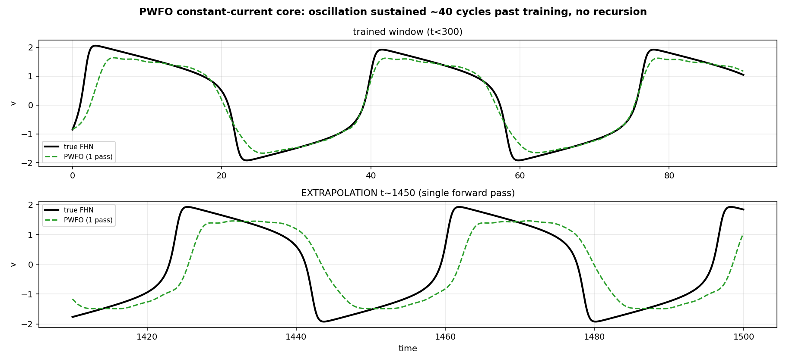

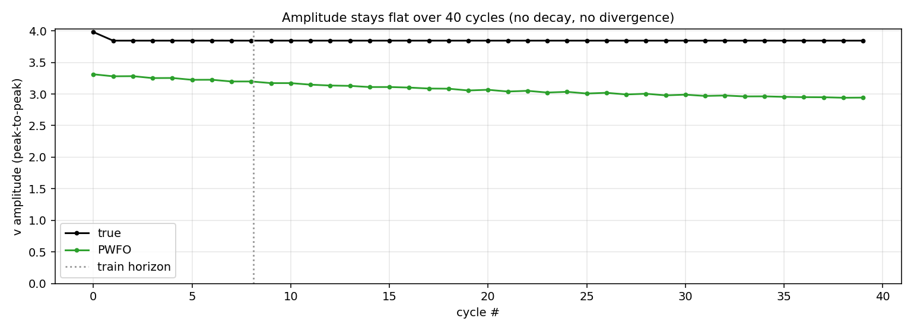

### 10.3 Flow-map: full waveform + phase across every current type

Anchored 3-cycle rollout from a measured state, one panel per current type. The learned
coarse flow map overlays the truth on all eight families, including the fast/oscillatory
ones (chirp, sines, pulse) that defeat the closed-form phase model:

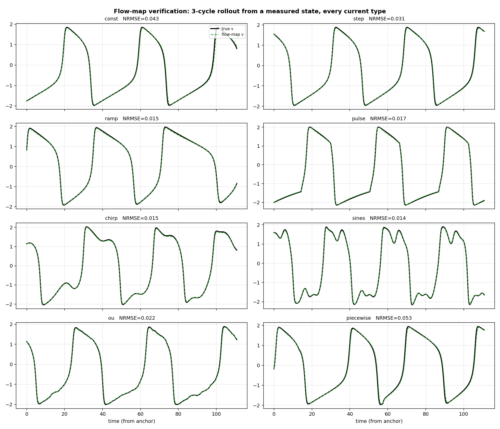

Fidelity holds in the phase plane as well — the predicted orbit lies on the true orbit,
not merely the $v(t)$ marginal:

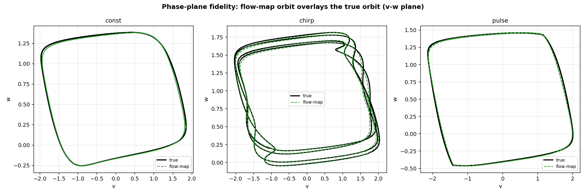

### 10.4 Head-to-head accuracy

Anchored 3-cycle NRMSE by current type (validation set; random measured-state anchors,
aggregated), flow-map versus PWFO one-shot:

| current | flow-map | PWFO (one-shot) | regime |
|---|---|---|---|
| const | **0.019** | 0.187 | slow |
| step | **0.022** | 0.366 | slow |
| ramp | **0.234** | 0.409 | slow (flow-map's weakest — regime drift) |
| pulse | **0.026** | 0.715 | fast |
| chirp | **0.016** | 0.767 | fast |
| sines | **0.110** | 0.768 | fastest |
| ou | **0.026** | 0.699 | fast |
| piecewise | **0.025** | 0.667 | fast |
| **MEAN** | **0.060** | **0.572** | ~10× gap |

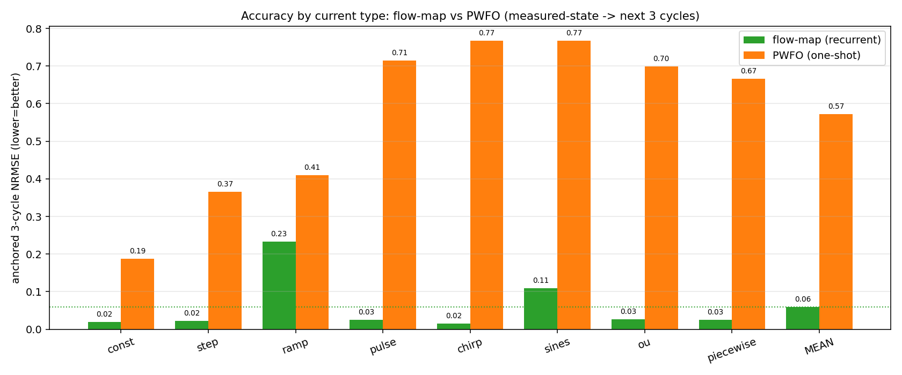

The separation is sharpest on a fast (chirp) current, where the flow-map tracks the
waveform and phase while the closed-form PWFO — whose adiabatic phase law (§6.3) is invalid
under fast forcing — drifts out of alignment:

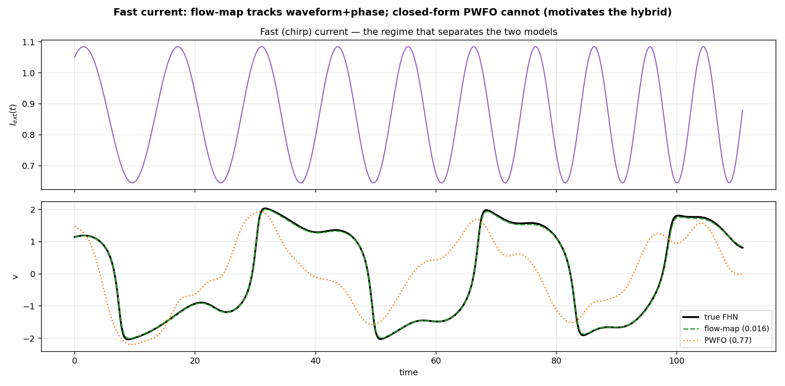

### 10.5 Why the error grows, and the hybrid that answers it

On a constant current the flow-map's rollout error stays bounded while the PWFO error
grows in envelope — but the growth is **phase drift**, not amplitude loss: the right panel
shows PWFO holding the correct amplitude and waveform while the spikes slip in time,
exactly the $\propto\varepsilon t$ mechanism of §6.4.

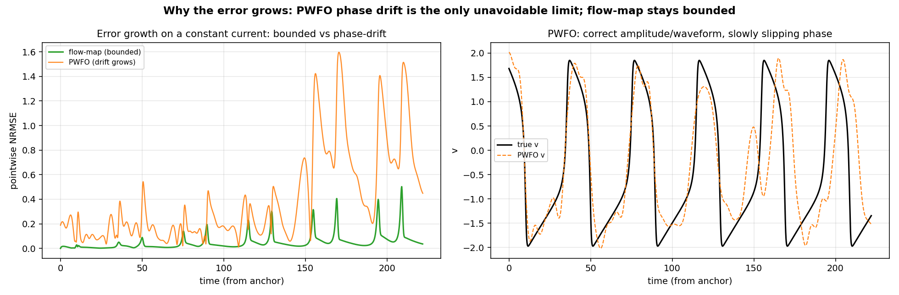

These two error/cost regimes define the routing. The flow-map is exact-in-waveform but its
cost is $O(t/\Delta)$; PWFO is instant at any $t$ but only accurate for slow currents. The
hybrid (§9.4) sends each query to the model that wins its regime, leaving one genuinely
unreachable corner (fast forcing **and** truly unbounded $t$, which has no finite-cost
exact answer).

### 10.6 Speed

PWFO has ~33k parameters (core) / ~170k (general); one forward pass is $O(K)$ in the query
time (a shared profile prefix-sum $O(S)$, then a gather + evaluate), so a batched far-horizon
query (32 trajectories × 7500 query times to $t=1500$) runs in ≈70 ms on a 6 GB GPU, with
identical cost at $t\approx 1$ and $t\approx 10^6$ — the one-shot property of §7.5.

**Flow-map vs standard numerical integration (`flowmap_benchmark.py`).** We timed the flow-map
rollout ($\Delta=0.2$) against the *same* vectorised, JIT-compiled RK4 that generated the data,
at two step sizes and across six time scales (batch 256, GPU), recording wall-clock **and** the
accuracy each delivers:

| horizon $T$ | cycles | RK4 fine $dt{=}0.05$ | RK4 coarse $\Delta{=}0.2$ | flow-map $\Delta{=}0.2$ | speedup vs fine | NRMSE flow / coarse |
|---:|---:|---:|---:|---:|---:|---:|
| 10 | 0.3 | 3.9 ms | 2.2 ms | 3.7 ms | 1.06× | 0.022 / 0.008 |
| 100 | 2.7 | 33.7 ms | 10.2 ms | 19.5 ms | 1.73× | 0.074 / 0.031 |
| 300 | 8.1 | 94.7 ms | 27.2 ms | 55.7 ms | 1.70× | 0.196 / 0.071 |
| 1000 | 27 | 341 ms | 89 ms | 182 ms | 1.88× | 0.264 / 0.211 |
| 3000 | 81 | 978 ms | 237 ms | 591 ms | 1.66× | 0.434 / 0.267 |

The flow-map is **~1.7× faster than reference (fine-step) RK4** — it takes 4× fewer steps, each
heavier, netting ~1.7×. **But on FHN this is not a genuine win:** FHN is only mildly stiff, so a
plain RK4 at the *same* coarse step $\Delta=0.2$ is both **faster** (its 2-D polynomial step is
~2.5× cheaper than the MLP) **and more accurate** than the learned map (right panel below). For
a non-stiff, low-dimensional system the classical integrator simply dominates at the coarse
step, and the learned stepper buys nothing. Its advantage appears only where an explicit solver
*cannot* take the coarse step — **stiff / high-dimensional** dynamics such as Hodgkin–Huxley,
where the fine step is forced by the fastest gating timescale and the §8.4 argument turns the
coarse learned step into a real, growing speedup. Two honest caveats visible in the table: the
flow-map's accuracy **degrades past its trained rollout length** (~112 time units), with NRMSE
growing 0.02 → 0.43 over 81 cycles — the Grönwall amplification of §8.3 — and the speedup number
is device- and batch-dependent (measured on a 6 GB GPU at batch 256).

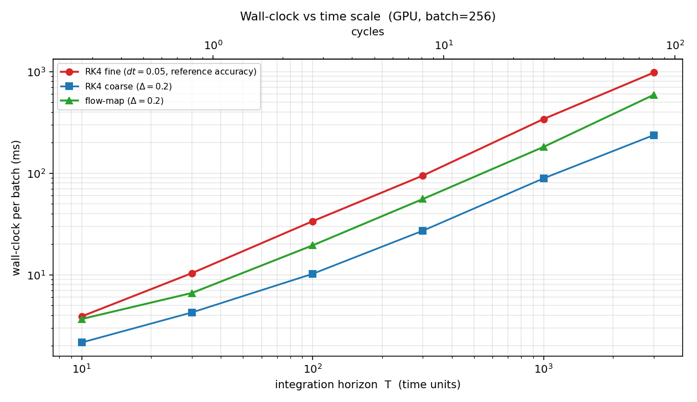

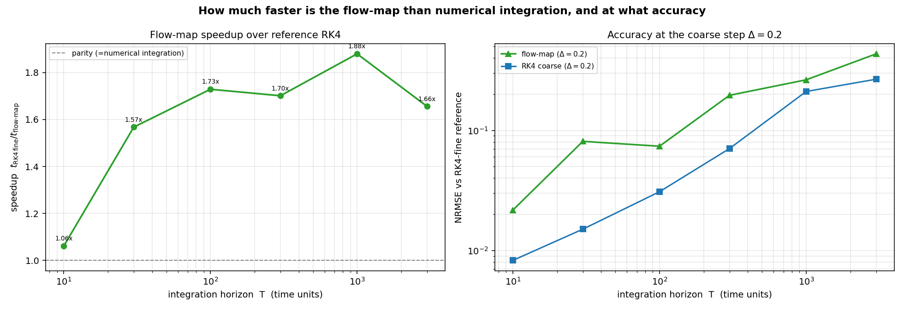

### 10.7 Optimizing inference: larger-stride distillation (past 2×)

The §10.6 flow-map ran at $\Delta=0.2$ (4× fewer steps than fine RK4) and reached only
~1.7×. A paper-grounded review of fast-inference techniques (parallel-in-time DEER
[arXiv:2309.12252], consistency/flow-map distillation [arXiv:2505.18825], mixed-precision
neural ODEs [arXiv:2510.23498], persistent kernels [arXiv:2412.07752]) identified one lever
whose speedup is guaranteed by step-count arithmetic for our latency-bound scan: **train the
map to a larger stride.** Per-step FLOPs are fixed, and the wall-clock of the sequential
rollout is ~linear in step count, so cutting steps cuts time ~proportionally. We therefore
distilled the stepper to $\Delta=0.4$ and $\Delta=0.8$, feeding $n=5$ interior forcing samples
per step (input dim $2\to7$) so the coarser step still sees the intra-step current
(`flowmap_fast.py`, `flowmap_fast_train.py`). Exact wall-clock (batch 256, 6 GB GPU) at the
canonical $T=300$ (8 cycles), vs the true integrator:

| method | step $\Delta$ | steps | wall-clock | speedup vs fine RK4 | NRMSE vs fine RK4 |
|---|---:|---:|---:|---:|---:|
| RK4 fine (reference) | 0.05 | 6000 | 67.2 ms | 1.0× | — |
| flow-map (old) | 0.2 | 1500 | 50.6 ms | 1.33× | 0.166 |
| **flow-map (distilled)** | **0.4** | 750 | **24.7 ms** | **2.72×** | **0.140** |
| **flow-map (distilled)** | **0.8** | 375 | **13.6 ms** | **4.94×** | 0.212 |
| coarse RK4 | 0.8 | 375 | 5.6 ms | 12.1× | 0.233 |

Across horizons $T\in[30,1000]$ the distilled maps give **2.7–3.6× ($\Delta=0.4$)** and
**4.9–6.9× ($\Delta=0.8$)** over fine RK4 — comfortably past the 2× target. Two results are
worth stating because they were not obvious:

1. **Fewer steps also means *less* error.** The $\Delta=0.4$ map is not only ~2× faster than
   the old $\Delta=0.2$ map, it is **more accurate at long horizons** (NRMSE 0.140 vs 0.166 at
   $T=300$; 0.289 vs 0.319 at $T=1000$): a shorter scan accumulates less of the Grönwall error
   of §8.3. Speed and long-horizon fidelity improve together.
2. **At the aggressive step the learned map beats classical integration.** At $\Delta=0.8$ the
   flow-map is **more accurate than coarse RK4 at the same step** (NRMSE 0.068/0.150/0.212/0.374
   vs 0.084/0.173/0.233/0.404 at $T=30/100/300/1000$): RK4 cannot resolve the fast spike in a
   $0.8$ step, while the trained map can. This is the accuracy-at-fixed-cost frontier crossing
   in the right panel below — the first regime, even on *non-stiff* FHN, where the learned
   stepper genuinely dominates the classical integrator (and it is exactly the mechanism that
   pays off far more on stiff Hodgkin–Huxley, §12).

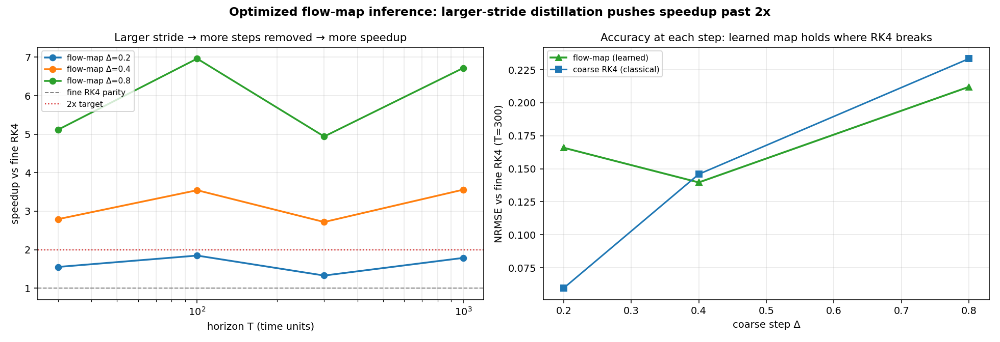

$\Delta$ is thus a **speed–accuracy knob**: $\Delta=0.4$ for ~3× at $\Delta=0.2$-or-better
accuracy, $\Delta=0.8$ for ~5–7× at coarser accuracy. Further multipliers left on the table
(paper-backed, not yet implemented): bf16 network evaluation with fp32 state accumulation
(roundoff provably $O(\text{unit-roundoff})$ independent of step count, arXiv:2510.23498) plus a
larger batch to saturate the GPU (~1.2–1.5× more), and — since the GPU is under-occupied at the
2-wide state — an AOT-compiled C/SIMD cache-resident stepper that removes all dispatch/transfer
overhead. Techniques deliberately **not** pursued (wrong regime for a tiny, non-stiff, 2-D
state): DEER/associative-scan parallelization (no idle parallelism on a batch-saturated GPU),
Parareal (no expensive fine solver to amortize), int8 (tiny GEMMs, state cannot be int8), and
one-shot operator surrogates (their large speedups are a stiff-system effect).

---

## 11. What is in the repository (code map)

Surrogate (kept in the main directory):

- `operator_data.py` — dataset generator: FHN under **random time-varying currents**
  (const/step/ramp/pulse/chirp/sines/OU/piecewise), broad initial conditions, long
  horizon; emits train ($t_{\max}=300$), val, and a far set ($t_{\max}=1500$) for
  unbounded-$t$ tests.
- `pwfo_model.py` — the PWFO forward map: `init_pwfo`, `forward(params,cfg,x0,u,t,dt)`,
  cumulative-phase prefix-sum, Fourier-in-phase cycle, isostable transient; the
  `local_waveform` flag conditions cycle coefficients on the local current.
- `pwfo_freq_table.py` — precomputes $\omega_{\text{measured}}(u)$ for frequency supervision.
- `pwfo_train.py` — trainer with **anchored-window operator training** (random anchor $t_0$,
  predict the next ~3 cycles); constant-current core → general profiles; losses
  $L_{\text{state}}+L_{\text{freq}}+L_{\text{range}}$; AdamW + cosine schedule.
- `pwfo_eval.py` — far-horizon **one-shot** evaluation vs. the integrator: amplitude
  flatness, phase drift, pointwise NRMSE, and a timing-invariance assertion.
- `flowmap_model.py` — the recurrent **flow-map stepper** (Markov residual integrator on a
  coarse grid) + a gradient-checkpointed rollout.
- `flowmap_train.py` — multi-step (BPTT) curriculum trainer over all current types.
- `flowmap_eval.py` — per-current-type rollout NRMSE + speed.
- `hybrid_model.py` — the shipped **hybrid**: routes between flow-map (accuracy, finite
  horizon) and PWFO (instant arbitrary-far-$t$, slow currents).
- `fhn_theory.py` — ground-truth spectral theory (fixed points, Jacobian eigenvalues,
  measured cycle frequency/amplitude), used for supervision and for the §1–§2 figures.
- `results_figures.py` — regenerates every verification figure in `plots/results/` used by this report.
- `flowmap_benchmark.py` — times the flow-map against fine/coarse RK4 across time scales (§10.6); emits `plots/results/bench_walltime.png`, `bench_speedup_accuracy.png`.
- `flowmap_fast.py`, `flowmap_fast_train.py` — the larger-stride distilled flow-map (interior forcing) that pushes inference past 2× (§10.7).
- `flowmap_speed_opt.py` — the optimized-inference benchmark ($\Delta=0.2/0.4/0.8$ vs RK4); emits `plots/results/bench_stride_speedup.png`.

Superseded stages (the Stuart–Landau Koopman fix and dead experiments) are grouped under
`archive/` and left intact as the research trail; the `.md` documents are the narrative.

---

## 12. Path to Hodgkin–Huxley

Both models swap to HH by **data only**. The **flow-map** is the HH workhorse and the real
speedup: HH is stiff, so its true solver is step-limited by the fastest gating timescale,
whereas a coarse learned map targets the solution and can take $\Delta$ far larger than the
stiff step (the argument of §8.4). The `flowmap_*` code is unchanged but for the dataset and
a wider MLP ($d:2\to4$, $\Delta$ tuned to the spike width). PWFO also ports (state dim
$2\to4$, isostable modes $m:1\to3$, more harmonics; optionally a SIREN decoder for sharper
spikes, and a small regime gate for spiking-vs-quiescent near the Hopf points). Generate the
HH dataset with a stiff solver (e.g. Kværnø via `diffrax`) and retrain.

---

## 13. Honest limitations

1. **PWFO phase drift / fast currents** — fundamental to a *closed-form* oscillator
   surrogate (§6.4). Handled by the hybrid: the recurrent flow-map covers fast currents and
   full waveform + phase at finite horizons (§10.3). PWFO is used only for instant
   arbitrary-far-$t$ on slow currents.
2. **The one unreachable corner** — *fast forcing + truly unbounded $t$*: the flow-map is
   accurate but $O(t/\Delta)$ (no instant jump), and PWFO is instant but only accurate for
   slow currents. There is no finite-cost exact answer here; one picks speed (PWFO, slow
   only) or accuracy (flow-map, bounded horizon). See §9.4.
3. **Flow-map ramp / sines (0.234 / 0.110)** — the weakest current types; slow regime-drift
   accumulation. A smaller $\Delta$ or more curriculum stages would tighten them.
4. **Networks of coupled units** — synaptic coupling makes $I_{\mathrm{ext}}$ an unknown of
   the other units; the per-unit surrogate then iterates (a few Picard / Gauss–Seidel
   sweeps) rather than answering in one shot.

**Where to push next (visible in §10.5):** the residual PWFO error is phase, so the
highest-leverage improvement is tighter frequency supervision (a denser $\omega(u)$ table or
a phase-response correction), followed by a sharper spike decoder (higher $K$ or SIREN) to
remove Fourier-truncation undershoot on the relaxation peak.

---

## 14. How to reproduce

```bash
python operator_data.py                                   # dataset (random time-varying currents)
python pwfo_freq_table.py                                 # omega(u) table for frequency supervision
python pwfo_train.py --mode core --K 20 --steps 8000  --out data/pwfo_core_k20.pkl
python pwfo_eval.py  --mode core   --model data/pwfo_core_k20.pkl
python pwfo_train.py --mode general --K 20 --m 2 --steps 10000 --window 2400   # anchored
python pwfo_eval.py  --mode general --model data/pwfo_general.pkl
python flowmap_train.py --steps 6000 --stride 4           # recurrent flow-map (full range)
python flowmap_eval.py  --model data/flowmap.pkl
python results_figures.py                                 # verification figures -> plots/results/
python flowmap_benchmark.py                               # flow-map vs RK4 speed across time scales
python flowmap_fast_train.py --stride 8  --n-samp 5       # distilled Delta=0.4 map (>2x)
python flowmap_fast_train.py --stride 16 --n-samp 5       # distilled Delta=0.8 map (~5-7x)
python flowmap_speed_opt.py                               # optimized-inference benchmark + figure
# hybrid: hybrid_model.predict(pwfo, flow, dt, x0, u_profile, t_query) -> (x, route)
```

## 15. Live intervention: the control-affine invertible surrogate and the stiffness crossover

Sections 1–14 built a *forward* surrogate: given a current, predict the trajectory. The
practical goal, however, is **intervention** — given a neuron and a desired next state,
find the current that steers it there, fast enough to close the loop in real time. This
section derives an invertible surrogate for that task, states the fair way to benchmark it
against classical integration, and reports honestly where it wins and where it does not.

### 15.1 Control-affine structure of conductance-based neurons

Every model in this report shares one exact structural fact. Write the state as
\(x=(V,\mathbf g)\) with membrane voltage \(V\) and gating variables \(\mathbf g\). The
injected current \(u=I_\text{ext}\) enters **only** the voltage equation, additively:

$$
C\dot V = -I_\text{ion}(x) + u, \qquad \dot{\mathbf g} = r(V,\mathbf g).
$$

Collecting terms, the dynamics are **control-affine** with a *constant* input vector:

$$
\dot x = a(x) + b\,u, \qquad b = \tfrac1C\,e_V = \big(\tfrac1C,0,\dots,0\big)^{\!\top}.
$$

This holds verbatim for FitzHugh–Nagumo (\(b=(1,0)^\top\)), Hodgkin–Huxley
(\(b=(1/C,0,0,0)^\top\)), the 7-D multi-channel cell of §15.6, and — crucially —
for diffusively coupled *networks*, where node \(i\) sees the affine total input
\(u_i = I_{\text{ext},i} + \sum_j W_{ij}(V_j-V_i)\) on the same voltage channel.

### 15.2 The coarse flow is affine in a held current, to \(O(\Delta^2)\)

Fix a coarse step \(\Delta\) and hold \(u\) constant across \([t,t+\Delta]\) (zero-order hold,
exactly how a digital controller acts). Let \(\Phi_\Delta(x,u)\) be the exact time-\(\Delta\)
flow. Expanding in the control, the sensitivity \(S(\tau)=\partial_u\varphi(\tau)\) obeys the
variational equation

$$
\dot S = Da\big(\varphi(\tau)\big)\,S + b, \qquad S(0)=0,
\qquad\Longrightarrow\qquad
G(x) \;\equiv\; \partial_u\Phi_\Delta(x,0)=\int_0^\Delta \!M(\Delta,s)\,b\,\mathrm ds,
$$

with \(M\) the state-transition matrix of the linearization along \(\varphi\). Because the
only \(u\)-dependence of \(a(\varphi)\) is through the accumulated state (itself \(O(\Delta)\)),
the second derivative \(\partial_u^2\Phi_\Delta = O(\Delta^2)\). Hence

$$
\boxed{\;\Phi_\Delta(x,u) = F(x) + G(x)\,u + O(\Delta^2 u^2),\quad F(x)=\Phi_\Delta(x,0).\;}
$$

The map is **exactly** affine in \(u\) for a linear system and affine up to a curvature that
vanishes with the step. The one place this bound is loose is a *spike crossing inside the
step*: there the voltage nonlinearity is near-threshold in \(u\), the effective curvature is
not small, and \(\Delta\) must be reduced (§15.6).

### 15.3 The surrogate and its closed-form inverse

We learn the two coarse-step fields directly with a shared-trunk MLP,

$$
F_\theta(x)=x+\mathrm{sd}\odot\mathrm{MLP}_F(\hat x),\qquad
G_\theta(x)=\mathrm{sd}\odot\mathrm{MLP}_G(\hat x)+g_\text{floor}\,e_V,\qquad
\hat x=(x-\mu)/\mathrm{sd},
$$

so that \(x_{t+\Delta}=F_\theta(x_t)+G_\theta(x_t)\,u_t\). Only \(u\) is constrained to enter
affinely; \(F_\theta,G_\theta\) are unconstrained, so no forward accuracy is traded for
invertibility. The floor \(g_\text{floor}e_V\) keeps the voltage channel of \(G\) bounded away
from zero — physically justified because injected current always moves \(V\) — so the inverse
below can never divide by zero.

**Inversion.** For a target \(x^\star\), the current is the scalar least-squares solution of
\(\min_u\|F_\theta(x)+G_\theta(x)u-x^\star\|^2\):

$$
\boxed{\;u^\star=\dfrac{\big\langle G_\theta(x),\,x^\star-F_\theta(x)\big\rangle}
{\big\langle G_\theta(x),G_\theta(x)\big\rangle},\qquad
u^\star\leftarrow\mathrm{clip}(u^\star,U_\text{lo},U_\text{hi}).\;}
$$

For a scalar control the box-constrained optimum **is** the clipped unconstrained optimum
(the feasible set is an interval, the objective a convex parabola), so the clip is exact, not
a heuristic. A scalar \(u\) can only move the state along the rank-one direction \(G\); the
unreachable part is the residual \(r=(I-GG^\top/\langle G,G\rangle)(x^\star-F)\), which we
report rather than hide. This is one MLP forward pass and a dot product: no optimizer, no
iteration, \(O(1)\) in the stiffness of the underlying neuron.

### 15.4 The only fair benchmark, and why forward-only is the wrong one

Comparing a surrogate forward pass against one RK4 step is the wrong contest for control,
because RK4 has *no inverse*: to steer the true model you must **solve** for \(u\). The honest
baseline grants the classical model the *same* affine structure the surrogate exploits —
**linearize once**:

$$
\text{rk4\_lin1:}\quad f_0=\Phi_\Delta^{\text{RK4}}(x,0),\;\;
g=\tfrac1\delta\big(\Phi_\Delta^{\text{RK4}}(x,\delta)-f_0\big),\;\;
u^\star=\frac{\langle g,x^\star-f_0\rangle}{\langle g,g\rangle}.
$$

This is *two* coarse solves and zero iterations — and on a system where \(\Phi_\Delta\) is
affine in \(u\), it is as accurate as the surrogate by construction. The surrogate beats it
only when

$$
\boxed{\;\text{cost}\big(2\,\Phi_\Delta^{\text{RK4}}\ \text{solves}\big)\;>\;
\text{cost}\big(1\ \text{MLP forward}\big).\;}
$$

Each \(\Phi_\Delta^{\text{RK4}}\) solve costs \(n_\text{sub}=\lceil\Delta/\Delta t_\text{stable}\rceil\)
sequential vector-field evaluations, where explicit stability caps
\(\Delta t_\text{stable}\lesssim c/\max_i|\mathrm{Re}\,\lambda_i(Da)|\). So the crossover is
governed by exactly two quantities: the **stiffness** \(n_\text{sub}\) and the **per-evaluation
cost** of the vector field (channels, dimension). This is the lens for every result below.

### 15.5 FitzHugh–Nagumo: an honest null result

FHN is non-stiff (\(\kappa=\max|\mathrm{Re}\,\lambda|/\min|\mathrm{Re}\,\lambda|\sim O(10)\))
and two-dimensional. Explicit RK4 is stable at a coarse step, so \(n_\text{sub}\!\approx\!1\)
and one \(\Phi_\Delta\) solve is a handful of cheap flops — far below one \(128\times128\) MLP
forward. The consequence, confirmed empirically, is unambiguous: **on FHN the invertible
surrogate wins neither the forward rollout nor the fair control loop.** `rk4_lin1` inverts the
true model in two cheap solves, more accurately and with fewer flops than the network. We
report this as the expected outcome of §15.4, not a failure — FHN simply sits below the
crossover.

### 15.6 Hodgkin–Huxley and a realistic multi-channel cell: the crossover in action

Stiffness changes the accounting. For the standard HH cell, correctly parameterized, explicit
RK4 **diverges** for \(\Delta t\ge0.1\) ms; a coarse step \(\Delta=0.4\) ms therefore needs
\(n_\text{sub}\approx8\) stable substeps. Coarse RK4 *at* \(\Delta\) is not a usable baseline
at all — it blows up — so the surrogate is the **only stable big-step integrator**, running
\(\sim\!7\times\) faster than the fine RK4 that stiffness forces upon the classical solver.

The control-loop win, however, is regime-dependent on textbook HH (4-D, cheap field): the
surrogate wins the **latency-bound** corner — few neurons, real-time closed loop — by
\(4\text{–}14\times\), because a single control decision cannot be batched across the
\(2n_\text{sub}\) sequential stiff substeps; at batch \(1\) it meets the \(\sim\!1\) ms/neuron
biological budget (\(0.22\) ms) where the fair stiff-RK4 controller misses it (\(1.5\) ms).
At large batch with a cheap field, classical integration reclaims the throughput corner.

Realistic neurons remove that caveat. A 7-D multi-channel cell (HH + M-current +
A-current, fast-spiking kinetics; §code `multichan_model.py`) has a vector field \(\sim\!5\times\)
costlier per evaluation and comparable stiffness. Its crossover map is qualitatively
different from HH's: the classical-wins corner **collapses**. At genuine stiffness
(\(n_\text{sub}\ge16\)) the surrogate wins across **every** batch size tested, \(2\text{–}22\times\),
including the high-throughput scale where it lost on HH. The lesson is a monotone law:

> The invertible surrogate's advantage grows with stiffness (\(n_\text{sub}\)) and with
> per-evaluation cost (channels, dimension), and shrinks with batch. Textbook single-neuron
> FHN/HH are the *worst case*; every step toward biological realism — more channels, faster
> kinetics, and ultimately coupled networks — enlarges the region where one closed-form
> inverse beats a stiff optimal-control solve.

### 15.7 Honest limitations

The surrogate is an *approximate* model, so its closed-loop tracking (a few percent NRMSE)
cannot match a controller that inverts the exact stiff model when that model is cheap enough
to run in the loop. Its value is precisely the regime where the exact stiff solve is *not*
cheap enough: hard real-time on few units, high-channel-count cells, and networks. Fast
spikes crossing a coarse step break the affine-in-\(u\) bound of §15.2 and degrade both the
surrogate and `rk4_lin1`, forcing a smaller \(\Delta\); the accuracy–speed frontier, not a
single operating point, is the honest object. Single-neuron GPU latency is partly
dispatch-bound, so we report per-evaluation counts and sequential depth as the primary,
hardware-independent metrics and wall-clock/throughput as secondary.

### 15.8 How to reproduce (invertible-surrogate track)

```bash
python neuron_data.py  --neuron hh_model       --dt 0.02 --stride 20 --tc 250 --out data/hh_operator.npz
python neuron_data.py  --neuron multichan_model --dt 0.02 --stride 10 --tc 500 --out data/mc_operator_s10.npz
python flowmap_affine_train.py --data data/hh_operator.npz     --out data/affine_hh.pkl     --steps 8000
python flowmap_affine_train.py --data data/mc_operator_s10.npz --out data/affine_mc_s10.pkl --steps 9000
python neuron_bench.py      --model data/affine_mc_s10.pkl --batch 256   # forward + 3-way control
python neuron_crossover.py  --neuron hh_model                            # crossover map (cheap 4-D cell)
python neuron_crossover.py  --neuron multichan_model                     # crossover map (realistic 7-D cell)
```
