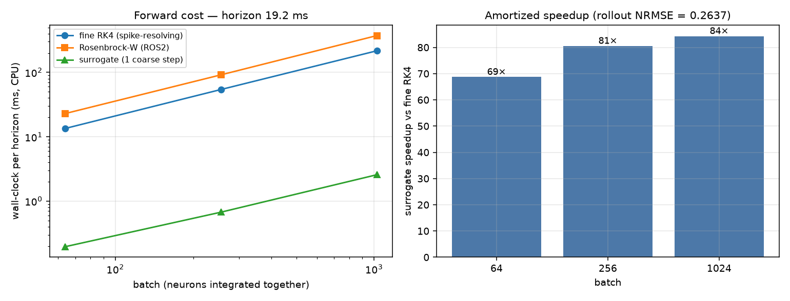
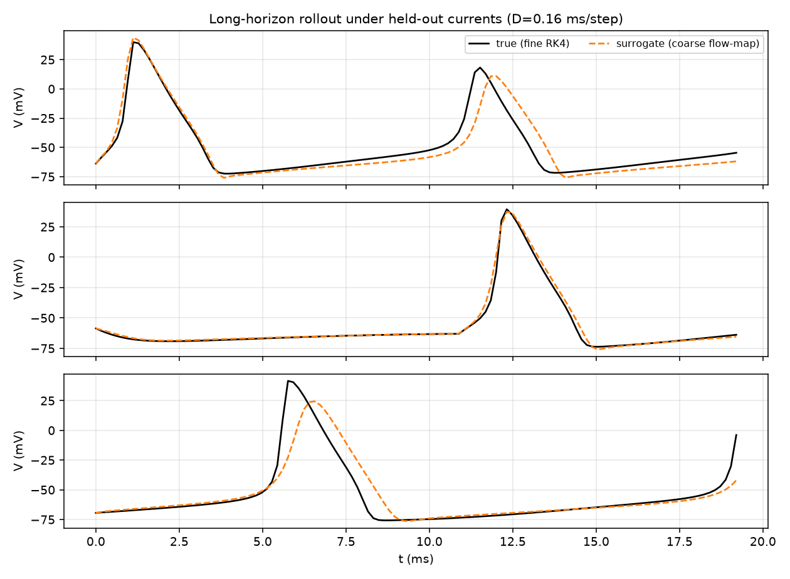
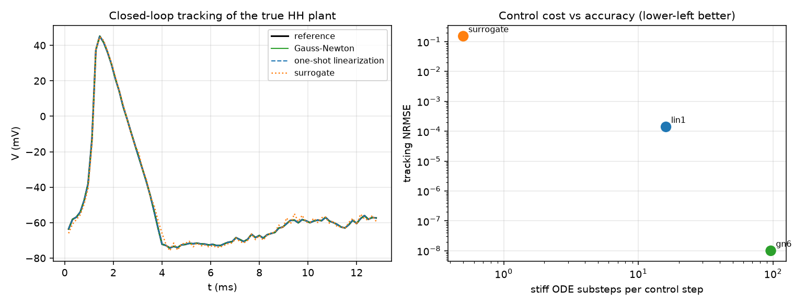
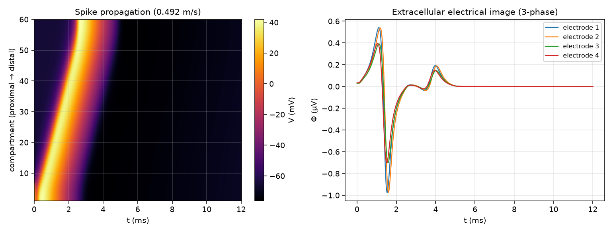
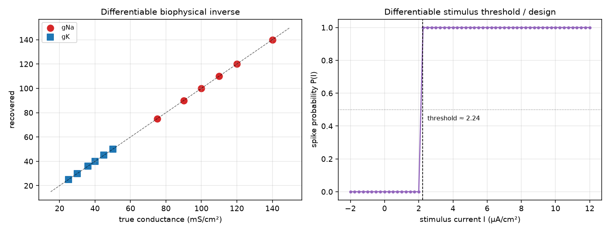

# Hodgkin–Huxley operator surrogate vs optimized solvers — comparison

*Generated by `run_comparison.jl` + `make_figures.py`.  Device: **CPU**.  Coarse step
D = 0.16 ms (stride 8 × dt 0.02 ms), horizon
19.2 ms.*

This report compares the learned **control-affine flow-map surrogate** against well-optimized
numerical integrators (spike-resolving fine RK4 and an L-stable Rosenbrock-W stepper), and
reproduces the multineuronal forward model and differentiable inverse of Lotlikar et al. (2026).

## 1. Forward: matching solver accuracy at a fraction of the cost

The batched RK4 / Rosenbrock kernels are the optimized solvers (one GPU thread per neuron). A
spike-resolving explicit solver is stability-capped at a tiny dt, so it takes many substeps per
coarse step; the surrogate takes **one** learned coarse step of D = 0.16 ms and
jumps over the stiff spike. Peak amortized speedup here: **84.3×** vs
fine RK4, at a full-rollout standardized NRMSE of **0.2637**.

| batch | fineRK4_ms | ros2_ms | sur_ms | speedup |
|---|---|---|---|---|
| 64.0 | 13.468027114868164 | 22.96304702758789 | 0.19598007202148438 | 68.7214111922141 |
| 256.0 | 54.29697036743164 | 91.77279472351074 | 0.6740093231201172 | 80.55818889281925 |
| 1024.0 | 216.8421745300293 | 373.3961582183838 | 2.5720596313476562 | 84.30682239525399 |

## 2. Long-horizon rollout accuracy

The surrogate tracks the true voltage trace over the full horizon under held-out currents without
recursive fine integration — the accuracy that backs the speedup above.

## 3. Inverse for control: steering the true plant

Because the current enters affinely, the steering current has the closed form
`u* = ⟨G, x_target − F⟩ / ⟨G, G⟩`. Three controllers drive the *true* HH plant to a reference:

| controller | track_nrmse | stiff_substeps_per_step | wall_ms |
|---|---|---|---|
| surrogate | 0.15155 | 0 | 0.306 |
| lin1 | 0.00014 | 16 | 0.438 |
| gn6 | 0.0 | 96 | 2.512 |

Gauss-Newton inverts the exact plant (near-zero tracking) but pays K stiff solves per step; the
one-shot linearization pays one; the **surrogate pays zero stiff solves** (a single MLP forward),
amortizing the controller — its tracking accuracy scales with training budget.

## 4. Multineuronal forward model (article): cable + electrical image

A spike propagates along the multi-compartment HH cable at **0.492 m/s**
(physiological for an unmyelinated axon) and the line-source model yields the characteristic
**three-phase electrical image** (capacitive +, sodium −, potassium +): three-phase =
true. This is the article's forward model (Eq. 1/4) reproduced.

## 5. Differentiable biophysical inverse + neurostimulation design

Gradient descent through the differentiable simulator recovers unknown channel densities (max gNa
error 0.039 mS/cm² across the sweep), and the differentiable
spike-probability relaxation gives a stimulus threshold ≈ 2.237 µA/cm² —
inverted, this is neurostimulation design (pick a target spike probability, get the current).

## 6. How this compares to the reference article

| Aspect | This work (`hh_julia`) | Lotlikar et al. (2026) |
|---|---|---|
| Neuron model | multi-compartment HH cable + point models | multi-compartment HH (RGC) |
| Simulator | own KernelAbstractions kernels (CPU/CUDA, native Windows) | JAXLEY (JAX) |
| Extracellular EI | line-source (Eq. 4), 3-phase reproduced | line-source (Eq. 4) |
| Inverse | gradient-based param recovery + closed-form control | gradient descent + SBI |
| Stimulation | differentiable P(I), threshold, `design_stimulus` | differentiable P_stim, threshold matching |
| Real data / SBI | not included (deterministic) | macaque MEA + neural posterior estimation |

**Honest notes.** Resolving HH *spikes* needs dt ≲ 0.05 ms for any fixed-step solver, which is why
the learned coarse-step map is the real forward win; Rosenbrock's advantage is unconditional
stability on the stiff-but-smooth cable diffusion. The deterministic P(I) is near-step (all-or-none
spikes); the article widens it with a current-noise model and Bayesian SBI — the natural extension
on top of the differentiable forward model here.
