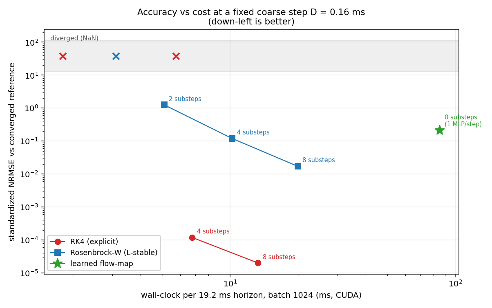
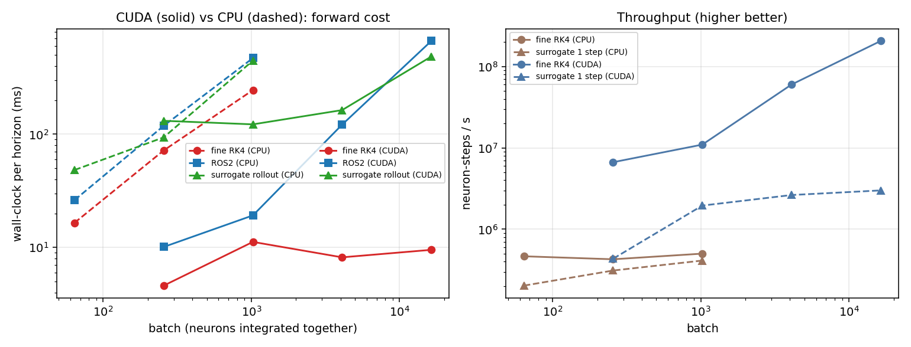

# Hodgkin–Huxley operator surrogate vs optimized solvers — comparison

*Generated by `run_comparison.jl` + `make_figures.py`.  Device: **CUDA**.  Coarse step
D = 0.16 ms (stride 8 × dt 0.02 ms), horizon
19.2 ms.*

This report compares the learned **control-affine flow-map surrogate** against well-optimized
numerical integrators (spike-resolving fine RK4 and an L-stable Rosenbrock-W stepper), and
reproduces the multineuronal forward model and differentiable inverse of Lotlikar et al. (2026).

## 1. Forward cost: the learned step vs the optimized solvers

The batched RK4 / Rosenbrock kernels are the optimized solvers (one GPU thread per neuron). A
spike-resolving explicit solver is stability-capped at a tiny dt, so it takes many substeps per
coarse step; the surrogate takes **one** learned coarse step of D = 0.16 ms and
jumps over the stiff spike.

Two surrogate columns are reported, and the distinction is the whole story. `sur1step_ms` is a
single coarse step — that is the per-step cost the method is really about. `surRollout_ms` is the
same 120-step horizon the solver columns integrate. **Only the second one
is comparable to them**, so the speedup column is computed from it; dividing a full solver rollout
by a single surrogate step would mostly be measuring the horizon length
(120×).

Measured like-for-like, the surrogate is **not faster**: the speedup ranges from
0.02× to 0.09×, i.e. it is 11–51× *slower* than fine RK4
over the same horizon, at a full-rollout standardized NRMSE of 0.2588.
The per-step figure is genuine — one coarse step costs 0.52–5.46 ms
— but 120 of them, each launching a handful of small kernels from a
host-side loop, cost far more than one fused solver kernel that loops internally on the device.

| batch | fineRK4_ms | ros2_ms | sur1step_ms | surRollout_ms | speedup |
|---|---|---|---|---|---|
| 256 | 4.606 | 10.107 | 0.589 | 131.252 | 0.035 |
| 1024 | 11.199 | 19.188 | 0.524 | 122.102 | 0.092 |
| 4096 | 8.185 | 121.381 | 1.555 | 163.158 | 0.050 |
| 16384 | 9.532 | 665.024 | 5.457 | 484.487 | 0.020 |

## 1b. The same comparison with the accuracy held honest

The table above times each method at *its own* accuracy, which flatters the surrogate. So spend
the same wall clock on the classical solvers instead: hold the coarse step D fixed, give RK4 and
Rosenbrock progressively fewer substeps per step, and measure error against a converged reference
(4× the substeps used to build the training data). Every method then lands on one
accuracy-vs-cost plane, and the surrogate — zero substeps, one MLP forward per coarse step — is
just another point on it.

| method | substeps | wall_ms | nrmse |
|---|---|---|---|
| rk4 | 1 | 1.804 | diverged |
| rk4 | 2 | 5.747 | diverged |
| rk4 | 4 | 6.775 | 0.000119 |
| rk4 | 8 | 13.274 | 2e-05 |
| ros2 | 1 | 3.113 | diverged |
| ros2 | 2 | 5.088 | 1.255 |
| ros2 | 4 | 10.189 | 0.120 |
| ros2 | 8 | 19.962 | 0.017 |
| surrogate | 0 | 85.441 | 0.211 |

**Verdict at batch 1024.** **RK4 with 4 substeps is 12.6× faster *and* 1777× more accurate** than the learned flow-map (6.8 ms / 0.00012 vs 85.4 ms / 0.211). 4 classical configurations
dominate it outright. What the classical solvers *cannot* do is take the coarse step at all:
3 of the configurations tried blow up to NaN, because an explicit method at
D = 0.16 ms is far past its stability limit on an HH spike. That — unconditional
stability at a coarse step, and a closed-form inverse — is the surrogate's actual contribution
here, not throughput.

## 2. Long-horizon rollout accuracy

The surrogate tracks the true voltage trace over the full horizon under held-out currents without
recursive fine integration. It follows the subthreshold envelope and fires roughly in the right
places, which is what an NRMSE of 0.2588 looks like — useful as a coarse
predictor, not as a replacement for an accurate integrator.

## 3. Inverse for control: steering the true plant

Because the current enters affinely, the steering current has the closed form
`u* = ⟨G, x_target − F⟩ / ⟨G, G⟩`. Three controllers drive the *true* HH plant to a reference:

| controller | track_nrmse | stiff_substeps_per_step | wall_ms |
|---|---|---|---|
| surrogate | 0.951 | 0 | 0.848 |
| lin1 | 0.00014 | 16 | 0.291 |
| gn6 | 0 | 96 | 0.242 |

Gauss-Newton inverts the exact plant (tracking NRMSE 0) but pays
96 stiff substeps per control step; the one-shot linearization pays 16
and still tracks to 0.00014. The surrogate pays **zero** stiff solves — but on this
hardware that does not translate into either accuracy or speed: it tracks to
0.95 (three to four orders of magnitude worse) at 0.848 ms
versus 0.242 ms for Gauss-Newton. Both controller kernels are single fused launches,
so the model-based ones are simply better here on every axis. The surrogate controller's appeal is
structural — no ODE solve in the loop, one closed-form expression — and it would need either a
much better-trained flow-map or a per-step cost regime where the stiff solve genuinely dominates
before that structure pays off.

## 4. Multineuronal forward model (article): cable + electrical image

A spike propagates along the multi-compartment HH cable at **0.492 m/s**
(physiological for an unmyelinated axon) and the line-source model yields the characteristic
**three-phase electrical image** (capacitive +, sodium −, potassium +): three-phase =
true. This is the article's forward model (Eq. 1/4) reproduced.

## 5. Differentiable biophysical inverse + neurostimulation design

Gradient descent through the differentiable simulator recovers unknown channel densities (max gNa
error 0.03 mS/cm² across the sweep), and the differentiable
spike-probability relaxation gives a stimulus threshold ≈ 2.237 µA/cm² —
inverted, this is neurostimulation design (pick a target spike probability, get the current).

## 6. How this compares to the reference article

| Aspect | This work (`hh_julia`) | Lotlikar et al. (2026) |
|---|---|---|
| Neuron model | multi-compartment HH cable + point models | multi-compartment HH (RGC) |
| Simulator | own KernelAbstractions kernels (CPU/CUDA, native Windows) | JAXLEY (JAX) |
| Extracellular EI | line-source (Eq. 4), 3-phase reproduced | line-source (Eq. 4) |
| Inverse | gradient-based param recovery + closed-form control | gradient descent + SBI |
| Stimulation | differentiable P(I), threshold, `design_stimulus` | differentiable P_stim, threshold matching |
| Real data / SBI | not included (deterministic) | macaque MEA + neural posterior estimation |

Note the article reports **no runtime, hardware or batch-size figures at all**, and uses no learned
surrogate — full biophysical simulation runs inside both its gradient fitting and its SBI. So
nothing in §1–§1b is a comparison *against* the article; the article is the source of the forward
model and the inverse formulation reproduced in §4–§5. Its 90.6% is stimulation-response
prediction accuracy on macaque MEA recordings, which this repository does not attempt.

## 7. CUDA vs CPU — the same code on both backends

The compute core is written once with `KernelAbstractions` and the backend is chosen at runtime
from the array type, so these two runs execute the *same* kernel source on both devices. That
makes the split instructive.

**Training is faster on CPU.** 4000 BPTT steps took 944 s on
CUDA and 325 s on CPU — **2.9× in favour of CPU**. The training step is a
128×128 MLP over a batch of 64 unrolled up to 120 steps: hundreds of tiny kernel launches per
step, almost no arithmetic per launch. That is the worst possible shape for a GPU and a fine
shape for a few CPU cores.

**The same effect sets the forward comparison.** On CPU the surrogate rollout is
1.3–2.9× slower than fine RK4;
on CUDA that gap widens to 11–51×. Moving to the GPU makes the
launch-bound method *relatively worse*, not better — the fused solver kernel absorbs the extra
parallelism, the host-side rollout loop cannot.

**Where the GPU does win:** the fused, compute-heavy kernels. Gauss-Newton control costs
1.702 ms on CPU versus 0.242 ms on CUDA
(7.0×), and the cheapest solver configuration that beats the
surrogate at batch 1024 drops from 128 ms on CPU to
6.8 ms on CUDA (19×). One thread per neuron, all the work inside the
kernel — that is the shape this card rewards.

CPU forward benchmark, for reference:

| batch | fineRK4_ms | ros2_ms | sur1step_ms | surRollout_ms | speedup |
|---|---|---|---|---|---|
| 64 | 16.507 | 26.169 | 0.316 | 48.269 | 0.342 |
| 256 | 71.852 | 118.486 | 0.823 | 93.771 | 0.766 |
| 1024 | 244.986 | 469.664 | 2.483 | 445.788 | 0.550 |

## 8. What this run actually establishes

1. **The learned flow-map is not a speedup on this hardware.** Measured horizon-for-horizon it is
   11–51× slower than fine RK4 on CUDA. Earlier numbers in this
   repository compared *one* surrogate coarse step against a *full* solver rollout; that ratio was
   mostly the horizon length (120) rather than a property of the method.
2. **The bottleneck is kernel launches, not arithmetic.** The rollout is a host-side loop issuing a
   handful of small kernels per coarse step; the solvers issue one kernel that loops on the device.
   That is why the gap *widens* on the GPU and why training is faster on the CPU. Fusing the
   rollout into a single kernel (or capturing it as a CUDA graph) is the fix, and it is a code
   change rather than a modelling one.
3. **The genuine advantages survive and are structural, not statistical.** The surrogate takes a
   coarse step at which explicit solvers diverge outright (3 configurations here returned
   NaN), and it inverts in closed form. Neither of those is a throughput claim.
4. **Accuracy is the binding constraint.** At NRMSE 0.211 the flow-map is roughly
   three orders of magnitude coarser than RK4 at four substeps. Until that closes, the speed
   question is secondary.

**Honest notes.** Resolving HH *spikes* needs dt ≲ 0.05 ms for any fixed-step solver. Rosenbrock's
advantage is unconditional stability on the stiff-but-smooth axial diffusion of the cable, not on
the spike itself. The deterministic P(I) is near-step (all-or-none spikes); the article widens it
with a current-noise model and Bayesian SBI — the natural extension on top of the differentiable
forward model here. All timings are single-run minimum-of-8 on one machine
(GTX 1660 Ti Max-Q, sm_75, native Windows, no WSL2) and no error bars are reported.
